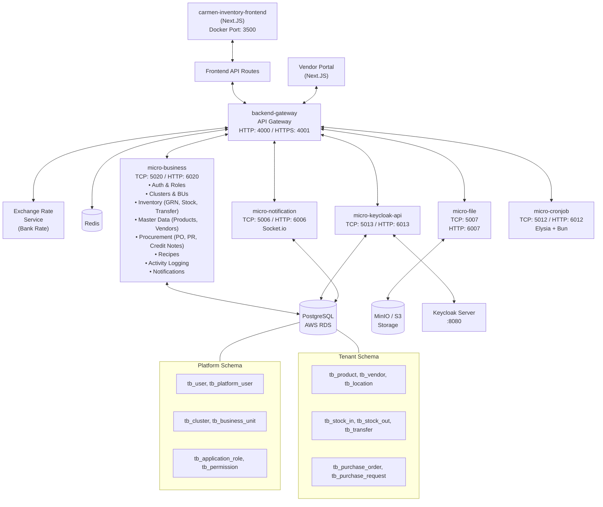

# System Architecture

## High-level system

_(stale — needs rewrite)_

```
                                USERS (Browser / Mobile)
                                         |
                        +----------------+--------------------+
                        |                                     |
                        v                                     v
            carmen-inventory-frontend                carmen-platform
              (Next.js / React)                    (Next.js / React)
                        |                                     |
                        +----------------+--------------------+
                                         |
                                    HTTPS/REST
                                         |
         ================================================================
         |              DEPLOYMENT ZONE 1: AWS EC2 (Production)         |
         |                                                              |
         |    +------------------------------------------------------+  |
         |    |           backend-gateway (:4000/:4001)               |  |
         |    |        [Auth, Routing, Swagger, WebSocket]            |  |
         |    |      JWT / Keycloak Auth Guards                       |  |
         |    +--+-------+-------+-------+-------+-------+-----------+  |
         |       |       |       |       |       |       |              |
         |      TCP     TCP     TCP     TCP     TCP     TCP             |
         |       |       |       |       |       |       |              |
         |  +----+--+ +--+---+ +--+--+ +-+---+ +--+--+ +--+--------+  |
         |  | micro  | |micro | |micro| |micro| |micro| |  micro    |  |
         |  |business| |key-  | |file | |noti-| |cron-| |  cluster  |  |
         |  | :5020  | |cloak | |:5007| |fica-| | job | |  :5014    |  |
         |  | :6020  | |api   | |:6007| |tion | |:5012| |  :6014    |  |
         |  |        | |:5013 | |     | |:5006| |:6012| |           |  |
         |  |        | |:6013 | |     | |:6006| |     | |           |  |
         |  +--------+ +--+---+ +-----+ +-----+ +-----+ +----------+  |
         |       |         |                                            |
         |       |         |        Docker Compose + ECR Images         |
         ===|====|=========|============================================
            |    |         |
            |    |         v
            |    |    +---------+
            |    |    |Keycloak |  (Identity Provider)
            |    |    |  Server |
            |    |    +---------+
            |    |
            v    v
         +---------------------------+
         |       AWS RDS             |
         |     (PostgreSQL)          |
         |                           |
         |  +---------------------+  |
         |  | Platform Schema     |  |
         |  | - users             |  |
         |  | - clusters          |  |
         |  | - business_units    |  |
         |  | - roles/permissions |  |
         |  | - subscriptions     |  |
         |  +---------------------+  |
         |                           |
         |  +---------------------+  |
         |  | Tenant Schema       |  |
         |  | - products          |  |
         |  | - inventory         |  |
         |  | - procurement       |  |
         |  | - recipes           |  |
         |  | - vendors           |  |
         |  | - locations         |  |
         |  +---------------------+  |
         +---------------------------+


         ================================================================
         |        DEPLOYMENT ZONE 2: VM dev.blueledgers.com (Dev/UAT)   |
         |                                                              |
         |    +------------------------------------------------------+  |
         |    |           backend-gateway (:4000/:4001)               |  |
         |    +--+-------+-------+-------+-------+-------+-----------+  |
         |       |       |       |       |       |       |              |
         |      TCP     TCP     TCP     TCP     TCP     TCP             |
         |       |       |       |       |       |       |              |
         |  +----+--+ +--+---+ +--+--+ +-+---+ +--+--+ +--+--------+  |
         |  | micro  | |micro | |micro| |micro| |micro| |  micro    |  |
         |  |business| |key-  | |file | |noti-| |cron-| |  cluster  |  |
         |  | :5020  | |cloak | |:5007| |fica-| | job | |  :5014    |  |
         |  | :6020  | |api   | |:6007| |tion | |:5012| |  :6014    |  |
         |  |        | |:5013 | |     | |:5006| |:6012| |           |  |
         |  |        | |:6013 | |     | |:6006| |     | |           |  |
         |  +--------+ +------+ +-----+ +-----+ +-----+ +----------+  |
         |                                                              |
         |            Docker Compose (Local Build)                      |
         ================================================================
```

### Service Communication Flow

_(stale — needs rewrite)_

```
                     HTTP Request
                          |
                          v
                +-------------------+
                | backend-gateway   |
                | - JWT Validation  |
                | - Keycloak Auth   |
                | - Permission Guard|
                | - Route to Service|
                +--------+----------+
                         |
          +--------------+--------------+
          |    NestJS TCP Transport     |
          |    (@MessagePattern)        |
          +-+----+----+----+----+----+-+
            |    |    |    |    |    |
            v    v    v    v    v    v
    +-------+ +--+ +--+ +--+ +--+ +-------+
    |business| |kc| |fi| |no| |cr| |cluster|
    |        | |  | |le| |ti| |on| |       |
    +---+----+ +--+ +--+ +--+ +--+ +--+---+
        |                              |
        v                              v
 +------+------+               +-------+------+
 |   Prisma    |               |    Prisma    |
 |   Tenant    |               |   Platform   |
 |   Client    |               |    Client    |
 +------+------+               +-------+------+
        |                              |
        +-------------+----------------+
                      |
                      v
              +-------+--------+
              |    AWS RDS     |
              |  (PostgreSQL)  |
              +----------------+
```

### Deployment Pipeline

```
  Developer
      |
      v
  Git Push
      |
      v
  +---+---+
  | Build |  bun install -> db:generate -> build:package -> build
  +---+---+
      |
      +-------------------+
      |                   |
      v                   v
  Production          Dev/UAT
  (AWS EC2)           (dev.blueledgers.com)
      |                   |
      v                   v
  Docker Build        Docker Build
  Push to ECR         Local Images
      |                   |
      v                   v
  docker-compose      docker-compose
  .yml (pull ECR)     .dev.yml (build)
      |                   |
      v                   v
  Services UP         Services UP
```

### Port Mapping

| Service              | TCP (Internal) | HTTP (Direct) | Description                    |
|----------------------|----------------|---------------|--------------------------------|
| backend-gateway      | -              | 4000 / 4001   | HTTP / HTTPS entry point       |
| micro-business       | 5020           | 6020          | Core business logic            |
| micro-keycloak-api   | 5013           | 6013          | Keycloak integration           |
| micro-file           | 5007           | 6007          | File storage                   |
| micro-notification   | 5006           | 6006          | Real-time notifications        |
| micro-cluster        | 5014           | 6014          | Cluster management             |

### Tech Stack

| Layer        | Technology                                      |
|--------------|--------------------------------------------------|
| Runtime      | Node.js 22 + Bun                                |
| Framework    | NestJS                                          |
| Monorepo     | Turborepo                                        |
| Database     | PostgreSQL (AWS RDS) + Prisma ORM                |
| Auth         | JWT + Keycloak (OIDC)                            |
| Container    | Docker (multi-stage build)                       |
| Registry     | AWS ECR                                          |
| Orchestrator | Docker Compose (current) -> Kubernetes (planned) |
| Frontends    | carmen-inventory-frontend, carmen-platform        |

## Infrastructure

Server AWS

### Server

#### CloudFront

    aws service : CloudFront
    comment : Domain management, Cloud, Proxy, DDOS

#### Front-end

    aws service : S3
    project type : NextJS
    next-build : SSG

#### Gateway

    aws service : EC2 (ECS)
    Project type : NestJS
    Concern : API Gateway Overload
    nest-build : microservice

#### Elastic Load Balancing

    aws service : ELB
    comment : Load balancing, SSL termination, Proxy

#### Microservices (Current Topology)

    - micro-business (Consolidated)

        project type : NestJS
        protocol : TCP
        Port number : 5020 (TCP) / 6020 (HTTP)
        Modules : auth, cluster, inventory, master, procurement, recipe, log, notification

    - micro-keycloak-api

        project type : NestJS
        protocol : TCP
        Port number : 5013 (TCP) / 6013 (HTTP)
        Integration : Keycloak identity provider

    - micro-file

        project type : NestJS
        protocol : TCP
        Port number : 5007 (TCP) / 6007 (HTTP)
        Storage : MinIO (S3-compatible)

    - micro-notification

        project type : NestJS
        protocol : TCP
        Port number : 5006 (TCP) / 6006 (HTTP)
        Real-time : Socket.io

#### Database

    aws service : RDS OR Aurora
    project type : PostgreSQL
    Database : PostgreSQL
    schema : Dual-schema (Platform + Tenant)

_(stale — needs rewrite)_



## Kubernetes

_(stale — needs rewrite)_

### Overview

```
                          USERS (Browser / Mobile)
                                   |
                  +----------------+----------------+
                  |                                 |
                  v                                 v
      carmen-inventory-frontend             carmen-platform
        (Next.js / Vercel)               (Next.js / Vercel)
                  |                                 |
                  +----------------+----------------+
                                   |
                              HTTPS/REST
                                   |
=======================================================================
|                        AWS EKS Cluster                              |
|                                                                     |
|  +---------------------------------------------------------------+  |
|  |                     INGRESS LAYER                             |  |
|  |                                                               |  |
|  |   +-------------------+          +-------------------------+  |  |
|  |   | AWS ALB Ingress   |          | Certificate Manager     |  |  |
|  |   | Controller        |--------->| (ACM / TLS Termination) |  |  |
|  |   | api.carmen.com/*  |          +-------------------------+  |  |
|  |   +--------+----------+                                       |  |
|  +------------|--------------------------------------------------+  |
|               |                                                     |
|  +------------|--------------------------------------------------+  |
|  |            v          NAMESPACE: carmen-production             |  |
|  |                                                               |  |
|  |  +--------------------------------------------------------+  |  |
|  |  |              GATEWAY LAYER (Public)                     |  |  |
|  |  |                                                         |  |  |
|  |  |   +-------------------------------------------------+  |  |  |
|  |  |   |  backend-gateway (Deployment)                    |  |  |  |
|  |  |   |  Replicas: 2  |  HPA: 2-5  |  Port: 4000/4001  |  |  |  |
|  |  |   |  [Auth, Routing, Swagger, WebSocket]             |  |  |  |
|  |  |   |  [JWT + Keycloak Guards + Permission Guards]     |  |  |  |
|  |  |   +---------+---------------------------------------+  |  |  |
|  |  |             |                                           |  |  |
|  |  |        ClusterIP Service                                |  |  |
|  |  |     svc/backend-gateway:4000                            |  |  |
|  |  +---------|-----------------------------------------------+  |  |
|  |            |                                                  |  |
|  |            | NestJS TCP Transport (@MessagePattern)           |  |
|  |            |                                                  |  |
|  |  +---------v----------------------------------------------+   |  |
|  |  |              MICROSERVICES LAYER (Internal Only)        |  |  |
|  |  |                                                         |  |  |
|  |  |  +-------------+  +-------------+  +----------------+  |  |  |
|  |  |  | micro-      |  | micro-      |  | micro-         |  |  |  |
|  |  |  | business    |  | keycloak-api|  | report (NEW)   |  |  |  |
|  |  |  | Replicas: 3 |  | Replicas: 2 |  | Replicas: 2    |  |  |  |
|  |  |  | HPA: 2-6    |  | HPA: 2-4    |  | HPA: 2-4       |  |  |  |
|  |  |  | TCP:5020    |  | TCP:5013    |  | TCP:5015       |  |  |  |
|  |  |  | HTTP:6020   |  | HTTP:6013   |  | HTTP:6015      |  |  |  |
|  |  |  +-------------+  +-------------+  +----------------+  |  |  |
|  |  |                                                         |  |  |
|  |  |  +-------------+  +-------------+  +----------------+  |  |  |
|  |  |  | micro-      |  | micro-      |  | micro-         |  |  |  |
|  |  |  | file        |  | notification|  | cluster        |  |  |  |
|  |  |  | Replicas: 2 |  | Replicas: 2 |  | Replicas: 2    |  |  |  |
|  |  |  | HPA: 1-3    |  | HPA: 2-4    |  | HPA: 1-3       |  |  |  |
|  |  |  | TCP:5007    |  | TCP:5006    |  | TCP:5014       |  |  |  |
|  |  |  | HTTP:6007   |  | HTTP:6006   |  | HTTP:6014      |  |  |  |
|  |  |  +-------------+  +-------------+  +----------------+  |  |  |
|  |  |                                                         |  |  |
|  |  |                 +----------------+                      |  |  |
|  |  |                 | micro-         |                      |  |  |
|  |  |                 | cronjob        |                      |  |  |
|  |  |                 | Replicas: 1    |                      |  |  |
|  |  |                 | (No HPA)       |                      |  |  |
|  |  |                 | TCP:5012       |                      |  |  |
|  |  |                 | HTTP:6012      |                      |  |  |
|  |  |                 +----------------+                      |  |  |
|  |  +---------------------------------------------------------+  |  |
|  |                                                               |  |
|  |  +---------------------------------------------------------+  |  |
|  |  |              CONFIG & SECRETS LAYER                     |  |  |
|  |  |                                                         |  |  |
|  |  |  +------------------+  +-----------------------------+  |  |  |
|  |  |  | ConfigMap        |  | External Secrets            |  |  |  |
|  |  |  | - service hosts  |  | (AWS Secrets Manager)       |  |  |  |
|  |  |  | - service ports  |  | - DATABASE_URL              |  |  |  |
|  |  |  | - NODE_ENV       |  | - JWT_SECRET       |  |  |  |
|  |  |  | - LOKI_*         |  | - KEYCLOAK_*                |  |  |  |
|  |  |  +------------------+  | - SMTP_*                    |  |  |  |
|  |  |                        | - SENTRY_DSN                |  |  |  |
|  |  |                        +-----------------------------+  |  |  |
|  |  +---------------------------------------------------------+  |  |
|  |                                                               |  |
|  +---------------------------------------------------------------+  |
|                                                                     |
=======================================================================
          |              |                    |
          v              v                    v
   +------------+  +-----------+     +----------------+
   |  AWS RDS   |  | Keycloak  |     | AWS ECR        |
   | PostgreSQL |  | Server    |     | (Container     |
   | (Multi-AZ) |  | (EKS or  |     |  Registry)     |
   |            |  |  ext.)    |     +----------------+
   | +--------+ |  +-----------+
   | |Platform| |
   | | Schema | |
   | +--------+ |
   | +--------+ |
   | |Tenant  | |
   | | Schema | |
   | +--------+ |
   +------------+
```

#### Namespace Strategy

```
EKS Cluster
  |
  +-- carmen-production        # Production workloads
  |     +-- All 8 microservices + gateway
  |     +-- ConfigMaps, Secrets, HPA, PDB
  |
  +-- carmen-staging           # UAT / Staging (replaces dev.blueledgers.com)
  |     +-- Same services, lower replicas
  |     +-- Separate ConfigMap/Secrets pointing to staging DB
  |
  +-- carmen-system            # Shared infrastructure
  |     +-- Keycloak (if running in-cluster)
  |     +-- Monitoring stack (Prometheus, Grafana, Loki)
  |
  +-- ingress-nginx / kube-system
        +-- Ingress Controller, Cert Manager, External Secrets Operator
```

#### Service Discovery (K8s vs Docker Compose)

```
  BEFORE (Docker Compose)                 AFTER (Kubernetes)
  ========================                ====================

  ENV hardcoded:                          K8s Service DNS:
  BUSINESS_SERVICE_HOST=                  BUSINESS_SERVICE_HOST=
    api-micro-business                      api-micro-business.carmen-production.svc.cluster.local
  BUSINESS_SERVICE_PORT=5020              BUSINESS_SERVICE_PORT=5020
                                          (or short: api-micro-business)

  Docker Network:                         ClusterIP Services:
  carmen-network (bridge)                 svc/api-micro-business      -> TCP:5020, HTTP:6020
                                          svc/api-micro-keycloak-api  -> TCP:5013, HTTP:6013
                                          svc/api-micro-report        -> TCP:5015, HTTP:6015
                                          svc/api-micro-file          -> TCP:5007, HTTP:6007
                                          svc/api-micro-notification  -> TCP:5006, HTTP:6006
                                          svc/api-micro-cronjob       -> TCP:5012, HTTP:6012
                                          svc/api-micro-cluster       -> TCP:5014, HTTP:6014

  NOTE: Service names match Docker Compose names
        -> ENV values stay the same, zero code changes needed!
```

#### Network Policy

```
                Internet
                   |
                   v
          +--------+--------+
          |  AWS ALB        |
          |  (Ingress)      |
          +--------+--------+
                   |
      Only port 4000/4001 exposed
                   |
                   v
+-----------------------------------------+
|          backend-gateway                |  <-- Public-facing
|          (NetworkPolicy: allow ingress) |
+----+----+----+----+----+----+----+------+
     |    |    |    |    |    |    |
     v    v    v    v    v    v    v
+----+----+----+----+----+----+----+------+
|  micro-services (Internal Only)         |  <-- No external access
|  NetworkPolicy:                         |
|    ingress: from gateway only           |
|    egress: to RDS, Keycloak, internet   |
+-----------------------------------------+
```

#### Horizontal Pod Autoscaler (HPA) Strategy

```
  Service              Min  Max  CPU Target  Memory Target  Reason
  -------------------  ---  ---  ----------  -------------  -------------------------
  backend-gateway       2    5     70%         80%          Entry point, must be HA
  micro-business        3    6     70%         80%          Heaviest workload
  micro-report (NEW)    2    4     70%         80%          Report generation = CPU heavy
  micro-keycloak-api    2    4     60%         70%          Auth is critical path
  micro-notification    2    4     60%         70%          WebSocket connections
  micro-file            1    3     70%         80%          I/O bound, less CPU
  micro-cluster         1    3     60%         70%          Lower traffic
  micro-cronjob         1    1     N/A         N/A          Singleton, no scaling
```

#### CI/CD Pipeline (GitHub Actions -> EKS)

```
  +----------+     +-----------+     +----------+     +-----------+
  |  GitHub  |     |  GitHub   |     |  AWS ECR |     |  AWS EKS  |
  |  Push    +---->+  Actions  +---->+  Push    +---->+  Deploy   |
  +----------+     +-----------+     +----------+     +-----------+

  Workflow Steps:
  ==============

  1. Trigger: push to main (prod) or uat (staging)
                    |
                    v
  2. Build:   bun install -> db:generate -> build:package
                    |
                    v
  3. Docker:  Build images for each service (parallel)
              docker build -f apps/<service>/Dockerfile .
                    |
                    v
  4. Push:    Tag & push to ECR
              <account>.dkr.ecr.ap-southeast-7.amazonaws.com/carmen-<service>:<sha>
                    |
                    v
  5. Deploy:  kubectl set image deployment/<service> <service>=<new-image>
              (or Helm upgrade / ArgoCD sync)
                    |
                    v
  6. Verify:  kubectl rollout status deployment/<service>
              Run smoke tests against /health endpoints
```

#### Kubernetes Resource Structure

```
k8s/
  +-- base/                              # Shared base configs
  |   +-- namespace.yaml                 # carmen-production, carmen-staging
  |   +-- configmap.yaml                 # Service discovery ENVs
  |   +-- network-policy.yaml            # Gateway-only ingress rule
  |   +-- external-secret.yaml           # AWS Secrets Manager refs
  |
  +-- services/
  |   +-- backend-gateway/
  |   |   +-- deployment.yaml            # 2 replicas, health checks
  |   |   +-- service.yaml               # ClusterIP :4000, :4001
  |   |   +-- hpa.yaml                   # 2-5 pods
  |   |   +-- pdb.yaml                   # minAvailable: 1
  |   |
  |   +-- micro-business/
  |   |   +-- deployment.yaml            # 3 replicas
  |   |   +-- service.yaml               # ClusterIP TCP:5020, HTTP:6020
  |   |   +-- hpa.yaml                   # 2-6 pods
  |   |   +-- pdb.yaml                   # minAvailable: 2
  |   |
  |   +-- micro-report/                  # NEW SERVICE
  |   |   +-- deployment.yaml            # 2 replicas
  |   |   +-- service.yaml               # ClusterIP TCP:5015, HTTP:6015
  |   |   +-- hpa.yaml                   # 2-4 pods
  |   |   +-- pdb.yaml                   # minAvailable: 1
  |   |
  |   +-- micro-keycloak-api/
  |   |   +-- deployment.yaml
  |   |   +-- service.yaml
  |   |   +-- hpa.yaml
  |   |   +-- pdb.yaml
  |   |
  |   +-- micro-file/
  |   |   +-- deployment.yaml
  |   |   +-- service.yaml
  |   |   +-- hpa.yaml
  |   |
  |   +-- micro-notification/
  |   |   +-- deployment.yaml
  |   |   +-- service.yaml
  |   |   +-- hpa.yaml
  |   |
  |   +-- micro-cluster/
  |   |   +-- deployment.yaml
  |   |   +-- service.yaml
  |   |   +-- hpa.yaml
  |   |
  |   +-- micro-cronjob/
  |       +-- deployment.yaml            # 1 replica (singleton)
  |       +-- service.yaml
  |
  +-- ingress/
  |   +-- ingress.yaml                   # ALB Ingress -> gateway
  |   +-- certificate.yaml               # TLS cert ref
  |
  +-- overlays/                          # Kustomize overlays
      +-- production/
      |   +-- kustomization.yaml         # High replicas, prod secrets
      +-- staging/
          +-- kustomization.yaml         # Low replicas, staging secrets
```

#### Port Mapping (K8s)

| Service              | TCP (Internal) | HTTP (Health) | K8s Service Name         | HPA   |
|----------------------|----------------|---------------|--------------------------|-------|
| backend-gateway      | -              | 4000 / 4001   | svc/backend-gateway      | 2-5   |
| micro-business       | 5020           | 6020          | svc/api-micro-business   | 2-6   |
| micro-report (NEW)   | 5015           | 6015          | svc/api-micro-report     | 2-4   |
| micro-keycloak-api   | 5013           | 6013          | svc/api-micro-keycloak   | 2-4   |
| micro-file           | 5007           | 6007          | svc/api-micro-file       | 1-3   |
| micro-notification   | 5006           | 6006          | svc/api-micro-notification| 2-4  |
| micro-cronjob        | 5012           | 6012          | svc/api-micro-cronjob    | 1     |
| micro-cluster        | 5014           | 6014          | svc/api-micro-cluster    | 1-3   |

#### Migration Path: Docker Compose -> Kubernetes

```
  Phase 1: Prepare (Week 1)
  -------------------------
  [x] Dockerfiles ready (all services)
  [x] Health check endpoints (/health)
  [x] ECR registry configured
  [ ] Create micro-report service
  [ ] Write K8s manifests
  [ ] Setup EKS cluster (eksctl / Terraform)

  Phase 2: Staging (Week 2)
  -------------------------
  [ ] Deploy to EKS carmen-staging namespace
  [ ] Migrate dev.blueledgers.com -> EKS staging
  [ ] Validate all services + health checks
  [ ] Test HPA scaling

  Phase 3: Production (Week 3)
  ----------------------------
  [ ] Deploy to EKS carmen-production namespace
  [ ] Setup ALB Ingress + TLS
  [ ] Configure External Secrets (AWS Secrets Manager)
  [ ] Setup monitoring (Prometheus + Grafana)
  [ ] DNS cutover: api.carmen.com -> ALB

  Phase 4: Optimize (Week 4+)
  ----------------------------
  [ ] Fine-tune HPA thresholds
  [ ] Add PodDisruptionBudgets
  [ ] Setup ArgoCD for GitOps
  [ ] Network policies hardening
  [ ] Cost optimization (Spot instances, right-sizing)
```

### Dynamic clustering

_(stale — needs rewrite)_

Carmen เป็น Multi-tenant SaaS โดยแต่ละ "Cluster" คือองค์กร/โรงแรม 1 แห่ง
Dynamic Clustering หมายถึงระบบที่สามารถ:
- สร้าง/ลบ tenant cluster ได้แบบอัตโนมัติผ่าน API
- Scale resources ตาม workload ของแต่ละ tenant
- แยก isolation ระหว่าง tenant ตามระดับ subscription
- Route traffic ไปยัง service instance ที่ถูกต้องตาม tenant context

#### High-Level Architecture (Dynamic Clustering)

```
                            USERS (Browser / Mobile)
                                     |
                +--------------------+--------------------+
                |                                         |
                v                                         v
    carmen-inventory-frontend                    carmen-platform
      (Next.js / Vercel)                        (Next.js / Vercel)
                |                                         |
                +--------------------+--------------------+
                                     |
                          HTTPS (api.carmen.com)
                                     |
                                     v
=============================================================================================
|                              AWS EKS CLUSTER                                              |
|                                                                                           |
|  +-------------------------------------------------------------------------------------+  |
|  |                           INGRESS LAYER                                             |  |
|  |                                                                                     |  |
|  |  +---------------------------+    +--------------------+   +---------------------+  |  |
|  |  | AWS ALB Ingress           |    | AWS Certificate    |   | AWS WAF             |  |  |
|  |  | Controller                |    | Manager (ACM)      |   | (Rate Limit, DDoS)  |  |  |
|  |  |                           |    | TLS Termination    |   | Per-Tenant Throttle  |  |  |
|  |  | api.carmen.com/*          |--->|                    |   |                     |  |  |
|  |  | api-staging.carmen.com/*  |    +--------------------+   +---------------------+  |  |
|  |  +-------------+-------------+                                                      |  |
|  +----------------|------------------------------------------------------------------------+
|                    |                                                                   |  |
|  +----- NAMESPACE: carmen-shared (Shared Control Plane) --------------------------+    |  |
|  |                 |                                                              |    |  |
|  |                 v                                                              |    |  |
|  |  +-------------------------------------------------------------------+        |    |  |
|  |  |              GATEWAY LAYER (Public-facing)                        |        |    |  |
|  |  |                                                                   |        |    |  |
|  |  |  +-------------------------------------------------------------+  |        |    |  |
|  |  |  |  backend-gateway (Deployment)                                |  |        |    |  |
|  |  |  |  Replicas: 2-5 (HPA)  |  Port: 4000 (HTTP) / 4001 (HTTPS)  |  |        |    |  |
|  |  |  |                                                              |  |        |    |  |
|  |  |  |  +----------+  +------------+  +----------+  +-----------+  |  |        |    |  |
|  |  |  |  | JWT Auth |  | Keycloak   |  |Permission|  | Tenant    |  |  |        |    |  |
|  |  |  |  | Guard    |  | Guard      |  | Guard    |  | Router    |  |  |        |    |  |
|  |  |  |  +----------+  +------------+  +----------+  +-----------+  |  |        |    |  |
|  |  |  |                                                  |          |  |        |    |  |
|  |  |  |                               Reads x-cluster-id header     |  |        |    |  |
|  |  |  |                               Routes to correct pool        |  |        |    |  |
|  |  |  +------------------------------+--------------------------+---+  |        |    |  |
|  |  +----------------------------------|--------------------------|------+        |    |  |
|  |                                     |                          |               |    |  |
|  |  +----------------------------------v--------------------------v-----------+   |    |  |
|  |  |              SHARED SERVICES (Stateless, All Tenants Share)             |   |    |  |
|  |  |                                                                         |   |    |  |
|  |  |  +-----------------+  +-------------------+  +----------------------+   |   |    |  |
|  |  |  | micro-          |  | micro-            |  | micro-cluster        |   |   |    |  |
|  |  |  | keycloak-api    |  | notification      |  | (Tenant Provisioner) |   |   |    |  |
|  |  |  | Replicas: 2-4   |  | Replicas: 2-4     |  | Replicas: 2-3       |   |   |    |  |
|  |  |  | TCP:5013        |  | TCP:5006           |  | TCP:5014             |   |   |    |  |
|  |  |  | HTTP:6013       |  | HTTP:6006          |  | HTTP:6014            |   |   |    |  |
|  |  |  |                 |  | (WebSocket/SSE)    |  |                      |   |   |    |  |
|  |  |  +-----------------+  +-------------------+  +----------+-----------+   |   |    |  |
|  |  |                                                          |               |   |    |  |
|  |  |  +-----------------+  +-------------------+              |               |   |    |  |
|  |  |  | micro-          |  | micro-            |    Provisions new tenant     |   |    |  |
|  |  |  | file            |  | cronjob           |    namespaces & resources    |   |    |  |
|  |  |  | Replicas: 1-3   |  | Replicas: 1       |              |               |   |    |  |
|  |  |  | TCP:5007        |  | TCP:5012           |              |               |   |    |  |
|  |  |  | HTTP:6007       |  | HTTP:6012          |              |               |   |    |  |
|  |  |  +-----------------+  +-------------------+              |               |   |    |  |
|  |  +----------------------------------------------------------|---------------+   |    |  |
|  +-------------------------------------------------------------|-------------------+    |  |
|                                                                |                        |  |
|         +------------------------------------------------------+                        |  |
|         |                                                                               |  |
|         v          DYNAMIC TENANT NAMESPACES                                            |  |
|  +------+------------------------------------------------------------------------+      |  |
|  |                                                                                |      |  |
|  |  +-- NAMESPACE: carmen-tenant-hotel-a ----------------------------------+      |      |  |
|  |  |   (Subscription: Enterprise - Dedicated Resources)                   |      |      |  |
|  |  |                                                                      |      |      |  |
|  |  |   +----------------+  +----------------+  +-------------------+      |      |      |  |
|  |  |   | micro-business |  | micro-report   |  | ResourceQuota     |      |      |      |  |
|  |  |   | Replicas: 3-6  |  | Replicas: 2-4  |  | CPU: 8 cores     |      |      |      |  |
|  |  |   | HPA: CPU 70%   |  | HPA: CPU 70%   |  | Memory: 16Gi     |      |      |      |  |
|  |  |   | TCP:5020       |  | TCP:5015       |  | Pods: 20         |      |      |      |  |
|  |  |   | HTTP:6020      |  | HTTP:6015      |  +-------------------+      |      |      |  |
|  |  |   +----------------+  +----------------+                             |      |      |  |
|  |  |                                                                      |      |      |  |
|  |  |   ConfigMap: TENANT_DATABASE_URL = hotel-a-db-connection             |      |      |  |
|  |  |   LimitRange: default CPU 500m, Memory 512Mi per pod                |      |      |  |
|  |  +----------------------------------------------------------------------+      |      |  |
|  |                                                                                |      |  |
|  |  +-- NAMESPACE: carmen-tenant-hotel-b ----------------------------------+      |      |  |
|  |  |   (Subscription: Standard - Shared Pool)                             |      |      |  |
|  |  |                                                                      |      |      |  |
|  |  |   +----------------+  +----------------+  +-------------------+      |      |      |  |
|  |  |   | micro-business |  | micro-report   |  | ResourceQuota     |      |      |      |  |
|  |  |   | Replicas: 2-3  |  | Replicas: 1-2  |  | CPU: 4 cores     |      |      |      |  |
|  |  |   | HPA: CPU 70%   |  | HPA: CPU 70%   |  | Memory: 8Gi      |      |      |      |  |
|  |  |   | TCP:5020       |  | TCP:5015       |  | Pods: 10         |      |      |      |  |
|  |  |   | HTTP:6020      |  | HTTP:6015      |  +-------------------+      |      |      |  |
|  |  |   +----------------+  +----------------+                             |      |      |  |
|  |  |                                                                      |      |      |  |
|  |  |   ConfigMap: TENANT_DATABASE_URL = hotel-b-db-connection             |      |      |  |
|  |  +----------------------------------------------------------------------+      |      |  |
|  |                                                                                |      |  |
|  |  +-- NAMESPACE: carmen-tenant-hotel-c ----------------------------------+      |      |  |
|  |  |   (Subscription: Starter - Minimal Resources)                        |      |      |  |
|  |  |                                                                      |      |      |  |
|  |  |   +----------------+  +----------------+  +-------------------+      |      |      |  |
|  |  |   | micro-business |  | micro-report   |  | ResourceQuota     |      |      |      |  |
|  |  |   | Replicas: 1-2  |  | Replicas: 1    |  | CPU: 2 cores     |      |      |      |  |
|  |  |   | HPA: CPU 80%   |  | (No HPA)       |  | Memory: 4Gi      |      |      |      |  |
|  |  |   | TCP:5020       |  | TCP:5015       |  | Pods: 5          |      |      |      |  |
|  |  |   | HTTP:6020      |  | HTTP:6015      |  +-------------------+      |      |      |  |
|  |  |   +----------------+  +----------------+                             |      |      |  |
|  |  +----------------------------------------------------------------------+      |      |  |
|  |                                                                                |      |  |
|  |  +-- NAMESPACE: carmen-tenant-pool-shared ------------------------------+      |      |  |
|  |  |   (Free/Trial tenants - shared instances, lowest priority)           |      |      |  |
|  |  |                                                                      |      |      |  |
|  |  |   +----------------+  +----------------+  +-------------------+      |      |      |  |
|  |  |   | micro-business |  | micro-report   |  | All free tenants  |      |      |      |  |
|  |  |   | Replicas: 2    |  | Replicas: 1    |  | share this pool   |      |      |      |  |
|  |  |   | TCP:5020       |  | TCP:5015       |  | PriorityClass:    |      |      |      |  |
|  |  |   | HTTP:6020      |  | HTTP:6015      |  |   low-priority    |      |      |      |  |
|  |  |   +----------------+  +----------------+  +-------------------+      |      |      |  |
|  |  +----------------------------------------------------------------------+      |      |  |
|  |                                                                                |      |  |
|  +--------------------------------------------------------------------------------+      |  |
|                                                                                           |  |
|  +-- NAMESPACE: carmen-system -----------------------------------------------+            |  |
|  |                                                                           |            |  |
|  |  +--------------+  +------------------+  +-------------------+            |            |  |
|  |  | Keycloak     |  | Prometheus       |  | Grafana + Loki    |            |            |  |
|  |  | (HA: 2 pods) |  | + AlertManager   |  | (Monitoring)      |            |            |  |
|  |  +--------------+  +------------------+  +-------------------+            |            |  |
|  |                                                                           |            |  |
|  |  +--------------+  +------------------+                                   |            |  |
|  |  | External     |  | Cluster          |                                   |            |  |
|  |  | Secrets Op.  |  | Autoscaler       |                                   |            |  |
|  |  | (AWS SM)     |  | (Karpenter)      |                                   |            |  |
|  |  +--------------+  +------------------+                                   |            |  |
|  +-----------------------------------------------------------------------+---+            |  |
|                                                                                           |  |
=============================================================================================
       |              |              |                    |
       v              v              v                    v
+------------+  +-----------+  +-----------+     +----------------+
|  AWS RDS   |  | Keycloak  |  | AWS S3    |     | AWS ECR        |
| PostgreSQL |  | DB        |  | (Files &  |     | (Container     |
| (Multi-AZ) |  | (if ext.) |  |  Reports) |     |  Registry)     |
|            |  +-----------+  +-----------+     +----------------+
| +--------+ |
| |Platform | |  <-- Shared across all tenants
| | Schema  | |
| +--------+ |
| +--------+ |
| |Tenant-A | |  <-- Per-tenant schema (or separate DB)
| | Schema  | |
| +--------+ |
| +--------+ |
| |Tenant-B | |
| | Schema  | |
| +--------+ |
| +--------+ |
| |Tenant-C | |
| | Schema  | |
| +--------+ |
+------------+
```

#### Dynamic Clustering Flow

```
                Admin creates new Cluster
                via carmen-platform UI
                          |
                          v
                POST /api/v1/cluster
                { name: "Hotel-D", plan: "enterprise" }
                          |
                          v
               +----------+----------+
               |   backend-gateway   |
               +----------+----------+
                          |
                     TCP:5014
                          |
                          v
          +---------------+----------------+
          |       micro-cluster            |
          |    (Tenant Provisioner)        |
          +---------------+----------------+
                          |
      +-------------------+-------------------+
      |                   |                   |
      v                   v                   v
+-------+--------+  +------+-------+  +--------+---------+
| 1. Create K8s  |  | 2. Create    |  | 3. Provision     |
|    Namespace   |  |    Tenant DB |  |    Keycloak      |
|                |  |    Schema    |  |    Realm         |
| carmen-tenant- |  |              |  |                  |
|  hotel-d       |  | Run Prisma  |  | Create realm,    |
|                |  | migrate     |  | roles, clients   |
| Apply:         |  |             |  |                  |
| - ResourceQuota|  | Seed base   |  |                  |
| - LimitRange   |  | data        |  |                  |
| - NetworkPolicy|  |             |  |                  |
+-------+--------+  +------+-------+  +--------+---------+
        |                   |                   |
        v                   v                   v
+-------+--------+  +------+-------+  +--------+---------+
| 4. Deploy      |  | 5. Create    |  | 6. Register      |
|    Services    |  |    Secrets   |  |    DNS/Routing   |
|                |  |              |  |                  |
| micro-business |  | DB URL from  |  | Update gateway   |
| micro-report   |  | AWS Secrets  |  | ConfigMap with   |
|                |  | Manager      |  | new tenant       |
| Apply HPA      |  |              |  | service endpoint |
| based on plan  |  |              |  |                  |
+----------------+  +--------------+  +------------------+
                          |
                          v
               Tenant "Hotel-D" is READY
               Status: Active in Platform DB
```

#### Tenant Routing Architecture

```
  HTTP Request
  Headers: {
    Authorization: Bearer <jwt>,
    x-cluster-id: "hotel-a-uuid",
    x-business-unit-id: "bu-uuid"
  }
        |
        v
  +-----+----------------------------------------------+
  |  backend-gateway                                    |
  |                                                     |
  |  1. JWT/Keycloak Auth --> Extract user_id            |
  |  2. Read x-cluster-id header                        |
  |  3. Lookup cluster in Platform DB                   |
  |         |                                           |
  |         v                                           |
  |  +------+---------------------------------------+   |
  |  |  Tenant Router (Service Resolver)            |   |
  |  |                                              |   |
  |  |  cluster "hotel-a" (Enterprise)              |   |
  |  |    --> micro-business.carmen-tenant-hotel-a   |   |
  |  |    --> micro-report.carmen-tenant-hotel-a     |   |
  |  |                                              |   |
  |  |  cluster "hotel-b" (Standard)                |   |
  |  |    --> micro-business.carmen-tenant-hotel-b   |   |
  |  |    --> micro-report.carmen-tenant-hotel-b     |   |
  |  |                                              |   |
  |  |  cluster "hotel-x" (Free/Trial)              |   |
  |  |    --> micro-business.carmen-tenant-pool      |   |
  |  |    --> micro-report.carmen-tenant-pool        |   |
  |  +------+---------------------------------------+   |
  |         |                                           |
  +---------|-------------------------------------------+
            |
            | TCP with payload: { cluster_id, data }
            |
            v
  +---------+-------------------------------------------+
  | micro-business.carmen-tenant-hotel-a.svc.cluster.local |
  |   (Dedicated instance for Hotel A)                     |
  |   Uses: TENANT_DATABASE_URL = hotel-a-connection       |
  +--------------------------------------------------------+
```

#### Subscription Tier -> Resource Allocation

```
  +==================================================================================+
  |                        SUBSCRIPTION TIERS                                        |
  +==================================================================================+
  |                                                                                  |
  |  ENTERPRISE                  STANDARD                   STARTER / FREE           |
  |  ============                =========                  ==============           |
  |                                                                                  |
  |  Dedicated Namespace         Dedicated Namespace        Shared Pool Namespace    |
  |  carmen-tenant-{name}        carmen-tenant-{name}       carmen-tenant-pool       |
  |                                                                                  |
  |  micro-business:             micro-business:            micro-business:          |
  |    Replicas: 3-6               Replicas: 2-3              Shared (2 replicas)    |
  |    CPU req: 500m               CPU req: 250m              CPU req: 100m          |
  |    Mem req: 512Mi              Mem req: 256Mi             Mem req: 128Mi         |
  |                                                                                  |
  |  micro-report:               micro-report:              micro-report:            |
  |    Replicas: 2-4               Replicas: 1-2              Shared (1 replica)     |
  |    CPU req: 500m               CPU req: 250m              No dedicated           |
  |    Mem req: 512Mi              Mem req: 256Mi                                    |
  |                                                                                  |
  |  ResourceQuota:              ResourceQuota:             ResourceQuota:           |
  |    CPU: 8 cores                CPU: 4 cores               CPU: 2 cores (pool)   |
  |    Memory: 16Gi                Memory: 8Gi                Memory: 4Gi (pool)    |
  |    Pods: 20                    Pods: 10                   Pods: 5 (pool)        |
  |                                                                                  |
  |  PriorityClass:              PriorityClass:             PriorityClass:           |
  |    high-priority (1000)        normal-priority (500)      low-priority (100)     |
  |                                                                                  |
  |  SLA: 99.9%                  SLA: 99.5%                 SLA: Best-effort        |
  |  Dedicated DB                Shared DB, own schema      Shared DB, shared schema|
  |  Custom domain support       -                          -                        |
  |                                                                                  |
  +==================================================================================+
```

#### Network Topology & Security

```
                     Internet
                        |
               +--------v--------+
               |    AWS WAF      |    <-- Rate limiting per tenant
               +--------+--------+        DDoS protection
                        |
               +--------v--------+
               |    AWS ALB      |    <-- TLS termination
               |    Ingress      |        Path-based routing
               +--------+--------+
                        |
     +------------------+------------------+
     |                                     |
api.carmen.com                    api-staging.carmen.com
     |                                     |
     v                                     v
carmen-shared namespace              carmen-staging namespace

+=======================================================+
|              NETWORK POLICIES                         |
|                                                       |
|  carmen-shared:                                       |
|    gateway    --> can reach ALL tenant namespaces      |
|    keycloak   --> can reach Keycloak DB only           |
|    file       --> can reach S3 only                    |
|    cronjob    --> can reach tenant namespaces           |
|    cluster    --> can reach K8s API (provisioning)      |
|    notification --> can reach all (push notifications)  |
|                                                       |
|  carmen-tenant-{name}:                                |
|    Ingress: ONLY from carmen-shared (gateway/cronjob) |
|    Egress:  ONLY to RDS, S3, external APIs            |
|    NO cross-tenant traffic allowed                    |
|                                                       |
|  carmen-tenant-pool:                                  |
|    Same as above, but shared across free tenants      |
+=======================================================+

  Tenant Isolation:
  +----------------+     X (BLOCKED)     +----------------+
  | carmen-tenant  |--------------------->| carmen-tenant  |
  |   hotel-a      |                     |   hotel-b      |
  +----------------+     X (BLOCKED)     +----------------+
         |                                       |
         | (allowed)                             | (allowed)
         v                                       v
  +------+---------------------------------------+------+
  |                    AWS RDS                          |
  |  hotel-a connects ONLY to hotel-a schema            |
  |  hotel-b connects ONLY to hotel-b schema            |
  +-----------------------------------------------------+
```

#### Auto-Scaling Architecture (KEDA + HPA + Karpenter)

```
  +=======================================================================+
  |                    3-LAYER AUTO-SCALING                               |
  +=======================================================================+
  |                                                                       |
  |  LAYER 1: Pod-Level (HPA / KEDA)                                     |
  |  ===================================                                  |
  |                                                                       |
  |  +-------------------+    Metrics     +-------------------+           |
  |  | Prometheus        |<---------------| Service Pods      |           |
  |  | (CPU, Memory,     |                | (each tenant NS)  |           |
  |  |  custom metrics)  |                +-------------------+           |
  |  +---------+---------+                                                |
  |            |                                                          |
  |            v                                                          |
  |  +---------+---------+    Scale Pods   +-------------------+          |
  |  | HPA Controller    |--------------->| Deployment        |          |
  |  | CPU > 70%: +1 pod |                | replicas: 2 -> 4  |          |
  |  +---------+---------+                +-------------------+          |
  |            |                                                          |
  |  +---------+---------+    Event-Driven +-------------------+          |
  |  | KEDA              |--------------->| Scale on:          |          |
  |  | (Event Autoscaler)|                | - Queue depth      |          |
  |  |                   |                | - Active WebSocket |          |
  |  |                   |                | - Report queue     |          |
  |  +-------------------+                +-------------------+          |
  |                                                                       |
  |  LAYER 2: Node-Level (Karpenter)                                     |
  |  ===================================                                  |
  |                                                                       |
  |  +-------------------+   Pending Pods  +-------------------+          |
  |  | Karpenter         |<---------------| K8s Scheduler      |          |
  |  | (Node Autoscaler) |                | (unschedulable)    |          |
  |  +---------+---------+                +-------------------+          |
  |            |                                                          |
  |            v                                                          |
  |  +---------+----------------------------------------------------+    |
  |  |  Node Provisioning Strategy                                  |    |
  |  |                                                              |    |
  |  |  Enterprise tenants:  On-Demand instances (c6g.xlarge)       |    |
  |  |  Standard tenants:    Mixed (70% Spot + 30% On-Demand)      |    |
  |  |  Free/Trial tenants:  Spot instances only (cost saving)      |    |
  |  |  System namespace:    On-Demand (always available)           |    |
  |  +--------------------------------------------------------------+    |
  |                                                                       |
  |  LAYER 3: Cluster-Level (Tenant Lifecycle)                           |
  |  ===================================                                  |
  |                                                                       |
  |  +-------------------+                +-------------------+           |
  |  | micro-cluster     |  Scale Down    | Idle Detection    |           |
  |  | (Provisioner)     |<---------------| (no requests for  |           |
  |  |                   |                |  30 min)          |           |
  |  +---------+---------+                +-------------------+           |
  |            |                                                          |
  |            v                                                          |
  |  +---------+----------------------------------------------------+    |
  |  |  Tenant Lifecycle Actions                                    |    |
  |  |                                                              |    |
  |  |  Active tenant:     Normal operation (HPA active)            |    |
  |  |  Idle tenant:       Scale to 0 (KEDA ScaledObject)           |    |
  |  |  Reactivation:      Scale from 0 on first request (~5s)     |    |
  |  |  Suspended tenant:  Delete namespace, keep DB snapshot       |    |
  |  +--------------------------------------------------------------+    |
  |                                                                       |
  +=======================================================================+
```

#### Complete Service Map

```
  +===========================================================================+
  |                     CARMEN K8S SERVICE MAP                                |
  +===========================================================================+
  |                                                                           |
  |  SHARED SERVICES (carmen-shared namespace)                               |
  |  ==========================================                               |
  |                                                                           |
  |  Service               Port(TCP/HTTP)  Replicas  Scaling    Notes         |
  |  --------------------  --------------  --------  ---------  ------------- |
  |  backend-gateway       4000/4001       2-5       HPA        Entry point   |
  |  micro-keycloak-api    5013/6013       2-4       HPA        Auth          |
  |  micro-file            5007/6007       1-3       HPA        S3 proxy      |
  |  micro-notification    5006/6006       2-4       HPA+KEDA   WebSocket     |
  |  micro-cronjob         5012/6012       1         None       Singleton     |
  |  micro-cluster         5014/6014       2-3       HPA        Provisioner   |
  |                                                                           |
  |  PER-TENANT SERVICES (carmen-tenant-{name} namespace)                    |
  |  =====================================================                    |
  |                                                                           |
  |  Service               Port(TCP/HTTP)  Replicas  Scaling    Notes         |
  |  --------------------  --------------  --------  ---------  ------------- |
  |  micro-business        5020/6020       1-6       HPA+KEDA   Core logic    |
  |  micro-report (NEW)    5015/6015       1-4       HPA+KEDA   Reports       |
  |                                                                           |
  +===========================================================================+
```

#### K8s Resource Structure (Kustomize)

```
  k8s/
  +-- base/
  |   +-- kustomization.yaml
  |   +-- namespaces/
  |   |   +-- shared.yaml                    # carmen-shared
  |   |   +-- system.yaml                    # carmen-system
  |   +-- rbac/
  |   |   +-- cluster-provisioner-role.yaml  # Role for micro-cluster to create namespaces
  |   |   +-- service-account.yaml
  |   +-- network-policies/
  |   |   +-- deny-all-default.yaml          # Default deny in tenant namespaces
  |   |   +-- allow-gateway-to-tenants.yaml  # Gateway can reach tenant services
  |   |   +-- allow-egress-rds.yaml          # Services can reach RDS
  |   |   +-- block-cross-tenant.yaml        # Tenants cannot reach each other
  |   +-- priority-classes/
  |       +-- high.yaml                      # Enterprise tenants
  |       +-- normal.yaml                    # Standard tenants
  |       +-- low.yaml                       # Free/Trial tenants
  |
  +-- shared-services/                       # carmen-shared namespace
  |   +-- kustomization.yaml
  |   +-- backend-gateway/
  |   |   +-- deployment.yaml
  |   |   +-- service.yaml
  |   |   +-- hpa.yaml
  |   |   +-- pdb.yaml
  |   +-- micro-keycloak-api/
  |   |   +-- deployment.yaml
  |   |   +-- service.yaml
  |   |   +-- hpa.yaml
  |   +-- micro-file/
  |   |   +-- deployment.yaml
  |   |   +-- service.yaml
  |   |   +-- hpa.yaml
  |   +-- micro-notification/
  |   |   +-- deployment.yaml
  |   |   +-- service.yaml
  |   |   +-- hpa.yaml
  |   |   +-- keda-scaledobject.yaml         # Scale on WebSocket connections
  |   +-- micro-cronjob/
  |   |   +-- deployment.yaml
  |   |   +-- service.yaml
  |   +-- micro-cluster/
  |   |   +-- deployment.yaml
  |   |   +-- service.yaml
  |   |   +-- hpa.yaml
  |   +-- configmap.yaml                     # Shared config (service discovery)
  |   +-- external-secret.yaml               # AWS Secrets Manager
  |
  +-- tenant-template/                       # Template for new tenants
  |   +-- kustomization.yaml
  |   +-- namespace.yaml.tmpl               # {{ .TenantName }}
  |   +-- resource-quota.yaml.tmpl          # {{ .Plan }} based limits
  |   +-- limit-range.yaml.tmpl
  |   +-- network-policy.yaml.tmpl
  |   +-- micro-business/
  |   |   +-- deployment.yaml.tmpl
  |   |   +-- service.yaml.tmpl
  |   |   +-- hpa.yaml.tmpl
  |   +-- micro-report/
  |   |   +-- deployment.yaml.tmpl
  |   |   +-- service.yaml.tmpl
  |   |   +-- hpa.yaml.tmpl
  |   +-- configmap.yaml.tmpl              # Tenant-specific DB URL etc.
  |   +-- external-secret.yaml.tmpl
  |
  +-- overlays/
  |   +-- production/
  |   |   +-- kustomization.yaml
  |   |   +-- patches/
  |   |       +-- gateway-replicas.yaml     # Higher replicas
  |   |       +-- resource-limits.yaml      # Production limits
  |   +-- staging/
  |       +-- kustomization.yaml
  |       +-- patches/
  |           +-- gateway-replicas.yaml     # Lower replicas
  |           +-- resource-limits.yaml      # Smaller limits
  |
  +-- system/                              # carmen-system namespace
  |   +-- kustomization.yaml
  |   +-- keycloak/
  |   +-- prometheus/
  |   +-- grafana/
  |   +-- karpenter/
  |   +-- keda/
  |   +-- external-secrets-operator/
  |
  +-- ingress/
      +-- alb-ingress.yaml
      +-- certificate.yaml
```

#### CI/CD Pipeline with Dynamic Clustering

```
  +=======================================================================+
  |                    CI/CD PIPELINE                                      |
  +=======================================================================+
  |                                                                       |
  |  CODE CHANGE (Service update)                                         |
  |  =============================                                        |
  |                                                                       |
  |  git push main                                                        |
  |       |                                                               |
  |       v                                                               |
  |  +----+----+     +----------+     +----------+     +-------------+   |
  |  | GitHub  |     | Build &  |     | Push to  |     | Update      |   |
  |  | Actions +---->+ Test     +---->+ ECR      +---->+ Shared Svcs |   |
  |  |         |     |          |     |          |     | (kubectl)   |   |
  |  +---------+     +----------+     +----------+     +------+------+   |
  |                                                           |          |
  |                                                           v          |
  |                                                    +------+------+   |
  |                                                    | Rolling     |   |
  |                                                    | Update ALL  |   |
  |                                                    | tenant NS   |   |
  |                                                    | (parallel)  |   |
  |                                                    +-------------+   |
  |                                                                       |
  |  TENANT LIFECYCLE (Dynamic provisioning)                              |
  |  =======================================                              |
  |                                                                       |
  |  New Tenant     Update Plan       Delete Tenant                       |
  |       |              |                 |                               |
  |       v              v                 v                               |
  |  +----+----+   +----+------+    +-----+-----+                        |
  |  | micro-  |   | micro-    |    | micro-    |                        |
  |  | cluster |   | cluster   |    | cluster   |                        |
  |  |         |   |           |    |           |                        |
  |  | Create: |   | Resize:   |    | Cleanup:  |                        |
  |  | - NS    |   | - Quota   |    | - Scale 0 |                        |
  |  | - Quota |   | - HPA     |    | - Backup  |                        |
  |  | - Deploy|   | - Priority|    | - Delete  |                        |
  |  | - Secret|   |           |    |   NS      |                        |
  |  | - HPA   |   |           |    |           |                        |
  |  +---------+   +-----------+    +-----------+                        |
  |                                                                       |
  +=======================================================================+
```

#### Monitoring & Observability

```
  +=======================================================================+
  |                    OBSERVABILITY STACK                                 |
  +=======================================================================+
  |                                                                       |
  |  +-------------------+    +-------------------+   +----------------+  |
  |  | Prometheus        |    | Grafana           |   | AlertManager   |  |
  |  | (Metrics)         |--->| (Dashboards)      |   | (Alerts)       |  |
  |  +-------------------+    +-------------------+   +----------------+  |
  |         ^                        |                       |            |
  |         |                        v                       v            |
  |  +------+--------+    +-------------------+   +------------------+   |
  |  | Service Pods   |    | Dashboards:       |   | Alerts:          |   |
  |  | /metrics       |    | - Per-tenant CPU  |   | - Tenant down    |   |
  |  | /health        |    | - Per-tenant RPS  |   | - Quota exceeded |   |
  |  |                |    | - Report queue    |   | - Scale failure  |   |
  |  +----------------+    | - DB connections  |   | - Idle tenant    |   |
  |                        | - Error rates     |   +------------------+   |
  |  +----------------+    | - Cost per tenant |                          |
  |  | Loki           |    +-------------------+                          |
  |  | (Logs)         |                                                   |
  |  | Labels:        |                                                   |
  |  |  tenant_id     |                                                   |
  |  |  service       |                                                   |
  |  |  namespace     |                                                   |
  |  +----------------+                                                   |
  |                                                                       |
  +=======================================================================+
```

#### Cost Optimization

```
  +=======================================================================+
  |                    COST STRATEGY                                       |
  +=======================================================================+
  |                                                                       |
  |  Node Strategy (Karpenter):                                           |
  |  +-----------------------------------------------------------------+  |
  |  | Node Pool        | Instance Types    | Pricing    | For          | |
  |  |------------------|-------------------|------------|--------------|  |
  |  | system-pool      | c6g.large         | On-Demand  | Shared svcs  | |
  |  | enterprise-pool  | c6g.xlarge        | On-Demand  | Enterprise   | |
  |  | standard-pool    | c6g.large/xlarge  | Mixed 70/30| Standard     | |
  |  | spot-pool        | c6g.large/medium  | 100% Spot  | Free/Trial   | |
  |  +-----------------------------------------------------------------+  |
  |                                                                       |
  |  Scale-to-Zero (KEDA):                                               |
  |  +-----------------------------------------------------------------+  |
  |  | Free/Trial tenants scale to 0 pods after 30 min idle             | |
  |  | Reactivation on first request: ~5 seconds cold start             | |
  |  | Estimated saving: 60-80% for low-traffic tenants                 | |
  |  +-----------------------------------------------------------------+  |
  |                                                                       |
  |  Resource Right-Sizing:                                               |
  |  +-----------------------------------------------------------------+  |
  |  | Use VPA (Vertical Pod Autoscaler) recommendations                | |
  |  | Monthly review of actual vs requested resources                  | |
  |  | Adjust ResourceQuota per tier based on usage patterns            | |
  |  +-----------------------------------------------------------------+  |
  |                                                                       |
  +=======================================================================+
```

#### Migration Path: Current -> K8s Dynamic Clustering

```
  Phase 1: Foundation (Week 1-2)
  ==============================
  [ ] Setup EKS cluster with Karpenter
  [ ] Create micro-report NestJS service
  [ ] Create base K8s manifests (shared services)
  [ ] Setup ECR + CI/CD pipeline
  [ ] Deploy shared services to carmen-shared namespace

  Phase 2: Single Tenant (Week 3)
  ================================
  [ ] Deploy micro-business + micro-report to single tenant namespace
  [ ] Test tenant routing from gateway
  [ ] Validate HPA and health checks
  [ ] Setup monitoring (Prometheus + Grafana + Loki)

  Phase 3: Dynamic Provisioning (Week 4-5)
  ==========================================
  [ ] Implement tenant provisioning in micro-cluster
  [ ] Create tenant-template manifests
  [ ] RBAC for micro-cluster to manage namespaces
  [ ] Test create/update/delete tenant lifecycle
  [ ] Migrate dev.blueledgers.com to carmen-staging namespace

  Phase 4: Multi-Tenant Production (Week 6-7)
  ==============================================
  [ ] Migrate existing tenants to dedicated namespaces
  [ ] Setup NetworkPolicies (cross-tenant isolation)
  [ ] Configure KEDA for scale-to-zero
  [ ] Setup External Secrets (AWS Secrets Manager)
  [ ] DNS cutover: api.carmen.com -> EKS ALB
  [ ] Setup PodDisruptionBudgets for HA

  Phase 5: Optimize (Week 8+)
  =============================
  [ ] Implement subscription tier resource allocation
  [ ] Fine-tune Karpenter node pools (Spot vs On-Demand)
  [ ] Setup ArgoCD for GitOps
  [ ] Cost monitoring per tenant (Kubecost)
  [ ] Load testing + chaos engineering
```
