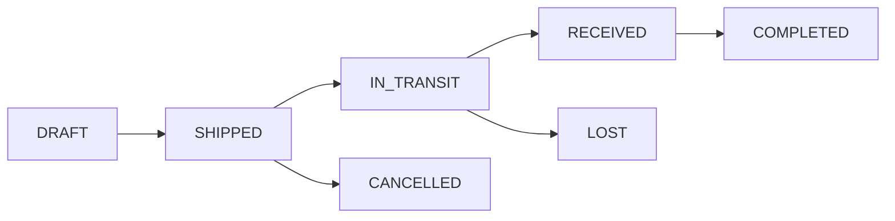
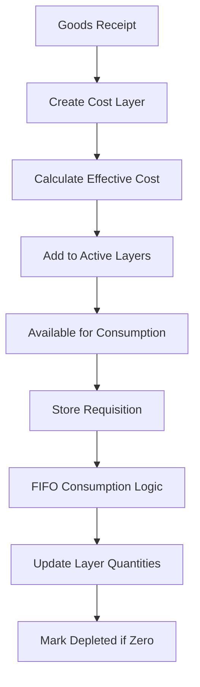
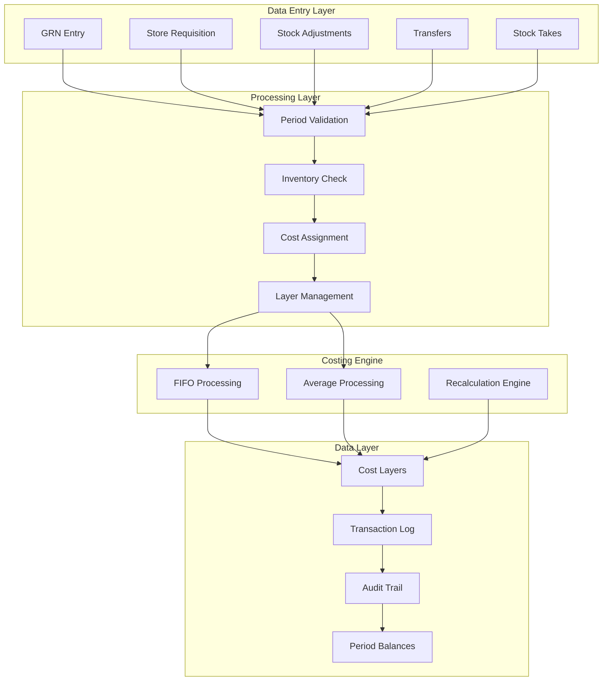

# Inventory Calculations — Domain Rules

## Business rules


---

## Table of Contents

1. [Core Business Rules Overview](#1-core-business-rules-overview)
2. [FIFO Costing Rules & Examples](#2-fifo-costing-rules--examples)
3. [Periodic Average Costing Rules & Examples](#3-periodic-average-costing-rules--examples)
4. [FOC (Free of Charge) Handling](#4-foc-free-of-charge-handling)
5. [Extra Cost Allocation Rules](#5-extra-cost-allocation-rules)
6. [Negative Inventory Rules](#6-negative-inventory-rules)
7. [Transfer Management Rules](#7-transfer-management-rules)
8. [Stock Take Adjustment Rules](#8-stock-take-adjustment-rules)
9. [Period Management Rules](#9-period-management-rules)
10. [Backdating Rules & Recalculation](#10-backdating-rules--recalculation)
11. [Approval Workflow Rules](#11-approval-workflow-rules)
12. [Transaction Priority & Sequencing](#12-transaction-priority--sequencing)
13. [Variance Control Rules](#13-variance-control-rules)
14. [Credit Note (Return) Rules](#14-credit-note-return-rules)
15. [Comprehensive Transaction Scenarios](#15-comprehensive-transaction-scenarios)

---

## 1. Core Business Rules Overview

_(stale — needs rewrite)_

### 1.1 Fundamental Principles

| Rule ID | Business Rule | Enforcement | Exception Handling |
|---------|--------------|-------------|-------------------|
| BR-001 | Each location maintains independent inventory and costing | System | No exceptions |
| BR-002 | Costing method (FIFO/AVG) is set per location, not mixed | System | No exceptions |
| BR-003 | All inventory movements require lot tracking | System | No exceptions |
| BR-004 | Negative inventory is blocked by default | System | Requires override approval |
| BR-005 | Period closure is irreversible without audit approval | System | EOP lock approval required |
| BR-006 | All costs include FOC averaging and extra costs | System | No exceptions |
| BR-007 | Backdating triggers automatic recalculation | System | No exceptions |
| BR-008 | Stock take variances > 5% require approval | Configurable | Manager override |

### 1.2 Location-Based Costing Configuration

```sql
-- Example Configuration
Location: Main Kitchen     → FIFO Costing
Location: Housekeeping     → Periodic Average
Location: F&B Storage      → FIFO Costing
Location: Engineering      → Periodic Average
```

---

## 2. FIFO Costing Rules & Examples

_(stale — needs rewrite)_

### 2.1 FIFO Business Rules

| Rule | Description |
|------|------------|
| FIFO-001 | Oldest inventory consumed first based on receipt date |
| FIFO-002 | Each receipt creates a new cost layer |
| FIFO-003 | Partial layer consumption is allowed |
| FIFO-004 | Depleted layers marked inactive but retained for audit |
| FIFO-005 | Cost is determined at consumption time |

### 2.2 FIFO Transaction Example

**Scenario**: Main Kitchen - Chicken Breast Inventory

#### Initial Receipts:

```
Transaction 1: GRN-2024-0001 (Jan 1, 2024)
Product: Chicken Breast
Quantity: 100 kg @ $8.00/kg = $800.00
Lot: LOT-2024-01-0001

Transaction 2: GRN-2024-0002 (Jan 5, 2024)
Product: Chicken Breast
Quantity: 150 kg @ $8.50/kg = $1,275.00
Lot: LOT-2024-01-0002

Transaction 3: GRN-2024-0003 (Jan 10, 2024)
Product: Chicken Breast
Quantity: 200 kg @ $9.00/kg = $1,800.00
FOC: 50 kg (free)
Total: 250 kg
Effective cost: $1,800 / 250 = $7.20/kg
Lot: LOT-2024-01-0003
```

#### Cost Layer Status After Receipts:

| Lot Number | Receipt Date | Available Qty | Unit Cost | Total Value | Status |
|------------|--------------|---------------|-----------|-------------|---------|
| LOT-2024-01-0001 | Jan 1 | 100 kg | $8.00 | $800.00 | ACTIVE |
| LOT-2024-01-0002 | Jan 5 | 150 kg | $8.50 | $1,275.00 | ACTIVE |
| LOT-2024-01-0003 | Jan 10 | 250 kg | $7.20 | $1,800.00 | ACTIVE |
| **TOTAL** | | **500 kg** | | **$3,875.00** | |

#### Consumption Transaction:

```
Transaction 4: SR-2024-0001 (Jan 15, 2024)
Store Requisition: 300 kg needed for banquet

FIFO Consumption:
1. From LOT-2024-01-0001: 100 kg @ $8.00 = $800.00
2. From LOT-2024-01-0002: 150 kg @ $8.50 = $1,275.00
3. From LOT-2024-01-0003: 50 kg @ $7.20 = $360.00

Total Consumed: 300 kg
Total Cost: $2,435.00
Average Cost per kg: $8.12
```

#### Cost Layer Status After Consumption:

| Lot Number | Available Qty | Unit Cost | Total Value | Status |
|------------|---------------|-----------|-------------|---------|
| LOT-2024-01-0001 | 0 kg | $8.00 | $0.00 | DEPLETED |
| LOT-2024-01-0002 | 0 kg | $8.50 | $0.00 | DEPLETED |
| LOT-2024-01-0003 | 200 kg | $7.20 | $1,440.00 | ACTIVE |
| **TOTAL** | **200 kg** | | **$1,440.00** | |

### 2.3 SQL Implementation Example

```sql
-- FIFO Consumption Calculation
WITH fifo_layers AS (
    SELECT 
        lot_no,
        available_qty,
        final_unit_cost,
        SUM(available_qty) OVER (ORDER BY layer_date, lot_no) as cumulative_qty
    FROM tb_inventory_cost_layer
    WHERE product_id = 'chicken-breast-uuid'
    AND location_id = 'main-kitchen-uuid'
    AND status = 'ACTIVE'
    ORDER BY layer_date, lot_no
),
consumption_calc AS (
    SELECT 
        lot_no,
        CASE 
            WHEN cumulative_qty - available_qty >= 300 THEN 0  -- Already consumed
            WHEN cumulative_qty > 300 THEN cumulative_qty - 300  -- Partial
            ELSE available_qty  -- Full consumption
        END as consumed_qty,
        final_unit_cost
    FROM fifo_layers
    WHERE cumulative_qty - available_qty < 300  -- Only relevant layers
)
SELECT 
    SUM(consumed_qty * final_unit_cost) as total_cost,
    SUM(consumed_qty) as total_qty,
    SUM(consumed_qty * final_unit_cost) / NULLIF(SUM(consumed_qty), 0) as avg_cost
FROM consumption_calc;
```

---

## 3. Periodic Average Costing Rules & Examples

_(stale — needs rewrite)_

### 3.1 Periodic Average Business Rules

| Rule | Description |
|------|------------|
| AVG-001 | Average cost calculated at period end only |
| AVG-002 | All issues during period use the same average cost |
| AVG-003 | Average = (Opening Value + Receipts Value) / (Opening Qty + Receipts Qty) |
| AVG-004 | Cost assigned to issues retroactively at period close |
| AVG-005 | No cost changes allowed after period finalization |

### 3.2 Periodic Average Transaction Example

**Scenario**: Housekeeping Store - Shampoo Bottles (January 2024)

#### Opening Balance (from December 2023):
```
Opening Quantity: 500 bottles
Opening Value: $1,000.00
Opening Average: $2.00/bottle
```

#### January Transactions:

```
Receipt 1: GRN-2024-0010 (Jan 5)
Quantity: 1,000 bottles @ $2.20/bottle = $2,200.00

Receipt 2: GRN-2024-0015 (Jan 15)
Quantity: 800 bottles @ $2.50/bottle = $2,000.00
FOC: 200 bottles
Total: 1,000 bottles
Effective Value: $2,000.00

Receipt 3: GRN-2024-0020 (Jan 25)
Quantity: 500 bottles @ $2.30/bottle = $1,150.00
```

#### Period Average Calculation:

```
Available for Averaging:
- Opening: 500 bottles @ $1,000.00
- Receipts: 2,500 bottles @ $5,350.00
- Total: 3,000 bottles @ $6,350.00

Period Average Cost = $6,350.00 / 3,000 = $2.117/bottle
```

#### January Issues (all at period average):

```
Issue 1: SR-2024-0100 (Jan 8)
Quantity: 300 bottles
Cost: 300 × $2.117 = $635.00

Issue 2: SR-2024-0101 (Jan 18)
Quantity: 500 bottles
Cost: 500 × $2.117 = $1,058.33

Issue 3: SR-2024-0102 (Jan 28)
Quantity: 400 bottles
Cost: 400 × $2.117 = $846.67

Total Issues: 1,200 bottles @ $2,540.00
```

#### Closing Balance:

```
Closing Quantity = 3,000 - 1,200 = 1,800 bottles
Closing Value = 1,800 × $2.117 = $3,810.00
Closing Average = $2.117/bottle

This becomes February's opening balance
```

### 3.3 Period-End Processing SQL

```sql
-- Calculate Period Average
DECLARE
    v_opening_qty DECIMAL := 500;
    v_opening_value DECIMAL := 1000.00;
    v_receipt_qty DECIMAL;
    v_receipt_value DECIMAL;
    v_period_avg DECIMAL;
BEGIN
    -- Get total receipts
    SELECT 
        SUM(total_qty),
        SUM(total_layer_cost)
    INTO v_receipt_qty, v_receipt_value
    FROM tb_inventory_cost_layer
    WHERE product_id = 'shampoo-uuid'
    AND location_id = 'housekeeping-uuid'
    AND DATE_TRUNC('month', layer_date) = '2024-01-01';
    
    -- Calculate average
    v_period_avg := (v_opening_value + v_receipt_value) / 
                    (v_opening_qty + v_receipt_qty);
    
    -- Update all issues with average cost
    UPDATE tb_inventory_transaction_detail itd
    SET 
        cost_per_unit = v_period_avg,
        total_cost = qty * v_period_avg
    FROM tb_inventory_transaction it
    WHERE it.id = itd.inventory_transaction_id
    AND it.inventory_doc_type IN ('store_requisition', 'stock_out')
    AND DATE_TRUNC('month', it.created_at) = '2024-01-01'
    AND itd.product_id = 'shampoo-uuid'
    AND itd.location_id = 'housekeeping-uuid';
END;
```

---

## 4. FOC (Free of Charge) Handling

### 4.1 FOC Business Rules

| Rule | Description |
|------|------------|
| FOC-001 | FOC quantities are averaged into the batch cost |
| FOC-002 | FOC items do not create separate zero-cost layers |
| FOC-003 | Effective unit cost = Total Paid Amount / (Paid Qty + FOC Qty) |
| FOC-004 | FOC quantities affect inventory quantity but not purchase value |

### 4.2 FOC Transaction Example

**Scenario**: Purchase with FOC Items

```
GRN-2024-0030 (Jan 20, 2024)
Vendor: ABC Supplies
```

#### Line Item 1: Toilet Paper
```
Purchased: 1,000 rolls @ $0.50/roll = $500.00
FOC: 200 rolls (20% bonus)
Total Quantity: 1,200 rolls

Cost Calculation:
- Line Amount: $500.00
- Total Quantity: 1,200 rolls
- Effective Unit Cost: $500.00 / 1,200 = $0.417/roll

Result: 1,200 rolls at $0.417/roll (not 1,000 @ $0.50 + 200 @ $0.00)
```

#### Line Item 2: Hand Soap
```
Purchased: 500 bottles @ $3.00/bottle = $1,500.00
FOC: 100 bottles (buy 5 get 1 free)
Total Quantity: 600 bottles

Cost Calculation:
- Line Amount: $1,500.00
- Total Quantity: 600 bottles
- Effective Unit Cost: $1,500.00 / 600 = $2.50/bottle
```

#### With Extra Costs Applied:
```
Total GRN Value: $2,000.00
Freight Cost: $100.00
Insurance: $50.00
Total Extra: $150.00

Allocation by Value:
- Toilet Paper: 25% of value = $37.50 extra
  Final cost: ($500 + $37.50) / 1,200 = $0.448/roll
  
- Hand Soap: 75% of value = $112.50 extra
  Final cost: ($1,500 + $112.50) / 600 = $2.688/bottle
```

---

## 5. Extra Cost Allocation Rules

_(stale — needs rewrite)_

### 5.1 Extra Cost Business Rules

| Rule | Description |
|------|------------|
| EXTRA-001 | Extra costs allocated proportionally by value |
| EXTRA-002 | Allocation happens after FOC calculation |
| EXTRA-003 | Extra costs become part of inventory value |
| EXTRA-004 | Cannot allocate negative extra costs |

### 5.2 Extra Cost Allocation Example

**Scenario**: Import shipment with multiple charges

```
GRN-2024-0040 (Feb 1, 2024)
Vendor: International Foods
```

#### Products:
```
1. Olive Oil: 100 bottles @ $10/bottle = $1,000 (20% of total)
2. Pasta: 500 packs @ $2/pack = $1,000 (20% of total)
3. Wine: 50 bottles @ $30/bottle = $1,500 (30% of total)
4. Cheese: 100 kg @ $15/kg = $1,500 (30% of total)

Subtotal: $5,000
```

#### Extra Costs:
```
Ocean Freight: $800
Customs Duty: $500
Port Handling: $200
Insurance: $100
Total Extra: $1,600
```

#### Allocation Calculation:

| Product | Base Value | % of Total | Allocated Extra | Final Cost | Unit Cost |
|---------|------------|------------|-----------------|------------|-----------|
| Olive Oil | $1,000 | 20% | $320 | $1,320 | $13.20/bottle |
| Pasta | $1,000 | 20% | $320 | $1,320 | $2.64/pack |
| Wine | $1,500 | 30% | $480 | $1,980 | $39.60/bottle |
| Cheese | $1,500 | 30% | $480 | $1,980 | $19.80/kg |
| **TOTAL** | **$5,000** | **100%** | **$1,600** | **$6,600** | |

### 5.3 SQL Implementation

```sql
-- Allocate extra costs
WITH grn_values AS (
    SELECT 
        id,
        product_id,
        (received_qty + COALESCE(foc_qty, 0)) * price as line_value,
        SUM((received_qty + COALESCE(foc_qty, 0)) * price) 
            OVER (PARTITION BY good_received_note_id) as total_value
    FROM tb_good_received_note_detail
    WHERE good_received_note_id = 'grn-uuid'
),
extra_costs AS (
    SELECT SUM(cost_amount) as total_extra
    FROM tb_grn_extra_cost
    WHERE grn_id = 'grn-uuid'
)
UPDATE tb_inventory_cost_layer cl
SET 
    allocated_extra_cost = (gv.line_value / gv.total_value) * ec.total_extra,
    total_layer_cost = line_amount + ((gv.line_value / gv.total_value) * ec.total_extra),
    final_unit_cost = (line_amount + ((gv.line_value / gv.total_value) * ec.total_extra)) / total_qty
FROM grn_values gv, extra_costs ec
WHERE cl.grn_detail_id = gv.id;
```

---

## 6. Negative Inventory Rules

_(stale — needs rewrite)_

### 6.1 Negative Inventory Business Rules

| Rule | Description |
|------|------------|
| NEG-001 | Negative inventory blocked by default |
| NEG-002 | Override requires management approval with reason |
| NEG-003 | Provisional cost assigned using last known cost |
| NEG-004 | Automatic true-up when stock arrives |
| NEG-005 | Maximum negative period: 24 hours (configurable) |
| NEG-006 | Cost variance posted to adjustment account |

### 6.2 Negative Inventory Example

**Scenario**: Emergency requisition exceeds available stock

```
Product: Cleaning Bleach
Location: Housekeeping
Available: 20 liters
```

#### Transaction Attempt:

```
SR-2024-0200 (Feb 10, 2024 14:00)
Requested: 50 liters
Available: 20 liters
Shortage: 30 liters

System Response: BLOCKED
Reason: Insufficient inventory (need 30 liters more)
```

#### Override Approval:

```
Override Request #OR-2024-001
Requested By: Housekeeping Supervisor
Reason: Emergency cleaning for VIP arrival
Approved By: Hotel Manager
Approval Time: Feb 10, 2024 14:15
Max Negative: 30 liters
Max Duration: 24 hours
```

#### Processing with Override:

```
Consumption:
1. Physical inventory: 20 liters @ $5.00/liter = $100.00
2. Negative inventory: 30 liters @ $5.00/liter = $150.00 (provisional)

Total Cost Assigned: $250.00
Status: 30 liters negative
```

#### Resolution (when stock arrives):

```
GRN-2024-0050 (Feb 10, 2024 18:00)
Received: 100 liters @ $5.50/liter = $550.00

Resolution Process:
1. Cover negative: 30 liters @ $5.50 = $165.00
2. Cost adjustment: $165.00 - $150.00 = $15.00 variance
3. Remaining stock: 70 liters @ $5.50/liter

Variance Posted:
- Original provisional: $150.00
- Actual cost: $165.00
- Variance: $15.00 (posted to cost adjustment account)
```

### 6.3 Negative Inventory Monitoring

```sql
-- Monitor negative inventory
CREATE VIEW v_negative_inventory_alert AS
SELECT 
    p.name as product_name,
    l.name as location_name,
    ni.negative_qty,
    ni.provisional_total_cost,
    ni.went_negative_at,
    EXTRACT(HOUR FROM NOW() - ni.went_negative_at) as hours_negative,
    CASE 
        WHEN NOW() - ni.went_negative_at > INTERVAL '24 hours' THEN 'CRITICAL'
        WHEN NOW() - ni.went_negative_at > INTERVAL '12 hours' THEN 'WARNING'
        ELSE 'MONITORING'
    END as alert_level
FROM tb_negative_inventory ni
JOIN tb_product p ON ni.product_id = p.id
JOIN tb_location l ON ni.location_id = l.id
WHERE ni.status = 'OPEN'
ORDER BY ni.went_negative_at;
```

---

## 7. Transfer Management Rules

### 7.1 Transfer Business Rules

| Rule | Description |
|------|------------|
| TRANS-001 | Transfers move inventory at actual cost |
| TRANS-002 | Source location must have sufficient inventory |
| TRANS-003 | In-transit inventory tracked separately |
| TRANS-004 | Variance between shipped and received requires approval |
| TRANS-005 | Cost basis maintained from source location |

### 7.2 Transfer Transaction Example

**Scenario**: Transfer from Central Store to Kitchen

```
Transfer #TRF-2024-0001 (Feb 15, 2024)
From: Central Store (FIFO)
To: Main Kitchen (FIFO)
```

#### Transfer Details:

```
Product: Cooking Oil
Requested: 50 liters
```

#### Source Location Inventory (Central Store):

| Lot | Available | Cost/Liter |
|-----|-----------|------------|
| LOT-2024-01-0010 | 20 L | $4.00 |
| LOT-2024-01-0011 | 25 L | $4.20 |
| LOT-2024-01-0012 | 30 L | $4.50 |

#### Shipment (FIFO Consumption):

```
Shipped: 50 liters
Consumption:
1. LOT-2024-01-0010: 20 L @ $4.00 = $80.00
2. LOT-2024-01-0011: 25 L @ $4.20 = $105.00
3. LOT-2024-01-0012: 5 L @ $4.50 = $22.50

Total Cost: $207.50
Average Cost: $4.15/liter
Status: IN_TRANSIT
```

#### Receipt at Destination:

```
Received: 48 liters (2 liters damaged in transit)
New Lot at Kitchen: LOT-2024-02-0001

Cost Assignment:
- Transferred Cost: $207.50
- Received Quantity: 48 liters
- Final Unit Cost: $207.50 / 48 = $4.32/liter

Variance:
- Expected: 50 liters
- Received: 48 liters
- Variance: 2 liters @ $4.15 = $8.30 (written off)
```

### 7.3 Transfer Status Workflow



---

## 8. Stock Take Adjustment Rules

### 8.1 Stock Take Business Rules

| Rule | Description |
|------|------------|
| STOCK-001 | Physical count overrides system quantity |
| STOCK-002 | Variance > 5% requires approval |
| STOCK-003 | Adjustment creates stock in/out transaction |
| STOCK-004 | Cost assigned based on location method |
| STOCK-005 | Spot checks allowed without full count |

### 8.2 Stock Take Example

**Scenario**: Monthly stock take at Main Kitchen

```
Stock Take #STK-2024-01-001 (Jan 31, 2024)
Location: Main Kitchen
Type: Full Physical Count
```

#### Count Results:

| Product | System Qty | Physical Qty | Variance | % Variance | Action |
|---------|------------|--------------|----------|------------|---------|
| Chicken Breast | 200 kg | 195 kg | -5 kg | -2.5% | Auto-adjust |
| Beef Tenderloin | 50 kg | 48 kg | -2 kg | -4% | Auto-adjust |
| Salmon Fillet | 30 kg | 25 kg | -5 kg | -16.7% | **Requires Approval** |
| Rice | 100 kg | 102 kg | +2 kg | +2% | Auto-adjust |
| Cooking Oil | 75 L | 90 L | +15 L | +20% | **Requires Approval** |

#### Variance Analysis for Salmon:

```
System Quantity: 30 kg
Physical Count: 25 kg
Variance: -5 kg (-16.7%)
Threshold: 5%
Status: REQUIRES APPROVAL

Investigation Notes:
- 3 kg used for staff meal (not recorded)
- 2 kg spoilage (not reported)
Approved By: F&B Manager
Approval Time: Jan 31, 2024 18:00
```

#### Adjustment Entries:

```sql
-- For shortage (Salmon)
INSERT INTO tb_inventory_transaction (inventory_doc_type, inventory_doc_no)
VALUES ('stock_out', 'STK-ADJ-2024-01-001');

INSERT INTO tb_inventory_transaction_detail (
    inventory_transaction_id,
    product_id,
    location_id,
    qty,
    cost_per_unit,
    total_cost
) VALUES (
    'txn-uuid',
    'salmon-uuid',
    'kitchen-uuid',
    5,  -- shortage quantity
    45.00,  -- current FIFO cost
    225.00
);

-- For overage (Cooking Oil)
INSERT INTO tb_inventory_transaction (inventory_doc_type, inventory_doc_no)
VALUES ('stock_in', 'STK-ADJ-2024-01-002');

-- Overage uses last known cost
INSERT INTO tb_inventory_transaction_detail (
    inventory_transaction_id,
    product_id,
    location_id,
    qty,
    cost_per_unit,
    total_cost
) VALUES (
    'txn-uuid',
    'oil-uuid',
    'kitchen-uuid',
    15,  -- overage quantity
    4.15,  -- last known cost
    62.25
);
```

---

## 9. Period Management Rules

### 9.1 Period Business Rules

| Rule | Description |
|------|------------|
| PERIOD-001 | Periods follow calendar months |
| PERIOD-002 | Each location can close independently |
| PERIOD-003 | Soft close allows 3-5 days for adjustments |
| PERIOD-004 | No backdating to locked periods |
| PERIOD-005 | Cost changes prohibited after closure |

### 9.2 Period Closing Example

**Scenario**: January 2024 Month-End Close

#### Timeline:

```
Jan 31, 2024 (Day 0) - Last operational day
├── 23:59 - Last transaction cutoff
└── 24:00 - February period opens

Feb 1-3, 2024 - Soft Close Window
├── Feb 1 - Initial reconciliation
├── Feb 2 - Corrections and adjustments
└── Feb 3 - Final approval

Feb 4, 2024 - Hard Close
├── 00:00 - January period closed
├── Average costs calculated (AVG locations)
└── Reports generated

Feb 15, 2024 - Audit Lock
└── Period locked after audit review
```

#### Soft Close Activities:

```sql
-- Day 1: Check pending transactions
SELECT 
    COUNT(*) as pending_count,
    STRING_AGG(document_no, ', ') as pending_docs
FROM tb_inventory_transaction
WHERE DATE(created_at) BETWEEN '2024-01-01' AND '2024-01-31'
AND status != 'COMPLETED';

-- Day 2: Process late GRNs
-- GRN dated Jan 30 but entered Feb 1
INSERT INTO tb_good_received_note (
    grn_no, 
    grn_date,  -- Backdated
    created_at  -- Actual entry
) VALUES (
    'GRN-2024-0199',
    '2024-01-30 15:00:00',  -- Within period
    '2024-02-01 09:00:00'   -- During soft close
);

-- Day 3: Calculate average costs
SELECT calculate_period_average_cost('jan-2024-period-uuid', 'housekeeping-uuid');
```

---

## 10. Backdating Rules & Recalculation

_(stale — needs rewrite)_

### 10.1 Backdating Business Rules

| Rule | Description |
|------|------------|
| BACK-001 | Backdating allowed to open/soft-closed periods only |
| BACK-002 | Triggers automatic recalculation from transaction date |
| BACK-003 | Current month: immediate recalculation |
| BACK-004 | Previous months: batch recalculation |
| BACK-005 | Cost changes tracked in audit log |

### 10.2 Backdating Example

**Scenario**: Late GRN entry affecting FIFO costs

```
Current Date: Feb 15, 2024
Backdated Transaction: GRN for Jan 20, 2024
```

#### Original Timeline (before backdating):

```
Jan 15: GRN-001 → 100 units @ $10 = $1,000
Jan 18: SR-001 → Consumed 80 units @ $10 = $800
Jan 22: GRN-002 → 50 units @ $12 = $600
Jan 25: SR-002 → Consumed 60 units
         ├── 20 @ $10 = $200 (remaining from GRN-001)
         └── 40 @ $12 = $480 (from GRN-002)
         Total: $680
```

#### Backdated Entry:

```
Jan 20: GRN-003 (BACKDATED) → 75 units @ $9 = $675
```

#### Recalculated Timeline:

```
Jan 15: GRN-001 → 100 units @ $10 = $1,000
Jan 18: SR-001 → 80 units @ $10 = $800 (NO CHANGE)
Jan 20: GRN-003 → 75 units @ $9 = $675 (NEW)
Jan 22: GRN-002 → 50 units @ $12 = $600
Jan 25: SR-002 → 60 units (RECALCULATED)
         ├── 20 @ $10 = $200 (from GRN-001)
         └── 40 @ $9 = $360 (from GRN-003) ← CHANGED
         Total: $560 (was $680)
```

#### Impact Summary:

```sql
-- Cost change log
INSERT INTO tb_cost_change_log (
    transaction_id,
    old_cost,
    new_cost,
    cost_difference,
    triggered_by,
    backdate_control_id
) VALUES (
    'SR-002-uuid',
    680.00,
    560.00,
    -120.00,
    'BACKDATE',
    'backdate-control-uuid'
);

-- Notification
Cost Impact Report:
- Transaction: SR-002
- Original Cost: $680.00
- Recalculated Cost: $560.00
- Savings: $120.00
- Affected Period: January 2024
- Recalculation Time: 2.3 seconds
```

---

## 11. Approval Workflow Rules

_(stale — needs rewrite)_

### 11.1 Approval Business Rules

| Rule | Description |
|------|------------|
| APPR-001 | Approval required based on threshold configuration |
| APPR-002 | Escalation if not approved within SLA |
| APPR-003 | Approval delegation allowed with audit trail |
| APPR-004 | Bulk approval permitted for same approval type |

### 11.2 Approval Scenarios

#### Scenario 1: Stock Take Variance Approval

```
Threshold Configuration:
- Auto-approve: ≤ 5% variance
- Supervisor: 5-10% variance
- Manager: 10-20% variance
- Director: > 20% variance

Transaction:
Product: Lobster
System: 20 kg
Physical: 15 kg
Variance: -5 kg (25%)
Required Approval: Director

Workflow:
1. System creates approval request
2. Notification to Director
3. If no response in 4 hours → Escalate to GM
4. Approval/Rejection with notes
5. Adjustment processed or cancelled
```

#### Scenario 2: Negative Inventory Override

```sql
-- Approval request creation
INSERT INTO tb_approval_request (
    request_type,
    entity_type,
    entity_id,
    requested_by_id,
    approval_level_required,
    details,
    expires_at
) VALUES (
    'NEGATIVE_INVENTORY',
    'store_requisition',
    'SR-2024-0300',
    'user-uuid',
    'MANAGER',
    jsonb_build_object(
        'product', 'Champagne',
        'requested_qty', 12,
        'available_qty', 8,
        'shortage', 4,
        'reason', 'VIP event tonight'
    ),
    NOW() + INTERVAL '2 hours'
);

-- Approval processing
UPDATE tb_approval_request
SET 
    status = 'APPROVED',
    approved_by_id = 'manager-uuid',
    approved_at = NOW(),
    approval_notes = 'Approved for VIP event. Ensure reorder tomorrow.'
WHERE id = 'approval-request-uuid';
```

---

## 12. Transaction Priority & Sequencing

### 12.1 Priority Rules

| Priority | Transaction Type | Description |
|----------|-----------------|-------------|
| 100 | Stock Take | Highest - establishes correct quantities |
| 200 | Stock In | Positive adjustments |
| 201 | GRN | Regular receipts |
| 202 | Transfer In | Incoming transfers |
| 300 | Transfer Out | Outgoing transfers |
| 301 | Credit Note | Returns to vendor |
| 302 | Store Requisition | Normal consumption |
| 303 | Stock Out | Negative adjustments |

### 12.2 Same-Day Transaction Example

**Scenario**: Multiple transactions on Feb 20, 2024

```
Transactions (order received):
1. 09:00 - SR-001: Request 50 units
2. 10:00 - GRN-001: Receive 100 units
3. 11:00 - STK-001: Stock count shows 145 units
4. 14:00 - SR-002: Request 30 units
5. 15:00 - Transfer-001: Send 20 units
```

#### System Processing Order:

```
1. STK-001 (Priority 100): Establish base quantity = 145 units
2. GRN-001 (Priority 201): Add 100 units = 245 units
3. Transfer-001 (Priority 300): Remove 20 units = 225 units
4. SR-001 (Priority 302): Remove 50 units = 175 units
5. SR-002 (Priority 302): Remove 30 units = 145 units

Note: SR-001 and SR-002 processed by timestamp since same priority
```

---

## 13. Variance Control Rules

_(stale — needs rewrite)_

### 13.1 Variance Threshold Configuration

| Location Type | Product Category | Qty Variance | Value Variance | Approval Level |
|--------------|-----------------|--------------|----------------|----------------|
| Kitchen | Proteins | 5% | $500 | Supervisor |
| Kitchen | Dry Goods | 10% | $200 | Auto |
| Bar | Spirits | 2% | $1000 | Manager |
| Housekeeping | Supplies | 15% | $300 | Supervisor |
| Engineering | Parts | 5% | $2000 | Manager |

### 13.2 Variance Calculation Example

```sql
-- Variance analysis for stock take
WITH variance_calc AS (
    SELECT 
        st.product_id,
        p.name as product_name,
        icl.current_avg_cost,
        st.system_qty,
        st.physical_qty,
        st.physical_qty - st.system_qty as variance_qty,
        ROUND(((st.physical_qty - st.system_qty) / NULLIF(st.system_qty, 0)) * 100, 2) as variance_pct,
        (st.physical_qty - st.system_qty) * icl.current_avg_cost as variance_value
    FROM tb_stock_take_detail st
    JOIN tb_product p ON st.product_id = p.id
    JOIN (
        SELECT 
            product_id,
            AVG(final_unit_cost) as current_avg_cost
        FROM tb_inventory_cost_layer
        WHERE status = 'ACTIVE'
        GROUP BY product_id
    ) icl ON icl.product_id = st.product_id
    WHERE st.stock_take_id = 'stk-uuid'
)
SELECT 
    *,
    CASE 
        WHEN ABS(variance_pct) <= 5 THEN 'AUTO_APPROVE'
        WHEN ABS(variance_pct) <= 10 THEN 'SUPERVISOR'
        WHEN ABS(variance_pct) <= 20 THEN 'MANAGER'
        ELSE 'DIRECTOR'
    END as required_approval
FROM variance_calc
ORDER BY ABS(variance_value) DESC;
```

---

## 14. Credit Note (Return) Rules

### 14.1 Credit Note Business Rules

| Rule | Description |
|------|------------|
| CN-001 | Returns create positive inventory adjustment |
| CN-002 | Original cost used if traceable to specific GRN |
| CN-003 | Period average used if cost not traceable |
| CN-004 | Quality issues require photo documentation |
| CN-005 | Credit notes affect period cost calculations |

### 14.2 Credit Note Example

**Scenario**: Return of damaged goods

```
Original GRN: GRN-2024-0100 (Feb 1, 2024)
Product: Wine Glasses
Received: 144 pieces @ $5.00 = $720.00
Lot: LOT-2024-02-0100
```

#### Return Transaction:

```
Credit Note: CN-2024-0010 (Feb 25, 2024)
Reason: 24 pieces damaged (broken in storage)
```

#### Cost Assignment Options:

##### Option 1: Traceable to Original GRN
```
Return Quantity: 24 pieces
Original Cost: $5.00/piece
Return Value: $120.00
New Lot: LOT-2024-02-0200 (negative adjustment)

Inventory Impact:
- Original Layer: 144 pieces reduced to 120 pieces
- Value adjusted: $720 - $120 = $600
```

##### Option 2: Period Average (if not traceable)
```
Current Period Average: $5.25/piece
Return Value: 24 × $5.25 = $126.00

Cost Variance: $126 - $120 = $6.00 (absorbed in period)
```

---

## 15. Comprehensive Transaction Scenarios

_(stale — needs rewrite)_

### 15.1 Complete Monthly Cycle Example

**Hotel**: Paradise Resort (250 rooms)
**Month**: January 2024
**Location**: Main Kitchen (FIFO)

#### Week 1 Transactions:

```
Jan 2: Opening Balance
- Chicken: 50 kg @ $8.00/kg
- Beef: 30 kg @ $25.00/kg
- Rice: 100 kg @ $2.00/kg

Jan 3: GRN-001
- Chicken: 200 kg @ $8.50/kg = $1,700
- FOC: 25 kg
- Total: 225 kg, Effective: $7.56/kg

Jan 4: SR-001 (Lunch Service)
- Chicken: 60 kg
  └── 50 kg @ $8.00 = $400
  └── 10 kg @ $7.56 = $75.56
  Total: $475.56

Jan 5: Emergency Transfer IN
- Rice: 50 kg @ $2.10/kg from Store
```

#### Cost Layer Evolution:

| Date | Transaction | Chicken Layers | Total Value |
|------|------------|---------------|-------------|
| Jan 2 | Opening | 50kg @ $8.00 | $400 |
| Jan 3 | GRN-001 | 50kg @ $8.00<br>225kg @ $7.56 | $2,100 |
| Jan 4 | SR-001 | 0kg @ $8.00<br>215kg @ $7.56 | $1,624.44 |
| Jan 5 | - | No change | $1,624.44 |

#### Week 2-4 Summary:

```
Total Receipts: 15 GRNs
Total Issues: 85 Store Requisitions
Stock Takes: 2 (mid-month spot check, month-end full)
Transfers: 5 IN, 3 OUT
Credit Notes: 1 (damaged vegetables)
Adjustments: 3 (spillage, spoilage)
```

#### Month-End Processing:

```sql
-- January 31, 2024 End of Day
BEGIN TRANSACTION;

-- 1. Complete pending transactions
UPDATE tb_inventory_transaction
SET status = 'COMPLETED'
WHERE DATE(created_at) <= '2024-01-31'
AND status = 'PENDING';

-- 2. Process final stock take
SELECT process_stock_take_with_variance('STK-2024-01-31');

-- 3. Calculate FIFO costs
SELECT finalize_fifo_costs('2024-01-01', '2024-01-31', 'main-kitchen-uuid');

-- 4. Generate cost report
INSERT INTO tb_monthly_cost_summary
SELECT 
    'main-kitchen-uuid',
    '2024-01',
    SUM(CASE WHEN doc_type = 'GRN' THEN total_cost ELSE 0 END) as total_purchases,
    SUM(CASE WHEN doc_type = 'SR' THEN total_cost ELSE 0 END) as total_consumption,
    SUM(available_qty * final_unit_cost) as closing_inventory_value
FROM tb_inventory_cost_layer
WHERE location_id = 'main-kitchen-uuid';

COMMIT;

-- 5. Soft close period
SELECT soft_close_period('jan-2024-period', 'main-kitchen-uuid', 'user-uuid');
```

### 15.2 Complex Scenario: Multi-Location with Mixed Costing

**Scenario**: Hotel-wide champagne requisition for New Year's Eve

```
Locations:
- Central Store: 50 bottles (FIFO)
- F&B Store: 30 bottles (AVG)
- Banquet Store: 20 bottles (FIFO)
Need: 150 bottles for event
```

#### Inventory Check:

```sql
-- Check available inventory
SELECT 
    l.name as location,
    l.costing_method,
    SUM(icl.available_qty) as available,
    AVG(icl.final_unit_cost) as avg_cost
FROM tb_inventory_cost_layer icl
JOIN tb_location l ON icl.location_id = l.id
WHERE icl.product_id = 'champagne-uuid'
AND icl.status = 'ACTIVE'
GROUP BY l.name, l.costing_method;

Result:
Central Store  | FIFO | 50  | $45.00
F&B Store     | AVG  | 30  | $43.50
Banquet Store | FIFO | 20  | $46.00
Total: 100 bottles (need 50 more)
```

#### Solution Process:

```
1. Issue from all locations (100 bottles)
2. Emergency purchase (50 bottles)
3. Direct delivery to event

Transactions:
- SR-001: 50 from Central @ FIFO cost = $2,250
- SR-002: 30 from F&B @ $43.50 = $1,305
- SR-003: 20 from Banquet @ FIFO = $920
- GRN-001: 50 emergency @ $50 = $2,500
- Direct Issue: 50 @ $50 = $2,500

Total Event Cost: $9,475
Average Cost per Bottle: $63.17
```

### 15.3 Year-End Scenario with Audit Adjustments

**Scenario**: December 31, 2024 Year-End Close with Audit

```
Discoveries during audit (January 15, 2025):
1. Unrecorded GRN from December 28
2. Mathematical error in stock take
3. Transfer recorded to wrong location
```

#### Required Corrections:

```sql
-- Since December is LOCKED, need special approval
INSERT INTO tb_audit_adjustment_request (
    period_id,
    adjustment_type,
    details,
    impact_assessment,
    requested_by
) VALUES (
    'dec-2024-period',
    'MULTIPLE_CORRECTIONS',
    jsonb_build_object(
        'grn_missing', 'GRN-2024-1299',
        'stock_error', 'STK-2024-12-31',
        'transfer_error', 'TRF-2024-0899'
    ),
    jsonb_build_object(
        'inventory_impact', 5420.00,
        'cogs_impact', -3200.00
    ),
    'external-auditor-uuid'
);

-- After approval, special adjustment posted
SELECT execute_audit_adjustment('adjustment-request-uuid', 'cfo-approval-token');
```

---

## Business Rules Validation Matrix

_(stale — needs rewrite)_

### Validation Checkpoints

| Checkpoint | Rule | Validation Query | Expected Result |
|------------|------|------------------|-----------------|
| Daily Close | No negative inventory | `SELECT COUNT(*) FROM tb_negative_inventory WHERE status = 'OPEN'` | 0 |
| Period Close | All transactions complete | `SELECT COUNT(*) FROM tb_transaction_sequence WHERE processed = FALSE` | 0 |
| Stock Take | Variance threshold | `SELECT COUNT(*) FROM tb_stock_take_approval WHERE status = 'PENDING'` | 0 |
| Month End | Cost integrity | `SELECT * FROM validate_cost_integrity()` | ALL PASS |
| Audit | No unauthorized changes | `SELECT COUNT(*) FROM tb_audit_log WHERE period_locked = TRUE` | 0 |

---

## Appendix: Quick Reference Tables

### A.1 Document Number Formats

| Document Type | Format | Example |
|--------------|--------|---------|
| GRN | GRN-YYYY-NNNN | GRN-2024-0001 |
| Store Requisition | SR-YYYY-NNNN | SR-2024-0001 |
| Transfer | TRF-YYYY-NNNN | TRF-2024-0001 |
| Credit Note | CN-YYYY-NNNN | CN-2024-0001 |
| Stock Take | STK-YYYY-MM-NNN | STK-2024-01-001 |
| Adjustment | ADJ-YYYY-NNNN | ADJ-2024-0001 |

### A.2 Status Codes

| Entity | Status Options |
|--------|---------------|
| Period | OPEN, SOFT_CLOSED, CLOSED, LOCKED |
| Transaction | DRAFT, PENDING, COMPLETED, CANCELLED |
| Transfer | DRAFT, SHIPPED, IN_TRANSIT, RECEIVED, COMPLETED |
| Approval | PENDING, APPROVED, REJECTED, EXPIRED |
| Inventory Layer | ACTIVE, DEPLETED |

### A.3 Cost Method Summary

| Method | When Cost Assigned | Cost Basis | Recalculation |
|--------|-------------------|------------|---------------|
| FIFO | At consumption | Actual layers | If backdated |
| Average | At period end | Period average | End of period |

---

## Conclusion

These business rules and transaction examples provide a comprehensive guide for implementing and operating the hotel inventory management system. The rules ensure:

1. **Consistency** - Same rules applied across all locations
2. **Accuracy** - Precise cost tracking with audit trails
3. **Control** - Approval workflows for exceptions
4. **Flexibility** - Support for different costing methods
5. **Compliance** - Complete documentation for audits

The system handles the complexity of hotel operations while maintaining the simplicity needed for daily use by operational staff.

---

**Document Version**: 1.0  
**Last Updated**: 2024  
**Total Examples**: 50+  
**Business Rules**: 100+  

---

*End of Business Rules Document*
## Functional requirements

## FIFO (First-In-First-Out) Costing Method
### Hotel Inventory Management System

**Document Version**: 1.0  
**Date**: 2024  
**Status**: Draft

---

## Table of Contents

1. [Introduction](#1-introduction)
2. [Functional Overview](#2-functional-overview)
3. [Core FIFO Requirements](#3-core-fifo-requirements)
4. [Cost Layer Management](#4-cost-layer-management)
5. [Consumption Processing](#5-consumption-processing)
6. [Integration Requirements](#6-integration-requirements)
7. [Data Requirements](#7-data-requirements)
8. [User Interface Requirements](#8-user-interface-requirements)
9. [Reporting Requirements](#9-reporting-requirements)
10. [Performance Requirements](#10-performance-requirements)
11. [Error Handling Requirements](#11-error-handling-requirements)
12. [Audit and Compliance](#12-audit-and-compliance)

---

## 1. Introduction

### 1.1 Purpose
This document defines the functional requirements for implementing the FIFO (First-In-First-Out) costing method in the Hotel Inventory Management System. FIFO ensures that the oldest inventory is consumed first, maintaining accurate cost tracking for hospitality operations.

### 1.2 Scope
These requirements cover:
- FIFO cost layer creation and management
- Consumption calculation algorithms
- Integration with receipts, transfers, and adjustments
- Cost recalculation for backdated transactions
- Reporting and audit trail requirements

### 1.3 Definitions

| Term | Definition |
|------|------------|
| Cost Layer | A batch of inventory received at a specific cost |
| Layer Date | The date when inventory was received |
| Consumption | The process of issuing inventory using FIFO logic |
| Effective Cost | The calculated cost after including FOC and extra costs |
| Active Layer | A cost layer with available inventory |
| Depleted Layer | A cost layer with zero available inventory |

---

## 2. Functional Overview

### 2.1 FIFO Process Flow



### 2.2 Key Business Rules Applied

- **BR-001**: Each location maintains independent FIFO layers
- **BR-003**: All movements require lot tracking
- **BR-007**: Backdating triggers automatic recalculation
- **FIFO-001**: Oldest inventory consumed first based on receipt date
- **FIFO-005**: Cost determined at consumption time

---

## 3. Core FIFO Requirements

### 3.1 FIFO Configuration

**FR-FIFO-001**: System Configuration
- The system SHALL allow configuration of FIFO costing method at the location level
- The system SHALL NOT allow mixed costing methods within a single location
- The system SHALL maintain FIFO configuration in the location master

**FR-FIFO-002**: Product Eligibility
- The system SHALL apply FIFO to all inventory-tracked products
- The system SHALL support both direct purchase and manufactured items
- The system SHALL handle unit of measure conversions within FIFO logic

### 3.2 FIFO Processing Rules

**FR-FIFO-003**: Consumption Sequence
- The system SHALL consume inventory in strict date order (oldest first)
- The system SHALL use receipt timestamp for same-date ordering
- The system SHALL allow partial layer consumption

**FR-FIFO-004**: Cost Determination
- The system SHALL calculate cost at the time of consumption
- The system SHALL maintain cost accuracy to 4 decimal places
- The system SHALL round final costs to 2 decimal places for accounting

---

## 4. Cost Layer Management

### 4.1 Layer Creation

**FR-LAYER-001**: Layer Generation
- The system SHALL create a new cost layer for each receipt transaction:
  - Goods Received Note (GRN)
  - Stock In adjustment
  - Transfer In receipt
  - Credit Note return
- Each layer SHALL have a unique identifier (lot number)

**FR-LAYER-002**: Layer Attributes
Required fields for each cost layer:
- Layer ID (UUID)
- Product ID
- Location ID
- Lot Number
- Receipt Date/Time
- Original Quantity
- Available Quantity
- Base Unit Cost
- FOC Quantity
- Allocated Extra Cost
- Effective Unit Cost
- Total Layer Value
- Status (ACTIVE/DEPLETED)
- Source Document Type
- Source Document ID

### 4.2 FOC and Extra Cost Handling

**FR-LAYER-003**: FOC Processing
- The system SHALL average FOC quantities into the batch cost
- Calculation: Effective Cost = Total Paid Amount / (Paid Qty + FOC Qty)
- The system SHALL NOT create separate zero-cost layers for FOC items

**FR-LAYER-004**: Extra Cost Allocation
- The system SHALL allocate extra costs proportionally by line value
- The system SHALL include allocated costs in the final unit cost
- Supported extra costs:
  - Freight charges
  - Insurance
  - Customs duty
  - Port handling
  - Other landed costs

### 4.3 Layer Status Management

**FR-LAYER-005**: Status Transitions
- The system SHALL maintain layer status as:
  - ACTIVE: Available quantity > 0
  - DEPLETED: Available quantity = 0
- The system SHALL automatically update status on consumption
- The system SHALL retain depleted layers for audit purposes

---

## 5. Consumption Processing

### 5.1 FIFO Consumption Algorithm

**FR-CONSUME-001**: Basic Consumption Logic
```sql
-- Pseudocode for FIFO consumption
1. Identify active layers ordered by receipt date
2. For requested quantity:
   a. Consume from oldest layer
   b. If layer insufficient, consume entire layer
   c. Move to next oldest layer
   d. Repeat until quantity fulfilled
3. Update layer quantities
4. Calculate weighted average cost for transaction
5. Mark depleted layers
```

**FR-CONSUME-002**: Multi-Layer Consumption
- The system SHALL support consumption across multiple layers
- The system SHALL track individual layer consumption details
- The system SHALL calculate weighted average cost for the transaction

### 5.2 Consumption Scenarios

**FR-CONSUME-003**: Supported Consumption Types
- Store Requisition
- Transfer Out
- Stock Out adjustment
- Sales/POS consumption
- Manufacturing/Recipe consumption
- Wastage/Spoilage

**FR-CONSUME-004**: Consumption Validation
- The system SHALL validate sufficient inventory before consumption
- The system SHALL check layer availability in real-time
- The system SHALL prevent negative inventory unless overridden

### 5.3 Cost Calculation

**FR-CONSUME-005**: Transaction Costing
- The system SHALL calculate total cost as sum of (quantity × unit cost) per layer
- The system SHALL store both detailed and summary costs
- The system SHALL maintain cost audit trail

---

## 6. Integration Requirements

### 6.1 Receipt Integration

**FR-INTEG-001**: GRN Integration
- The system SHALL create cost layers from approved GRNs
- The system SHALL process FOC quantities from GRN
- The system SHALL apply extra costs from GRN

**FR-INTEG-002**: Transfer Integration
- The system SHALL create layers from transfer receipts
- The system SHALL maintain source location cost basis
- The system SHALL handle in-transit inventory

### 6.2 Period Management Integration

**FR-INTEG-003**: Period Closure
- The system SHALL finalize FIFO costs before period closure
- The system SHALL prevent modifications to closed period layers
- The system SHALL support soft-close adjustments

**FR-INTEG-004**: Backdating Support
- The system SHALL recalculate FIFO costs when transactions are backdated
- The system SHALL maintain before/after cost comparison
- The system SHALL update all affected downstream transactions

### 6.3 Stock Take Integration

**FR-INTEG-005**: Inventory Adjustments
- The system SHALL create adjustment layers for positive variances
- The system SHALL consume using FIFO for negative variances
- The system SHALL use current FIFO cost for adjustments

---

## 7. Data Requirements

_(stale — needs rewrite)_

### 7.1 Database Schema

**FR-DATA-001**: Cost Layer Table
```sql
tb_inventory_cost_layer:
- id (UUID, PK)
- product_id (UUID, FK)
- location_id (UUID, FK)
- lot_no (VARCHAR)
- layer_date (TIMESTAMP)
- source_doc_type (ENUM)
- source_doc_id (UUID)
- original_qty (DECIMAL)
- available_qty (DECIMAL)
- consumed_qty (DECIMAL)
- base_unit_cost (DECIMAL)
- foc_qty (DECIMAL)
- allocated_extra_cost (DECIMAL)
- final_unit_cost (DECIMAL)
- total_layer_cost (DECIMAL)
- status (ENUM)
- created_at (TIMESTAMP)
- updated_at (TIMESTAMP)
```

**FR-DATA-002**: Consumption Detail Table
```sql
tb_fifo_consumption_detail:
- id (UUID, PK)
- transaction_id (UUID, FK)
- layer_id (UUID, FK)
- consumed_qty (DECIMAL)
- unit_cost (DECIMAL)
- total_cost (DECIMAL)
- consumption_date (TIMESTAMP)
```

### 7.2 Data Retention

**FR-DATA-003**: Historical Data
- The system SHALL retain all cost layers indefinitely
- The system SHALL maintain consumption history for 7 years
- The system SHALL archive depleted layers after 1 year

---

## 8. User Interface Requirements

### 8.1 Layer Visibility

**FR-UI-001**: Cost Layer View
- The system SHALL display active layers for each product/location
- Display columns:
  - Lot Number
  - Receipt Date
  - Available Quantity
  - Unit Cost
  - Total Value
  - Age (days)

**FR-UI-002**: Consumption Preview
- The system SHALL show FIFO simulation before confirming consumption
- Display which layers will be consumed
- Show calculated transaction cost

### 8.2 Management Screens

**FR-UI-003**: FIFO Dashboard
- Current inventory value by FIFO
- Layer aging analysis
- Cost trend visualization
- Consumption patterns

**FR-UI-004**: Layer Management
- View all layers (active/depleted)
- Filter by product, location, date range
- Export layer details

---

## 9. Reporting Requirements

### 9.1 Operational Reports

**FR-REPORT-001**: FIFO Valuation Report
- The system SHALL generate FIFO inventory valuation reports
- Report elements:
  - Product-wise FIFO value
  - Location-wise summary
  - Layer aging analysis
  - Total inventory value

**FR-REPORT-002**: Consumption Report
- The system SHALL provide detailed consumption reports showing:
  - Layers consumed per transaction
  - Cost breakdown
  - Quantity and value summary

### 9.2 Audit Reports

**FR-REPORT-003**: Layer Movement Report
- The system SHALL track all layer movements
- Include receipts, consumptions, adjustments
- Show before/after quantities and values

**FR-REPORT-004**: Cost Variance Report
- The system SHALL identify cost variations between layers
- Highlight unusual cost changes
- Compare period-over-period costs

### 9.3 Analytics

**FR-REPORT-005**: FIFO Analytics
- Layer turnover rates
- Average holding period
- Cost trend analysis
- Dead stock identification

---

## 10. Performance Requirements

### 10.1 Processing Speed

**FR-PERF-001**: Real-time Processing
- FIFO consumption calculation SHALL complete within 2 seconds
- Layer creation SHALL be instantaneous (<100ms)
- Bulk consumption SHALL process 100 items within 10 seconds

**FR-PERF-002**: Concurrent Access
- The system SHALL support 50 concurrent FIFO operations
- The system SHALL implement optimistic locking for layers
- The system SHALL queue consumption requests if needed

### 10.2 Scalability

**FR-PERF-003**: Data Volume
- The system SHALL handle 10,000+ active layers per location
- The system SHALL maintain performance with 1M+ historical layers
- The system SHALL support 10,000+ daily transactions

---

## 11. Error Handling Requirements

### 11.1 Validation Errors

**FR-ERROR-001**: Insufficient Inventory
- The system SHALL clearly indicate when inventory is insufficient
- Display required quantity vs available quantity
- Provide option for partial fulfillment or override

**FR-ERROR-002**: Data Integrity
- The system SHALL validate layer data consistency
- Detect and prevent duplicate layer creation
- Alert on data corruption or inconsistencies

### 11.2 Recovery Procedures

**FR-ERROR-003**: Transaction Rollback
- The system SHALL support transaction rollback on errors
- Restore layer quantities to pre-transaction state
- Maintain audit log of rollback actions

**FR-ERROR-004**: Recalculation Recovery
- The system SHALL handle recalculation failures gracefully
- Provide detailed error logs
- Allow manual intervention if needed

---

## 12. Audit and Compliance

### 12.1 Audit Trail

**FR-AUDIT-001**: Comprehensive Logging
- The system SHALL log all layer creation events
- The system SHALL log all consumption transactions
- The system SHALL log all cost modifications
- Required audit fields:
  - Transaction ID
  - User ID
  - Timestamp
  - Before/After values
  - Reason for change

**FR-AUDIT-002**: Cost Change Tracking
- The system SHALL maintain history of cost changes
- Track backdated entry impacts
- Document recalculation results

### 12.2 Compliance Features

**FR-AUDIT-003**: Regulatory Compliance
- The system SHALL support lot traceability
- The system SHALL maintain batch/expiry tracking
- The system SHALL provide FIFO certification reports

**FR-AUDIT-004**: Internal Controls
- The system SHALL enforce approval workflows for adjustments
- The system SHALL prevent unauthorized cost modifications
- The system SHALL support period lock controls

---

## 13. Acceptance Criteria

### 13.1 Functional Testing

| Test Case | Acceptance Criteria |
|-----------|-------------------|
| Layer Creation | New layer created for each receipt with correct cost calculation |
| FOC Processing | FOC quantities correctly averaged into unit cost |
| FIFO Consumption | Oldest layers consumed first in correct sequence |
| Multi-layer Consumption | Correctly consumes across multiple layers with accurate costing |
| Backdating | Triggers recalculation and updates affected transactions |
| Period Closure | FIFO costs finalized and locked after period close |

### 13.2 Performance Testing

| Metric | Target | Acceptance Criteria |
|--------|--------|-------------------|
| Consumption Calculation | <2 seconds | 95% of transactions |
| Layer Creation | <100ms | 99% of transactions |
| Report Generation | <30 seconds | For 10,000 records |
| Concurrent Users | 50 | No performance degradation |

---

## 14. Dependencies

### 14.1 System Dependencies
- Product Master module
- Location Master module
- GRN Processing module
- Period Management module
- Approval Workflow engine

### 14.2 External Dependencies
- Database system with transaction support
- Message queue for asynchronous processing
- Reporting engine for complex reports

---

## 15. Assumptions and Constraints

### 15.1 Assumptions
- Each location operates independently
- System date/time is synchronized across servers
- Users are trained on FIFO concepts
- Historical data migration completed before go-live

### 15.2 Constraints
- Cannot change costing method mid-period
- Cannot modify closed period transactions
- Maximum 999 layers per consumption transaction
- Decimal precision limited to 4 places for calculations

---

## Appendix A: Sample Calculations

### A.1 Simple FIFO Consumption
```
Available Layers:
Layer 1: 100 units @ $10 = $1,000
Layer 2: 150 units @ $12 = $1,800

Consumption: 120 units
From Layer 1: 100 @ $10 = $1,000
From Layer 2: 20 @ $12 = $240
Total Cost: $1,240
Average: $10.33/unit
```

### A.2 FOC Cost Calculation
```
Purchase: 100 units @ $5 = $500
FOC: 25 units (free)
Total Quantity: 125 units
Effective Cost: $500 / 125 = $4.00/unit
```

### A.3 Extra Cost Allocation
```
Product A: $1,000 (40% of total)
Product B: $1,500 (60% of total)
Extra Cost: $500

Product A allocation: $500 × 40% = $200
Product B allocation: $500 × 60% = $300
```

---

## Appendix B: Error Messages

| Code | Message | Resolution |
|------|---------|------------|
| FIFO-E001 | Insufficient inventory for FIFO consumption | Check available layers or request override |
| FIFO-E002 | No active layers found | Verify receipts exist for product/location |
| FIFO-E003 | Cost calculation failed | Review layer data integrity |
| FIFO-E004 | Period is locked for modifications | Request audit adjustment approval |
| FIFO-E005 | Backdating exceeds allowed period | Check backdating rules and limits |

---

## Document Control

| Version | Date | Author | Changes |
|---------|------|--------|---------|
| 1.0 | 2024 | System Analyst | Initial version |

---

**END OF DOCUMENT**
## Calculation reference

### Date: 2024
### System Type: Medium Hotel Operations (100-300 rooms)

---

## Table of Contents

1. [Executive Summary](#1-executive-summary)
2. [System Requirements & Architecture](#2-system-requirements--architecture)
3. [Period Management System](#3-period-management-system)
4. [Lot Management & Tracking](#4-lot-management--tracking)
5. [Cost Layer Architecture](#5-cost-layer-architecture)
6. [Transaction Processing & Sequencing](#6-transaction-processing--sequencing)
7. [Location & Transfer Management](#7-location--transfer-management)
8. [Recalculation & Backdating Engine](#8-recalculation--backdating-engine)
9. [Negative Inventory Control](#9-negative-inventory-control)
10. [Periodic Average Costing](#10-periodic-average-costing)
11. [Performance Optimization](#11-performance-optimization)
12. [Implementation Roadmap](#12-implementation-roadmap)
13. [SQL Schema Scripts](#13-sql-schema-scripts)
14. [Monitoring & Maintenance](#14-monitoring--maintenance)
15. [Appendices](#15-appendices)

---

## 1. Executive Summary

_(stale — needs rewrite)_

### 1.1 Purpose

This document provides a comprehensive implementation guide for a FIFO (First-In-First-Out) and Periodic Average inventory costing system specifically designed for hotel supply chain management. The system handles inventory for:

- **Food & Beverage** operations with expiry date tracking
- **Hotel Amenities** (soaps, shampoos, toiletries)
- **Operating Supplies** (cleaning materials, linens)
- **General Purchases** across multiple hotel locations

### 1.2 Key Features

| Feature | Implementation |
|---------|---------------|
| **Costing Methods** | FIFO or Periodic Average (not mixed) per location |
| **Period Management** | Calendar monthly with 3-5 day soft-close window |
| **Lot Tracking** | System-generated lots for all products |
| **Negative Inventory** | Blocked by default with optional overrides |
| **FOC Handling** | Averaged into batch cost |
| **Extra Cost Allocation** | Proportional by value |
| **Backdating** | Supported with automatic recalculation |
| **Multi-Location** | Independent costing per location |
| **Transfers** | At actual cost with in-transit tracking |
| **Audit Trail** | Complete cost change history |

### 1.3 Design Principles

1. **Data Integrity First** - Negative inventory blocked by default
2. **Hotel-Specific** - Designed for F&B, amenities, and operating supplies
3. **Flexibility** - Support for both FIFO and Average costing
4. **Auditability** - Complete trail of all changes
5. **Performance** - Optimized for 200-1000 daily transactions
6. **Scalability** - Ready for growth to 2000+ transactions/day

---

## 2. System Requirements & Architecture

_(stale — needs rewrite)_

### 2.1 Technical Requirements

```yaml
Database: PostgreSQL 14+
Memory: 16GB RAM minimum
Storage: 500GB SSD with growth capacity
CPU: 4-8 cores
Operating System: Linux (Ubuntu 20.04 LTS recommended)
Backup: Daily incremental, weekly full
```

### 2.2 Architecture Overview



### 2.3 Core Database Schema Overview

```sql
-- Core configuration
tb_inventory_period              -- Period definitions
tb_period_control                -- Period status management
tb_location_costing_method       -- FIFO/AVG per location

-- Transaction tables
tb_inventory_transaction         -- Master transaction record
tb_inventory_transaction_detail  -- Transaction details
tb_transaction_sequence          -- Processing order

-- Cost management
tb_inventory_lot                 -- Lot tracking
tb_inventory_cost_layer          -- FIFO layers
tb_periodic_average_cost         -- Average cost calculations

-- Control tables
tb_negative_inventory_override   -- Negative inventory permissions
tb_blocked_transactions          -- Blocked transaction log
tb_backdate_control             -- Backdating management
```

---

## 3. Period Management System

_(stale — needs rewrite)_

### 3.1 Period Structure

The system operates on **calendar monthly periods** with independent closing per location.

```sql
-- Period definition table
CREATE TABLE tb_inventory_period (
    id UUID PRIMARY KEY DEFAULT gen_random_uuid(),
    period_code VARCHAR(20) NOT NULL,        -- Format: "2024-01"
    start_date TIMESTAMP NOT NULL,           -- "2024-01-01 00:00:00"
    end_date TIMESTAMP NOT NULL,             -- "2024-01-31 23:59:59"
    status VARCHAR(20) NOT NULL DEFAULT 'OPEN',
    location_id UUID NOT NULL,
    
    -- Soft close window (3-5 days)
    soft_closed_at TIMESTAMP,
    soft_closed_by_id UUID,
    soft_close_deadline TIMESTAMP,
    
    -- Final close
    closed_at TIMESTAMP,
    closed_by_id UUID,
    
    -- Lock (post-audit)
    locked_at TIMESTAMP,
    locked_by_id UUID,
    
    created_at TIMESTAMP DEFAULT NOW(),
    updated_at TIMESTAMP DEFAULT NOW(),
    
    CONSTRAINT uk_period_location UNIQUE(period_code, location_id),
    CONSTRAINT chk_period_dates CHECK (start_date < end_date),
    CONSTRAINT chk_period_status CHECK (status IN ('OPEN', 'SOFT_CLOSED', 'CLOSED', 'LOCKED'))
);

-- Index for performance
CREATE INDEX idx_period_status ON tb_inventory_period(status, location_id);
CREATE INDEX idx_period_dates ON tb_inventory_period(start_date, end_date);
```

### 3.2 Period Status Workflow

```sql
-- Period status transitions: OPEN → SOFT_CLOSED → CLOSED → LOCKED

-- Period control with location independence
CREATE TABLE tb_period_control (
    id UUID PRIMARY KEY DEFAULT gen_random_uuid(),
    location_id UUID NOT NULL,
    period_id UUID NOT NULL,
    status VARCHAR(20) DEFAULT 'OPEN',
    
    -- Snapshot values at closing
    closing_snapshot JSONB,  -- Calculated balances
    closing_balance JSONB,   -- FIFO layers or average costs
    
    -- Control for soft-close
    allowed_users UUID[],    -- Users who can post during soft-close
    
    -- Audit trail
    opened_at TIMESTAMP,
    soft_closed_at TIMESTAMP,
    soft_closed_by_id UUID,
    closed_at TIMESTAMP,
    closed_by_id UUID,
    locked_at TIMESTAMP,
    locked_by_id UUID,
    
    created_at TIMESTAMP DEFAULT NOW(),
    
    CONSTRAINT uk_location_period UNIQUE(location_id, period_id),
    CONSTRAINT fk_period FOREIGN KEY (period_id) 
        REFERENCES tb_inventory_period(id)
);
```

### 3.3 Period Status Rules

| Status | Description | Allowed Transactions | Authorized Users | Duration |
|--------|-------------|---------------------|------------------|----------|
| **OPEN** | Current operational period | All transaction types | All users | Full month |
| **SOFT_CLOSED** | Month-end adjustments | GRN corrections, credit notes, adjustments only | Finance team | 3-5 days |
| **CLOSED** | Period finalized | View only | System admin with approval | Until audit |
| **LOCKED** | Post-audit lock | No changes | No one | Permanent |

### 3.4 Period Management Functions

```sql
-- Create new period
CREATE OR REPLACE FUNCTION create_inventory_period(
    p_period_code VARCHAR,
    p_start_date DATE,
    p_end_date DATE,
    p_location_id UUID DEFAULT NULL
) RETURNS UUID AS $$
DECLARE
    v_period_id UUID;
BEGIN
    -- If no location specified, create for all active locations
    IF p_location_id IS NULL THEN
        INSERT INTO tb_inventory_period (
            period_code, start_date, end_date, location_id, status
        )
        SELECT 
            p_period_code,
            p_start_date::TIMESTAMP,
            (p_end_date::TIMESTAMP + INTERVAL '23 hours 59 minutes 59 seconds'),
            id,
            'OPEN'
        FROM tb_location
        WHERE deleted_at IS NULL
        RETURNING id INTO v_period_id;
    ELSE
        INSERT INTO tb_inventory_period (
            period_code, start_date, end_date, location_id, status
        ) VALUES (
            p_period_code,
            p_start_date::TIMESTAMP,
            (p_end_date::TIMESTAMP + INTERVAL '23 hours 59 minutes 59 seconds'),
            p_location_id,
            'OPEN'
        ) RETURNING id INTO v_period_id;
    END IF;
    
    RETURN v_period_id;
END;
$$ LANGUAGE plpgsql;

-- Soft close period
CREATE OR REPLACE FUNCTION soft_close_period(
    p_period_id UUID,
    p_location_id UUID,
    p_user_id UUID
) RETURNS VOID AS $$
BEGIN
    -- Validate current status
    IF NOT EXISTS (
        SELECT 1 FROM tb_inventory_period
        WHERE id = p_period_id
        AND location_id = p_location_id
        AND status = 'OPEN'
    ) THEN
        RAISE EXCEPTION 'Period must be OPEN to soft close';
    END IF;
    
    -- Update status
    UPDATE tb_inventory_period
    SET status = 'SOFT_CLOSED',
        soft_closed_at = NOW(),
        soft_closed_by_id = p_user_id,
        soft_close_deadline = NOW() + INTERVAL '5 days',
        updated_at = NOW()
    WHERE id = p_period_id
    AND location_id = p_location_id;
    
    -- Take snapshot of current balances
    INSERT INTO tb_period_control (
        period_id,
        location_id,
        status,
        closing_snapshot,
        soft_closed_at,
        soft_closed_by_id
    )
    SELECT 
        p_period_id,
        p_location_id,
        'SOFT_CLOSED',
        jsonb_build_object(
            'timestamp', NOW(),
            'total_value', SUM(available_qty * final_unit_cost),
            'total_qty', SUM(available_qty),
            'product_count', COUNT(DISTINCT product_id)
        ),
        NOW(),
        p_user_id
    FROM tb_inventory_cost_layer
    WHERE location_id = p_location_id
    AND status = 'ACTIVE';
    
    -- Open next period
    PERFORM create_next_period(p_location_id);
END;
$$ LANGUAGE plpgsql;

-- Final close period
CREATE OR REPLACE FUNCTION close_period(
    p_period_id UUID,
    p_location_id UUID,
    p_user_id UUID,
    p_approval_token UUID DEFAULT NULL
) RETURNS VOID AS $$
BEGIN
    -- Validate status
    IF NOT EXISTS (
        SELECT 1 FROM tb_inventory_period
        WHERE id = p_period_id
        AND location_id = p_location_id
        AND status = 'SOFT_CLOSED'
    ) THEN
        RAISE EXCEPTION 'Period must be SOFT_CLOSED to close';
    END IF;
    
    -- Check soft close deadline
    IF EXISTS (
        SELECT 1 FROM tb_inventory_period
        WHERE id = p_period_id
        AND soft_close_deadline < NOW()
    ) THEN
        RAISE NOTICE 'Soft close deadline has passed';
    END IF;
    
    -- Calculate final costs
    IF EXISTS (
        SELECT 1 FROM tb_location_costing_method
        WHERE location_id = p_location_id
        AND calculation_method = 'AVG'
    ) THEN
        PERFORM calculate_period_average_cost(p_period_id, p_location_id);
    END IF;
    
    -- Update status
    UPDATE tb_inventory_period
    SET status = 'CLOSED',
        closed_at = NOW(),
        closed_by_id = p_user_id,
        updated_at = NOW()
    WHERE id = p_period_id
    AND location_id = p_location_id;
    
    -- Archive cost layers
    INSERT INTO tb_cost_layer_archive
    SELECT * FROM tb_inventory_cost_layer
    WHERE location_id = p_location_id
    AND layer_date BETWEEN 
        (SELECT start_date FROM tb_inventory_period WHERE id = p_period_id)
        AND (SELECT end_date FROM tb_inventory_period WHERE id = p_period_id);
END;
$$ LANGUAGE plpgsql;

-- EOP Lock (End of Period - final lock after audit)
CREATE OR REPLACE FUNCTION execute_eop_lock(
    p_period_id UUID,
    p_location_id UUID,
    p_approval_token UUID
) RETURNS VOID AS $$
BEGIN
    -- Verify approval token
    IF NOT EXISTS (
        SELECT 1 FROM tb_eop_approval
        WHERE token = p_approval_token
        AND period_id = p_period_id
        AND used = FALSE
        AND expires_at > NOW()
    ) THEN
        RAISE EXCEPTION 'Invalid or expired EOP approval token';
    END IF;
    
    -- Update period status to LOCKED
    UPDATE tb_inventory_period
    SET status = 'LOCKED',
        locked_at = NOW(),
        locked_by_id = (SELECT approved_by_id FROM tb_eop_approval WHERE token = p_approval_token),
        updated_at = NOW()
    WHERE id = p_period_id
    AND location_id = p_location_id
    AND status = 'CLOSED';
    
    -- Mark token as used
    UPDATE tb_eop_approval
    SET used = TRUE,
        used_at = NOW()
    WHERE token = p_approval_token;
    
    -- Log the lock
    INSERT INTO tb_audit_log (
        action_type,
        entity_type,
        entity_id,
        details,
        created_by_id,
        created_at
    ) VALUES (
        'PERIOD_LOCKED',
        'period',
        p_period_id,
        jsonb_build_object(
            'location_id', p_location_id,
            'approval_token', p_approval_token
        ),
        (SELECT approved_by_id FROM tb_eop_approval WHERE token = p_approval_token),
        NOW()
    );
END;
$$ LANGUAGE plpgsql;
```

---

## 4. Lot Management & Tracking

_(stale — needs rewrite)_

### 4.1 Lot Structure

All inventory items are tracked using **system-generated lot numbers** for complete traceability.

```sql
-- Lot tracking table
CREATE TABLE tb_inventory_lot (
    id UUID PRIMARY KEY DEFAULT gen_random_uuid(),
    lot_no VARCHAR(50) NOT NULL UNIQUE,  -- Format: "LOT-2024-01-0001"
    
    -- Source identification
    grn_id UUID NOT NULL,
    grn_detail_id UUID NOT NULL,
    product_id UUID NOT NULL,
    location_id UUID NOT NULL,
    
    -- Vendor information (optional)
    vendor_batch_no VARCHAR(100),
    manufacture_date DATE,
    expiry_date DATE,
    
    -- Quantity tracking
    original_qty DECIMAL(20,5) NOT NULL,
    available_qty DECIMAL(20,5) NOT NULL,
    allocated_qty DECIMAL(20,5) DEFAULT 0,
    
    -- Cost information
    unit_cost DECIMAL(20,5) NOT NULL,
    
    -- FIFO sequencing
    fifo_date TIMESTAMP NOT NULL,
    fifo_sequence INT NOT NULL,
    
    -- Status
    status VARCHAR(20) DEFAULT 'ACTIVE',
    
    created_at TIMESTAMP DEFAULT NOW(),
    updated_at TIMESTAMP DEFAULT NOW(),
    
    CONSTRAINT chk_lot_qty CHECK (available_qty >= 0),
    CONSTRAINT chk_lot_status CHECK (status IN ('ACTIVE', 'DEPLETED', 'EXPIRED', 'BLOCKED')),
    CONSTRAINT fk_lot_grn FOREIGN KEY (grn_id) 
        REFERENCES tb_good_received_note(id),
    CONSTRAINT fk_lot_product FOREIGN KEY (product_id) 
        REFERENCES tb_product(id),
    CONSTRAINT fk_lot_location FOREIGN KEY (location_id) 
        REFERENCES tb_location(id)
);

-- Indexes for performance
CREATE INDEX idx_lot_product_location ON tb_inventory_lot(product_id, location_id, status);
CREATE INDEX idx_lot_fifo ON tb_inventory_lot(fifo_date, fifo_sequence);
CREATE INDEX idx_lot_expiry ON tb_inventory_lot(expiry_date) WHERE expiry_date IS NOT NULL;
```

### 4.2 Lot Generation

```sql
-- Lot number generation function
CREATE OR REPLACE FUNCTION generate_lot_number(
    p_location_id UUID
) RETURNS VARCHAR AS $$
DECLARE
    v_year VARCHAR(4);
    v_month VARCHAR(2);
    v_sequence INT;
    v_lot_no VARCHAR(50);
BEGIN
    v_year := TO_CHAR(NOW(), 'YYYY');
    v_month := TO_CHAR(NOW(), 'MM');
    
    -- Get next sequence for location/month
    SELECT COALESCE(MAX(
        CAST(SUBSTRING(lot_no FROM 13 FOR 4) AS INT)
    ), 0) + 1
    INTO v_sequence
    FROM tb_inventory_lot
    WHERE location_id = p_location_id
    AND lot_no LIKE 'LOT-' || v_year || '-' || v_month || '-%';
    
    v_lot_no := FORMAT('LOT-%s-%s-%s', 
        v_year, 
        v_month, 
        LPAD(v_sequence::TEXT, 4, '0')
    );
    
    RETURN v_lot_no;
END;
$$ LANGUAGE plpgsql;

-- Lot consumption tracking
CREATE TABLE tb_inventory_lot_consumption (
    id UUID PRIMARY KEY DEFAULT gen_random_uuid(),
    lot_id UUID NOT NULL,
    transaction_id UUID NOT NULL,
    
    consumed_qty DECIMAL(20,5) NOT NULL,
    consumption_date TIMESTAMP NOT NULL,
    consumption_cost DECIMAL(20,5) NOT NULL,
    
    -- Reference to outbound document
    document_type VARCHAR(50) NOT NULL,
    document_id UUID NOT NULL,
    
    created_at TIMESTAMP DEFAULT NOW(),
    
    CONSTRAINT fk_consumption_lot FOREIGN KEY (lot_id) 
        REFERENCES tb_inventory_lot(id),
    CONSTRAINT fk_consumption_transaction FOREIGN KEY (transaction_id) 
        REFERENCES tb_inventory_transaction(id)
);

CREATE INDEX idx_consumption_lot ON tb_inventory_lot_consumption(lot_id);
CREATE INDEX idx_consumption_date ON tb_inventory_lot_consumption(consumption_date);
```

### 4.3 FIFO Sequencing Rules

```sql
-- FIFO sequencing configuration
CREATE TABLE tb_fifo_sequence_config (
    id UUID PRIMARY KEY DEFAULT gen_random_uuid(),
    product_category_id UUID,
    location_id UUID,
    
    -- Sequencing method
    sequence_method VARCHAR(50) NOT NULL, -- 'EXPIRY_FIRST', 'DATE_FIRST'
    
    -- For perishables
    expiry_warning_days INT DEFAULT 7,
    block_expired BOOLEAN DEFAULT TRUE,
    
    created_at TIMESTAMP DEFAULT NOW(),
    
    CONSTRAINT uk_fifo_config UNIQUE(product_category_id, location_id)
);

-- FIFO consumption order function
CREATE OR REPLACE FUNCTION get_fifo_consumption_order(
    p_product_id UUID,
    p_location_id UUID
) RETURNS TABLE (
    lot_id UUID,
    lot_no VARCHAR,
    available_qty DECIMAL,
    unit_cost DECIMAL,
    expiry_date DATE,
    consumption_order INT
) AS $$
DECLARE
    v_sequence_method VARCHAR;
BEGIN
    -- Get sequencing method for product
    SELECT COALESCE(fc.sequence_method, 'DATE_FIRST')
    INTO v_sequence_method
    FROM tb_product p
    LEFT JOIN tb_fifo_sequence_config fc 
        ON fc.product_category_id = p.product_category_id
        AND fc.location_id = p_location_id
    WHERE p.id = p_product_id;
    
    IF v_sequence_method = 'EXPIRY_FIRST' THEN
        -- Expiry-based FIFO (for F&B items)
        RETURN QUERY
        SELECT 
            l.id,
            l.lot_no,
            l.available_qty,
            l.unit_cost,
            l.expiry_date,
            ROW_NUMBER() OVER (
                ORDER BY 
                    CASE 
                        WHEN l.expiry_date IS NOT NULL THEN l.expiry_date 
                        ELSE DATE '9999-12-31' 
                    END ASC,
                    l.fifo_date ASC,
                    l.fifo_sequence ASC,
                    l.lot_no ASC
            )::INT as consumption_order
        FROM tb_inventory_lot l
        WHERE l.product_id = p_product_id
        AND l.location_id = p_location_id
        AND l.status = 'ACTIVE'
        AND l.available_qty > 0;
    ELSE
        -- Standard date-based FIFO
        RETURN QUERY
        SELECT 
            l.id,
            l.lot_no,
            l.available_qty,
            l.unit_cost,
            l.expiry_date,
            ROW_NUMBER() OVER (
                ORDER BY 
                    l.fifo_date ASC,
                    l.fifo_sequence ASC,
                    l.lot_no ASC
            )::INT as consumption_order
        FROM tb_inventory_lot l
        WHERE l.product_id = p_product_id
        AND l.location_id = p_location_id
        AND l.status = 'ACTIVE'
        AND l.available_qty > 0;
    END IF;
END;
$$ LANGUAGE plpgsql;
```

---

## 5. Cost Layer Architecture

_(stale — needs rewrite)_

### 5.1 Cost Layer Structure with FOC Handling

FOC (Free of Charge) items are **averaged into the batch cost** rather than maintained as separate zero-cost layers.

```sql
-- Cost layer table with FOC averaging
CREATE TABLE tb_inventory_cost_layer (
    id UUID PRIMARY KEY DEFAULT gen_random_uuid(),
    lot_no VARCHAR(50) NOT NULL,
    grn_id UUID NOT NULL,
    grn_detail_id UUID NOT NULL,
    product_id UUID NOT NULL,
    location_id UUID NOT NULL,
    
    -- Quantity breakdown
    purchased_qty DECIMAL(20,5) NOT NULL,     -- Quantity actually paid for
    foc_qty DECIMAL(20,5) DEFAULT 0,          -- Free of charge quantity
    total_qty DECIMAL(20,5) NOT NULL,         -- purchased_qty + foc_qty
    available_qty DECIMAL(20,5) NOT NULL,     -- Currently available
    
    -- Cost calculation with FOC averaging
    base_price DECIMAL(20,5) NOT NULL,        -- Price per purchased unit
    line_amount DECIMAL(20,5) NOT NULL,       -- purchased_qty * base_price
    
    -- FOC averaging calculation
    effective_unit_cost DECIMAL(20,5) NOT NULL, -- line_amount / total_qty
    
    -- Extra cost allocation
    allocated_extra_cost DECIMAL(20,5) DEFAULT 0,
    
    -- Final layer costs
    total_layer_cost DECIMAL(20,5) NOT NULL,  -- line_amount + allocated_extra_cost
    final_unit_cost DECIMAL(20,5) NOT NULL,   -- total_layer_cost / total_qty
    
    -- Status and dates
    layer_date TIMESTAMP NOT NULL,
    status VARCHAR(20) DEFAULT 'ACTIVE',
    
    created_at TIMESTAMP DEFAULT NOW(),
    updated_at TIMESTAMP DEFAULT NOW(),
    
    CONSTRAINT chk_layer_qty CHECK (available_qty >= 0),
    CONSTRAINT chk_layer_status CHECK (status IN ('ACTIVE', 'DEPLETED')),
    CONSTRAINT fk_layer_lot FOREIGN KEY (lot_no) 
        REFERENCES tb_inventory_lot(lot_no),
    CONSTRAINT uk_layer_lot UNIQUE(lot_no)
);

-- Indexes for performance
CREATE INDEX idx_layer_product_location ON tb_inventory_cost_layer(product_id, location_id, status);
CREATE INDEX idx_layer_date ON tb_inventory_cost_layer(layer_date);
```

### 5.2 Extra Cost Allocation

Extra costs (freight, insurance, duties) are allocated **proportionally by value**.

```sql
-- Extra cost tracking
CREATE TABLE tb_grn_extra_cost (
    id UUID PRIMARY KEY DEFAULT gen_random_uuid(),
    grn_id UUID NOT NULL,
    
    -- Cost details
    cost_type VARCHAR(50) NOT NULL, -- 'FREIGHT', 'INSURANCE', 'DUTIES', 'HANDLING'
    cost_amount DECIMAL(20,5) NOT NULL,
    
    -- Allocation method
    allocation_method VARCHAR(50) DEFAULT 'BY_VALUE', -- 'BY_VALUE', 'BY_QUANTITY', 'MANUAL'
    
    created_at TIMESTAMP DEFAULT NOW(),
    
    CONSTRAINT fk_extra_cost_grn FOREIGN KEY (grn_id) 
        REFERENCES tb_good_received_note(id)
);

-- Extra cost allocation function
CREATE OR REPLACE FUNCTION allocate_extra_costs(
    p_grn_id UUID
) RETURNS VOID AS $$
DECLARE
    v_total_extra_cost DECIMAL;
    v_total_grn_value DECIMAL;
    v_line RECORD;
    v_allocation DECIMAL;
BEGIN
    -- Get total extra costs
    SELECT COALESCE(SUM(cost_amount), 0) 
    INTO v_total_extra_cost
    FROM tb_grn_extra_cost
    WHERE grn_id = p_grn_id;
    
    IF v_total_extra_cost = 0 THEN
        RETURN;
    END IF;
    
    -- Calculate total GRN value (excluding extra costs)
    SELECT SUM(
        (received_qty + COALESCE(foc_qty, 0)) * price
    ) INTO v_total_grn_value
    FROM tb_good_received_note_detail
    WHERE good_received_note_id = p_grn_id;
    
    -- Allocate to each line proportionally by value
    FOR v_line IN 
        SELECT 
            id,
            (received_qty + COALESCE(foc_qty, 0)) * price as line_value
        FROM tb_good_received_note_detail
        WHERE good_received_note_id = p_grn_id
    LOOP
        -- Calculate proportional allocation
        v_allocation := v_total_extra_cost * (v_line.line_value / v_total_grn_value);
        
        -- Update cost layer with allocated extra cost
        UPDATE tb_inventory_cost_layer
        SET 
            allocated_extra_cost = v_allocation,
            total_layer_cost = line_amount + v_allocation,
            final_unit_cost = (line_amount + v_allocation) / total_qty,
            updated_at = NOW()
        WHERE grn_detail_id = v_line.id;
        
        -- Log the allocation
        INSERT INTO tb_cost_allocation_log (
            grn_detail_id,
            allocation_type,
            allocated_amount,
            calculation_method
        ) VALUES (
            v_line.id,
            'EXTRA_COST',
            v_allocation,
            'PROPORTIONAL_BY_VALUE'
        );
    END LOOP;
END;
$$ LANGUAGE plpgsql;
```

### 5.3 Cost Layer Creation Example

```sql
-- Function to create cost layer from GRN
CREATE OR REPLACE FUNCTION create_cost_layer_from_grn(
    p_grn_detail_id UUID
) RETURNS UUID AS $$
DECLARE
    v_grn_detail RECORD;
    v_lot_no VARCHAR;
    v_layer_id UUID;
    v_effective_unit_cost DECIMAL;
    v_final_unit_cost DECIMAL;
BEGIN
    -- Get GRN detail information
    SELECT 
        gd.*,
        g.grn_date,
        g.vendor_id
    INTO v_grn_detail
    FROM tb_good_received_note_detail gd
    JOIN tb_good_received_note g ON g.id = gd.good_received_note_id
    WHERE gd.id = p_grn_detail_id;
    
    -- Generate lot number
    v_lot_no := generate_lot_number(v_grn_detail.location_id);
    
    -- Create lot record
    INSERT INTO tb_inventory_lot (
        lot_no,
        grn_id,
        grn_detail_id,
        product_id,
        location_id,
        original_qty,
        available_qty,
        unit_cost,
        fifo_date,
        fifo_sequence,
        expiry_date
    ) VALUES (
        v_lot_no,
        v_grn_detail.good_received_note_id,
        p_grn_detail_id,
        v_grn_detail.product_id,
        v_grn_detail.location_id,
        v_grn_detail.received_qty + COALESCE(v_grn_detail.foc_qty, 0),
        v_grn_detail.received_qty + COALESCE(v_grn_detail.foc_qty, 0),
        v_grn_detail.price,
        v_grn_detail.grn_date,
        1, -- Will be updated if multiple receipts same day
        v_grn_detail.expired_date
    );
    
    -- Calculate effective unit cost with FOC averaging
    IF (v_grn_detail.received_qty + COALESCE(v_grn_detail.foc_qty, 0)) > 0 THEN
        v_effective_unit_cost := (v_grn_detail.received_qty * v_grn_detail.price) / 
                                 (v_grn_detail.received_qty + COALESCE(v_grn_detail.foc_qty, 0));
    ELSE
        v_effective_unit_cost := v_grn_detail.price;
    END IF;
    
    -- Create cost layer
    INSERT INTO tb_inventory_cost_layer (
        lot_no,
        grn_id,
        grn_detail_id,
        product_id,
        location_id,
        purchased_qty,
        foc_qty,
        total_qty,
        available_qty,
        base_price,
        line_amount,
        effective_unit_cost,
        allocated_extra_cost,
        total_layer_cost,
        final_unit_cost,
        layer_date
    ) VALUES (
        v_lot_no,
        v_grn_detail.good_received_note_id,
        p_grn_detail_id,
        v_grn_detail.product_id,
        v_grn_detail.location_id,
        v_grn_detail.received_qty,
        COALESCE(v_grn_detail.foc_qty, 0),
        v_grn_detail.received_qty + COALESCE(v_grn_detail.foc_qty, 0),
        v_grn_detail.received_qty + COALESCE(v_grn_detail.foc_qty, 0),
        v_grn_detail.price,
        v_grn_detail.received_qty * v_grn_detail.price,
        v_effective_unit_cost,
        0, -- Will be updated when extra costs are allocated
        v_grn_detail.received_qty * v_grn_detail.price, -- Will be updated
        v_effective_unit_cost, -- Will be updated after extra cost allocation
        v_grn_detail.grn_date
    ) RETURNING id INTO v_layer_id;
    
    RETURN v_layer_id;
END;
$$ LANGUAGE plpgsql;

-- Example calculation demonstration
/*
Example: GRN with FOC and extra costs

Product: Shampoo Bottles
Purchased: 1000 bottles @ $2.00 each = $2,000
FOC: 200 bottles (free)
Total Quantity: 1200 bottles

Base Calculation:
- Line Amount: $2,000
- Effective Unit Cost (before extras): $2,000 / 1200 = $1.67 per bottle

Extra Costs for entire GRN:
- Freight: $400
- Insurance: $100
- Total Extra: $500

If this product represents 50% of GRN value:
- Allocated Extra Cost: $500 × 50% = $250
- Total Layer Cost: $2,000 + $250 = $2,250
- Final Unit Cost: $2,250 / 1200 = $1.875 per bottle

Result: FOC items reduced unit cost from $2.00 to $1.875 including all costs
*/
```

---

## 6. Transaction Processing & Sequencing

_(stale — needs rewrite)_

### 6.1 Transaction Types and Priority

```sql
-- Transaction priority configuration
CREATE TABLE tb_transaction_priority (
    transaction_type enum_inventory_doc_type PRIMARY KEY,
    priority_group INT NOT NULL,
    description VARCHAR(100)
);

-- Insert priority order
INSERT INTO tb_transaction_priority (transaction_type, priority_group, description) VALUES
('stock_take', 100, 'Physical counts - highest priority'),
('stock_in', 200, 'Positive adjustments'),
('good_received_note', 201, 'Purchases'),
('transfer_in', 202, 'Transfers received'),
('transfer_out', 300, 'Transfers sent'),
('credit_note', 301, 'Returns to vendor'),
('store_requisition', 302, 'Internal consumption'),
('stock_out', 303, 'Negative adjustments');

-- Transaction sequence tracking
CREATE TABLE tb_transaction_sequence (
    id UUID PRIMARY KEY DEFAULT gen_random_uuid(),
    transaction_date DATE NOT NULL,
    transaction_time TIMESTAMP NOT NULL,
    
    -- Transaction reference
    transaction_type enum_inventory_doc_type NOT NULL,
    transaction_id UUID NOT NULL,
    document_no VARCHAR(50),
    
    -- Sequencing
    system_sequence BIGSERIAL,      -- Auto-increment for absolute order
    date_sequence INT,              -- Sequence within the date
    priority_group INT NOT NULL,    -- Based on transaction type
    
    -- Processing status
    processed BOOLEAN DEFAULT FALSE,
    process_timestamp TIMESTAMP,
    
    -- For handling conflicts
    original_datetime TIMESTAMP,    -- User-entered date/time
    effective_datetime TIMESTAMP,   -- System-adjusted for sequencing
    
    created_at TIMESTAMP DEFAULT NOW(),
    
    CONSTRAINT fk_sequence_transaction FOREIGN KEY (transaction_id) 
        REFERENCES tb_inventory_transaction(id)
);

-- Indexes for processing
CREATE INDEX idx_transaction_sequence_processing 
    ON tb_transaction_sequence(transaction_date, priority_group, date_sequence)
    WHERE processed = FALSE;
CREATE INDEX idx_transaction_sequence_date 
    ON tb_transaction_sequence(transaction_date);
```

### 6.2 Stock Take Variance Control

```sql
-- Stock take variance configuration
CREATE TABLE tb_stock_take_variance_control (
    id UUID PRIMARY KEY DEFAULT gen_random_uuid(),
    location_id UUID NOT NULL,
    product_id UUID,
    product_category_id UUID,
    
    -- Variance thresholds
    qty_variance_threshold DECIMAL(20,5),     -- Absolute quantity
    qty_variance_percent DECIMAL(5,2),        -- Percentage (e.g., 5%)
    value_variance_threshold DECIMAL(20,5),   -- Dollar value
    
    -- Approval requirements
    requires_approval BOOLEAN DEFAULT TRUE,
    auto_approve_within_threshold BOOLEAN DEFAULT TRUE,
    approval_roles VARCHAR[],
    
    created_at TIMESTAMP DEFAULT NOW(),
    
    CONSTRAINT uk_variance_control UNIQUE(location_id, COALESCE(product_id, product_category_id))
);

-- Stock take approval workflow
CREATE TABLE tb_stock_take_approval (
    id UUID PRIMARY KEY DEFAULT gen_random_uuid(),
    stock_take_id UUID NOT NULL,
    stock_take_detail_id UUID,
    
    -- Variance details
    product_id UUID NOT NULL,
    system_qty DECIMAL(20,5) NOT NULL,
    physical_qty DECIMAL(20,5) NOT NULL,
    variance_qty DECIMAL(20,5) NOT NULL,
    variance_percent DECIMAL(10,2),
    variance_value DECIMAL(20,5),
    
    -- Approval status
    status VARCHAR(20) DEFAULT 'PENDING',
    
    -- Approval details
    approved_by_id UUID,
    approved_at TIMESTAMP,
    approval_notes TEXT,
    rejected_by_id UUID,
    rejected_at TIMESTAMP,
    rejection_reason TEXT,
    
    created_at TIMESTAMP DEFAULT NOW(),
    
    CONSTRAINT chk_approval_status CHECK (status IN ('PENDING', 'APPROVED', 'REJECTED', 'AUTO_APPROVED')),
    CONSTRAINT fk_approval_stock_take FOREIGN KEY (stock_take_id) 
        REFERENCES tb_stock_take(id)
);

-- Stock take processing with variance check
CREATE OR REPLACE FUNCTION process_stock_take_with_variance(
    p_stock_take_id UUID
) RETURNS VOID AS $$
DECLARE
    v_detail RECORD;
    v_system_qty DECIMAL;
    v_variance_qty DECIMAL;
    v_variance_percent DECIMAL;
    v_variance_value DECIMAL;
    v_threshold RECORD;
    v_requires_approval BOOLEAN;
BEGIN
    -- Process each stock take detail
    FOR v_detail IN 
        SELECT * FROM tb_stock_take_detail
        WHERE stock_take_id = p_stock_take_id
    LOOP
        -- Get system quantity
        SELECT COALESCE(SUM(available_qty), 0) INTO v_system_qty
        FROM tb_inventory_cost_layer
        WHERE product_id = v_detail.product_id
        AND location_id = v_detail.location_id
        AND status = 'ACTIVE';
        
        -- Calculate variance
        v_variance_qty := v_detail.qty - v_system_qty;
        IF v_system_qty > 0 THEN
            v_variance_percent := (v_variance_qty / v_system_qty) * 100;
        ELSE
            v_variance_percent := 100;
        END IF;
        
        -- Get variance threshold configuration
        SELECT * INTO v_threshold
        FROM tb_stock_take_variance_control
        WHERE location_id = v_detail.location_id
        AND (product_id = v_detail.product_id 
             OR product_category_id = (
                 SELECT product_category_id 
                 FROM tb_product 
                 WHERE id = v_detail.product_id
             ))
        ORDER BY product_id NULLS LAST
        LIMIT 1;
        
        -- Check if approval required
        v_requires_approval := FALSE;
        
        IF v_threshold.requires_approval THEN
            IF ABS(v_variance_qty) > COALESCE(v_threshold.qty_variance_threshold, 999999) THEN
                v_requires_approval := TRUE;
            END IF;
            
            IF ABS(v_variance_percent) > COALESCE(v_threshold.qty_variance_percent, 100) THEN
                v_requires_approval := TRUE;
            END IF;
        END IF;
        
        IF v_requires_approval THEN
            -- Create approval request
            INSERT INTO tb_stock_take_approval (
                stock_take_id,
                stock_take_detail_id,
                product_id,
                system_qty,
                physical_qty,
                variance_qty,
                variance_percent,
                status
            ) VALUES (
                p_stock_take_id,
                v_detail.id,
                v_detail.product_id,
                v_system_qty,
                v_detail.qty,
                v_variance_qty,
                v_variance_percent,
                'PENDING'
            );
        ELSE
            -- Auto-approve or process directly
            IF v_threshold.auto_approve_within_threshold THEN
                -- Process the adjustment
                PERFORM adjust_inventory_for_stock_take(
                    v_detail.product_id,
                    v_detail.location_id,
                    v_detail.qty,
                    v_system_qty
                );
                
                -- Log auto-approval
                INSERT INTO tb_stock_take_approval (
                    stock_take_id,
                    stock_take_detail_id,
                    product_id,
                    system_qty,
                    physical_qty,
                    variance_qty,
                    variance_percent,
                    status,
                    approved_at
                ) VALUES (
                    p_stock_take_id,
                    v_detail.id,
                    v_detail.product_id,
                    v_system_qty,
                    v_detail.qty,
                    v_variance_qty,
                    v_variance_percent,
                    'AUTO_APPROVED',
                    NOW()
                );
            END IF;
        END IF;
    END LOOP;
END;
$$ LANGUAGE plpgsql;
```

### 6.3 Daily Transaction Processing

```sql
-- Main daily processing function
CREATE OR REPLACE FUNCTION process_daily_transactions(
    p_process_date DATE,
    p_location_id UUID
) RETURNS TABLE (
    processed_count INT,
    error_count INT,
    processing_time_ms INT
) AS $$
DECLARE
    v_start_time TIMESTAMP;
    v_transaction RECORD;
    v_processed INT := 0;
    v_errors INT := 0;
    v_current_inventory JSONB;
BEGIN
    v_start_time := clock_timestamp();
    
    -- Lock the date to prevent concurrent processing
    PERFORM pg_advisory_lock(
        hashtext(p_process_date::TEXT || p_location_id::TEXT)::BIGINT
    );
    
    -- Get opening balance
    SELECT closing_balance INTO v_current_inventory
    FROM tb_daily_closing_balance
    WHERE balance_date = p_process_date - 1
    AND location_id = p_location_id;
    
    -- Process all transactions for the date in sequence
    FOR v_transaction IN 
        SELECT * FROM tb_transaction_sequence ts
        JOIN tb_inventory_transaction it ON it.id = ts.transaction_id
        WHERE ts.transaction_date = p_process_date
        AND EXISTS (
            SELECT 1 FROM tb_inventory_transaction_detail itd
            WHERE itd.inventory_transaction_id = it.id
            AND itd.location_id = p_location_id
        )
        ORDER BY ts.priority_group ASC, 
                ts.transaction_time ASC,
                ts.system_sequence ASC
    LOOP
        BEGIN
            -- Process based on transaction type
            CASE v_transaction.transaction_type
                WHEN 'stock_take' THEN
                    PERFORM process_stock_take_with_variance(v_transaction.transaction_id);
                    
                WHEN 'good_received_note' THEN
                    PERFORM process_grn_fifo(v_transaction.transaction_id);
                    
                WHEN 'store_requisition' THEN
                    PERFORM process_requisition_fifo(v_transaction.transaction_id);
                    
                WHEN 'credit_note' THEN
                    PERFORM process_return_fifo(v_transaction.transaction_id);
                    
                WHEN 'stock_in' THEN
                    PERFORM process_stock_adjustment_in(v_transaction.transaction_id);
                    
                WHEN 'stock_out' THEN
                    PERFORM process_stock_adjustment_out(v_transaction.transaction_id);
                    
                WHEN 'transfer_in', 'transfer_out' THEN
                    PERFORM process_transfer(v_transaction.transaction_id);
            END CASE;
            
            -- Mark as processed
            UPDATE tb_transaction_sequence
            SET processed = TRUE,
                process_timestamp = NOW()
            WHERE id = v_transaction.id;
            
            v_processed := v_processed + 1;
            
        EXCEPTION WHEN OTHERS THEN
            -- Log error
            INSERT INTO tb_processing_errors (
                transaction_id,
                error_message,
                error_detail,
                occurred_at
            ) VALUES (
                v_transaction.transaction_id,
                SQLERRM,
                SQLSTATE,
                NOW()
            );
            
            v_errors := v_errors + 1;
        END;
    END LOOP;
    
    -- Save closing balance
    PERFORM save_daily_closing_balance(p_process_date, p_location_id);
    
    -- Release lock
    PERFORM pg_advisory_unlock(
        hashtext(p_process_date::TEXT || p_location_id::TEXT)::BIGINT
    );
    
    RETURN QUERY SELECT 
        v_processed,
        v_errors,
        EXTRACT(MILLISECOND FROM clock_timestamp() - v_start_time)::INT;
END;
$$ LANGUAGE plpgsql;
```

---

## 7. Location & Transfer Management

_(stale — needs rewrite)_

### 7.1 Location Configuration

```sql
-- Location-based costing configuration
CREATE TABLE tb_location_costing_method (
    location_id UUID PRIMARY KEY,
    calculation_method enum_calculation_method NOT NULL, -- 'FIFO' or 'AVG'
    
    -- Transfer settings
    transfer_out_method VARCHAR(50) DEFAULT 'ACTUAL_COST',
    allow_negative_inventory BOOLEAN DEFAULT FALSE,
    requires_period_close BOOLEAN DEFAULT TRUE,
    
    created_at TIMESTAMP DEFAULT NOW(),
    
    CONSTRAINT fk_location FOREIGN KEY (location_id) 
        REFERENCES tb_location(id)
);

-- Insert default configuration for locations
INSERT INTO tb_location_costing_method (location_id, calculation_method)
SELECT id, 'FIFO' FROM tb_location WHERE location_type = 'inventory';
```

### 7.2 Transfer Management

```sql
-- Transfer header
CREATE TABLE tb_transfer (
    id UUID PRIMARY KEY DEFAULT gen_random_uuid(),
    transfer_no VARCHAR(50) UNIQUE NOT NULL,
    transfer_date TIMESTAMP NOT NULL,
    
    -- Locations
    from_location_id UUID NOT NULL,
    from_location_name VARCHAR(100),
    to_location_id UUID NOT NULL,
    to_location_name VARCHAR(100),
    
    -- Status tracking
    status VARCHAR(20) DEFAULT 'DRAFT',
    
    -- Important dates
    shipped_date TIMESTAMP,
    received_date TIMESTAMP,
    expected_delivery_days INT DEFAULT 3,
    
    -- Personnel
    created_by_id UUID,
    shipped_by_id UUID,
    received_by_id UUID,
    
    notes TEXT,
    
    created_at TIMESTAMP DEFAULT NOW(),
    updated_at TIMESTAMP DEFAULT NOW(),
    
    CONSTRAINT chk_transfer_status CHECK (status IN ('DRAFT', 'SHIPPED', 'IN_TRANSIT', 'RECEIVED', 'COMPLETED', 'CANCELLED')),
    CONSTRAINT fk_transfer_from FOREIGN KEY (from_location_id) 
        REFERENCES tb_location(id),
    CONSTRAINT fk_transfer_to FOREIGN KEY (to_location_id) 
        REFERENCES tb_location(id)
);

-- Transfer details
CREATE TABLE tb_transfer_detail (
    id UUID PRIMARY KEY DEFAULT gen_random_uuid(),
    transfer_id UUID NOT NULL,
    sequence_no INT NOT NULL,
    
    product_id UUID NOT NULL,
    product_name VARCHAR(200),
    
    -- Quantities
    requested_qty DECIMAL(20,5) NOT NULL,
    shipped_qty DECIMAL(20,5),
    received_qty DECIMAL(20,5),
    
    -- Cost tracking (captured at shipment)
    unit_cost DECIMAL(20,5),
    total_cost DECIMAL(20,5),
    
    -- Lot tracking for traceability
    source_lot_no VARCHAR(50),
    destination_lot_no VARCHAR(50),
    
    -- Variance handling
    variance_qty DECIMAL(20,5),
    variance_reason VARCHAR(200),
    
    created_at TIMESTAMP DEFAULT NOW(),
    
    CONSTRAINT fk_transfer_detail FOREIGN KEY (transfer_id) 
        REFERENCES tb_transfer(id),
    CONSTRAINT fk_transfer_product FOREIGN KEY (product_id) 
        REFERENCES tb_product(id)
);

-- In-transit inventory tracking
CREATE TABLE tb_inventory_in_transit (
    id UUID PRIMARY KEY DEFAULT gen_random_uuid(),
    transfer_id UUID NOT NULL,
    transfer_detail_id UUID NOT NULL,
    
    product_id UUID NOT NULL,
    from_location_id UUID NOT NULL,
    to_location_id UUID NOT NULL,
    
    qty_in_transit DECIMAL(20,5) NOT NULL,
    cost_in_transit DECIMAL(20,5) NOT NULL,
    
    -- Status
    status VARCHAR(20) DEFAULT 'IN_TRANSIT',
    
    shipped_date TIMESTAMP NOT NULL,
    expected_date TIMESTAMP,
    received_date TIMESTAMP,
    
    created_at TIMESTAMP DEFAULT NOW(),
    
    CONSTRAINT chk_transit_status CHECK (status IN ('IN_TRANSIT', 'RECEIVED', 'LOST', 'DAMAGED')),
    CONSTRAINT fk_transit_transfer FOREIGN KEY (transfer_id) 
        REFERENCES tb_transfer(id)
);

-- Transfer alerts for overdue shipments
CREATE TABLE tb_transfer_alerts (
    id UUID PRIMARY KEY DEFAULT gen_random_uuid(),
    transfer_id UUID NOT NULL,
    alert_type VARCHAR(50) NOT NULL,
    alert_message TEXT,
    alert_date TIMESTAMP DEFAULT NOW(),
    resolved BOOLEAN DEFAULT FALSE,
    resolved_at TIMESTAMP,
    resolved_by_id UUID,
    
    CONSTRAINT fk_alert_transfer FOREIGN KEY (transfer_id) 
        REFERENCES tb_transfer(id)
);
```

### 7.3 Transfer Processing Functions

```sql
-- Process transfer shipment (consume from source)
CREATE OR REPLACE FUNCTION process_transfer_shipment(
    p_transfer_id UUID
) RETURNS VOID AS $$
DECLARE
    v_transfer RECORD;
    v_detail RECORD;
    v_consumption RECORD;
BEGIN
    -- Get transfer details
    SELECT * INTO v_transfer
    FROM tb_transfer
    WHERE id = p_transfer_id;
    
    -- Validate status
    IF v_transfer.status != 'DRAFT' THEN
        RAISE EXCEPTION 'Transfer must be in DRAFT status to ship';
    END IF;
    
    -- Process each line item
    FOR v_detail IN 
        SELECT * FROM tb_transfer_detail
        WHERE transfer_id = p_transfer_id
        ORDER BY sequence_no
    LOOP
        -- Consume inventory using FIFO/AVG at source location
        SELECT * INTO v_consumption
        FROM consume_inventory_with_check(
            v_detail.product_id,
            v_transfer.from_location_id,
            v_detail.shipped_qty,
            p_transfer_id,
            FALSE -- Don't force negative
        );
        
        IF NOT v_consumption.success THEN
            RAISE EXCEPTION 'Insufficient inventory for product %: %', 
                v_detail.product_name, v_consumption.message;
        END IF;
        
        -- Update transfer detail with cost
        UPDATE tb_transfer_detail
        SET 
            unit_cost = v_consumption.total_cost / v_detail.shipped_qty,
            total_cost = v_consumption.total_cost,
            source_lot_no = (
                SELECT string_agg(lot_no, ',') 
                FROM tb_inventory_lot_consumption 
                WHERE transaction_id = p_transfer_id
                AND product_id = v_detail.product_id
            )
        WHERE id = v_detail.id;
        
        -- Create in-transit record
        INSERT INTO tb_inventory_in_transit (
            transfer_id,
            transfer_detail_id,
            product_id,
            from_location_id,
            to_location_id,
            qty_in_transit,
            cost_in_transit,
            status,
            shipped_date,
            expected_date
        ) VALUES (
            p_transfer_id,
            v_detail.id,
            v_detail.product_id,
            v_transfer.from_location_id,
            v_transfer.to_location_id,
            v_detail.shipped_qty,
            v_consumption.total_cost,
            'IN_TRANSIT',
            NOW(),
            NOW() + (v_transfer.expected_delivery_days || ' days')::INTERVAL
        );
    END LOOP;
    
    -- Update transfer status
    UPDATE tb_transfer
    SET 
        status = 'IN_TRANSIT',
        shipped_date = NOW(),
        shipped_by_id = current_user_id(),
        updated_at = NOW()
    WHERE id = p_transfer_id;
    
    -- Create transaction record
    INSERT INTO tb_inventory_transaction (
        inventory_doc_type,
        inventory_doc_no,
        created_at,
        created_by_id
    ) VALUES (
        'transfer_out',
        v_transfer.transfer_no,
        NOW(),
        current_user_id()
    );
END;
$$ LANGUAGE plpgsql;

-- Process transfer receipt (add to destination)
CREATE OR REPLACE FUNCTION process_transfer_receipt(
    p_transfer_id UUID,
    p_received_by_id UUID
) RETURNS VOID AS $$
DECLARE
    v_transfer RECORD;
    v_detail RECORD;
    v_new_lot VARCHAR;
    v_layer_id UUID;
BEGIN
    -- Get transfer details
    SELECT * INTO v_transfer
    FROM tb_transfer
    WHERE id = p_transfer_id;
    
    -- Validate status
    IF v_transfer.status != 'IN_TRANSIT' THEN
        RAISE EXCEPTION 'Transfer must be IN_TRANSIT to receive';
    END IF;
    
    -- Process each line item
    FOR v_detail IN 
        SELECT * FROM tb_transfer_detail
        WHERE transfer_id = p_transfer_id
        ORDER BY sequence_no
    LOOP
        -- Generate new lot at destination
        v_new_lot := generate_lot_number(v_transfer.to_location_id);
        
        -- Create lot record at destination
        INSERT INTO tb_inventory_lot (
            lot_no,
            grn_id,
            grn_detail_id,
            product_id,
            location_id,
            original_qty,
            available_qty,
            unit_cost,
            fifo_date,
            fifo_sequence
        ) VALUES (
            v_new_lot,
            NULL, -- No GRN for transfers
            NULL,
            v_detail.product_id,
            v_transfer.to_location_id,
            v_detail.received_qty,
            v_detail.received_qty,
            v_detail.unit_cost,
            NOW(),
            1
        );
        
        -- Create cost layer at destination
        INSERT INTO tb_inventory_cost_layer (
            lot_no,
            grn_id,
            grn_detail_id,
            product_id,
            location_id,
            purchased_qty,
            foc_qty,
            total_qty,
            available_qty,
            base_price,
            line_amount,
            effective_unit_cost,
            total_layer_cost,
            final_unit_cost,
            layer_date
        ) VALUES (
            v_new_lot,
            NULL,
            NULL,
            v_detail.product_id,
            v_transfer.to_location_id,
            v_detail.received_qty,
            0,
            v_detail.received_qty,
            v_detail.received_qty,
            v_detail.unit_cost,
            v_detail.total_cost,
            v_detail.unit_cost,
            v_detail.total_cost,
            v_detail.unit_cost,
            NOW()
        ) RETURNING id INTO v_layer_id;
        
        -- Update transfer detail
        UPDATE tb_transfer_detail
        SET destination_lot_no = v_new_lot
        WHERE id = v_detail.id;
        
        -- Handle variance if any
        IF v_detail.received_qty != v_detail.shipped_qty THEN
            UPDATE tb_transfer_detail
            SET variance_qty = v_detail.received_qty - v_detail.shipped_qty
            WHERE id = v_detail.id;
            
            -- Log variance
            INSERT INTO tb_transfer_variance_log (
                transfer_id,
                transfer_detail_id,
                product_id,
                expected_qty,
                received_qty,
                variance_qty,
                variance_cost
            ) VALUES (
                p_transfer_id,
                v_detail.id,
                v_detail.product_id,
                v_detail.shipped_qty,
                v_detail.received_qty,
                v_detail.received_qty - v_detail.shipped_qty,
                (v_detail.received_qty - v_detail.shipped_qty) * v_detail.unit_cost
            );
        END IF;
        
        -- Update in-transit record
        UPDATE tb_inventory_in_transit
        SET 
            status = 'RECEIVED',
            received_date = NOW()
        WHERE transfer_detail_id = v_detail.id;
    END LOOP;
    
    -- Update transfer status
    UPDATE tb_transfer
    SET 
        status = 'COMPLETED',
        received_date = NOW(),
        received_by_id = p_received_by_id,
        updated_at = NOW()
    WHERE id = p_transfer_id;
    
    -- Create transaction record
    INSERT INTO tb_inventory_transaction (
        inventory_doc_type,
        inventory_doc_no,
        created_at,
        created_by_id
    ) VALUES (
        'transfer_in',
        v_transfer.transfer_no,
        NOW(),
        p_received_by_id
    );
END;
$$ LANGUAGE plpgsql;

-- Monitor overdue transfers
CREATE OR REPLACE FUNCTION check_overdue_transfers()
RETURNS VOID AS $$
DECLARE
    v_transfer RECORD;
BEGIN
    FOR v_transfer IN 
        SELECT 
            t.*,
            NOW() - (t.shipped_date + (t.expected_delivery_days || ' days')::INTERVAL) as overdue_by
        FROM tb_transfer t
        WHERE t.status = 'IN_TRANSIT'
        AND t.shipped_date + (t.expected_delivery_days || ' days')::INTERVAL < NOW()
    LOOP
        -- Check if alert already exists
        IF NOT EXISTS (
            SELECT 1 FROM tb_transfer_alerts
            WHERE transfer_id = v_transfer.id
            AND alert_type = 'OVERDUE'
            AND resolved = FALSE
        ) THEN
            -- Create alert
            INSERT INTO tb_transfer_alerts (
                transfer_id,
                alert_type,
                alert_message
            ) VALUES (
                v_transfer.id,
                'OVERDUE',
                format('Transfer %s is overdue by %s', 
                    v_transfer.transfer_no, 
                    v_transfer.overdue_by)
            );
            
            -- Send notification (implement based on your notification system)
            PERFORM send_transfer_alert_notification(v_transfer.id);
        END IF;
    END LOOP;
END;
$$ LANGUAGE plpgsql;
```

---

## 8. Recalculation & Backdating Engine

_(stale — needs rewrite)_

### 8.1 Backdating Control

```sql
-- Backdate control and tracking
CREATE TABLE tb_backdate_control (
    id UUID PRIMARY KEY DEFAULT gen_random_uuid(),
    
    -- Transaction details
    transaction_type enum_inventory_doc_type NOT NULL,
    transaction_id UUID NOT NULL,
    document_no VARCHAR(50),
    
    -- Dates
    original_date DATE NOT NULL,      -- Date of the backdated transaction
    entry_date DATE NOT NULL,         -- Date when entry was made
    days_backdated INT NOT NULL,
    
    -- Affected scope
    recalc_start_date DATE NOT NULL,
    recalc_end_date DATE NOT NULL,
    products_affected UUID[],
    locations_affected UUID[],
    periods_affected UUID[],
    
    -- Impact tracking
    cost_impact JSONB,
    transactions_affected INT,
    
    -- Approval (optional based on configuration)
    requires_approval BOOLEAN DEFAULT FALSE,
    approved_by_id UUID,
    approved_at TIMESTAMP,
    approval_notes TEXT,
    
    -- Processing
    status VARCHAR(20) DEFAULT 'PENDING',
    processed_at TIMESTAMP,
    processing_time_seconds DECIMAL(10,2),
    error_message TEXT,
    
    created_at TIMESTAMP DEFAULT NOW(),
    created_by_id UUID,
    
    CONSTRAINT chk_backdate_status CHECK (status IN ('PENDING', 'PROCESSING', 'COMPLETED', 'FAILED', 'CANCELLED'))
);

-- Recalculation queue for batch processing
CREATE TABLE tb_recalc_queue (
    id UUID PRIMARY KEY DEFAULT gen_random_uuid(),
    priority INT DEFAULT 5, -- 1=highest, 10=lowest
    
    -- Scope
    location_id UUID NOT NULL,
    product_id UUID,
    date_from DATE NOT NULL,
    date_to DATE NOT NULL,
    
    -- Trigger
    trigger_type VARCHAR(50) NOT NULL, -- 'BACKDATE', 'ADJUSTMENT', 'CORRECTION'
    trigger_transaction_id UUID,
    
    -- Processing
    status VARCHAR(20) DEFAULT 'PENDING',
    scheduled_for TIMESTAMP DEFAULT NOW(),
    started_at TIMESTAMP,
    completed_at TIMESTAMP,
    attempts INT DEFAULT 0,
    max_attempts INT DEFAULT 3,
    
    created_at TIMESTAMP DEFAULT NOW(),
    
    CONSTRAINT chk_queue_status CHECK (status IN ('PENDING', 'PROCESSING', 'COMPLETED', 'FAILED'))
);

CREATE INDEX idx_recalc_queue_pending ON tb_recalc_queue(status, scheduled_for) 
    WHERE status = 'PENDING';
```

### 8.2 Recalculation Decision Logic

```sql
-- Determine if recalculation should be immediate or batched
CREATE OR REPLACE FUNCTION should_recalc_immediately(
    p_txn_date DATE
) RETURNS BOOLEAN AS $$
DECLARE
    v_months_ago INT;
BEGIN
    v_months_ago := EXTRACT(MONTH FROM AGE(CURRENT_DATE, p_txn_date));
    
    -- Current month: always immediate
    IF DATE_TRUNC('month', p_txn_date) = DATE_TRUNC('month', CURRENT_DATE) THEN
        RETURN TRUE;
    END IF;
    
    -- Previous month during soft-close window: immediate
    IF DATE_TRUNC('month', p_txn_date) = DATE_TRUNC('month', CURRENT_DATE - INTERVAL '1 month')
       AND EXTRACT(DAY FROM CURRENT_DATE) <= 5 THEN
        RETURN TRUE;
    END IF;
    
    -- Older than 2 months: batch
    RETURN FALSE;
END;
$$ LANGUAGE plpgsql;

-- Main backdated transaction handler
CREATE OR REPLACE FUNCTION handle_backdated_transaction(
    p_txn_type VARCHAR,
    p_txn_id UUID,
    p_txn_date DATE,
    p_location_id UUID
) RETURNS UUID AS $$
DECLARE
    v_backdate_id UUID;
    v_affected_products UUID[];
    v_is_immediate BOOLEAN;
BEGIN
    -- Check if period allows backdating
    IF NOT EXISTS (
        SELECT 1 FROM tb_inventory_period
        WHERE location_id = p_location_id
        AND p_txn_date BETWEEN start_date AND end_date
        AND status IN ('OPEN', 'SOFT_CLOSED')
    ) THEN
        RAISE EXCEPTION 'Cannot backdate to closed/locked period';
    END IF;
    
    -- Get affected products
    SELECT ARRAY_AGG(DISTINCT product_id) INTO v_affected_products
    FROM tb_inventory_transaction_detail
    WHERE inventory_transaction_id = p_txn_id;
    
    -- Create backdate control record
    INSERT INTO tb_backdate_control (
        transaction_type,
        transaction_id,
        original_date,
        entry_date,
        days_backdated,
        recalc_start_date,
        recalc_end_date,
        products_affected,
        locations_affected,
        status,
        created_by_id
    ) VALUES (
        p_txn_type::enum_inventory_doc_type,
        p_txn_id,
        p_txn_date,
        CURRENT_DATE,
        CURRENT_DATE - p_txn_date,
        p_txn_date,
        CURRENT_DATE,
        v_affected_products,
        ARRAY[p_location_id],
        'PENDING',
        current_user_id()
    ) RETURNING id INTO v_backdate_id;
    
    -- Determine if immediate or batch processing
    v_is_immediate := should_recalc_immediately(p_txn_date);
    
    IF v_is_immediate THEN
        -- Process immediately
        PERFORM process_recalculation_immediate(v_backdate_id);
    ELSE
        -- Queue for batch processing
        INSERT INTO tb_recalc_queue (
            priority,
            location_id,
            date_from,
            date_to,
            trigger_type,
            trigger_transaction_id,
            status,
            scheduled_for
        )
        SELECT 
            CASE 
                WHEN days_backdated <= 30 THEN 3
                WHEN days_backdated <= 60 THEN 5
                ELSE 7
            END,
            unnest(locations_affected),
            recalc_start_date,
            recalc_end_date,
            'BACKDATE',
            transaction_id,
            'PENDING',
            CURRENT_TIMESTAMP + INTERVAL '3 hours'
        FROM tb_backdate_control
        WHERE id = v_backdate_id;
    END IF;
    
    RETURN v_backdate_id;
END;
$$ LANGUAGE plpgsql;
```

### 8.3 FIFO Recalculation Engine

```sql
-- Recalculate FIFO costs for affected products
CREATE OR REPLACE FUNCTION recalculate_fifo_costs(
    p_product_id UUID,
    p_location_id UUID,
    p_start_date DATE,
    p_end_date DATE,
    p_log_id UUID DEFAULT NULL
) RETURNS VOID AS $$
DECLARE
    v_date DATE;
    v_transaction RECORD;
    v_layers JSONB;
    v_old_cost DECIMAL;
    v_new_cost DECIMAL;
    v_cost_changes JSONB := '[]'::JSONB;
BEGIN
    -- Loop through each day in the range
    FOR v_date IN 
        SELECT generate_series(p_start_date, p_end_date, '1 day'::INTERVAL)::DATE
    LOOP
        -- Get opening layers for the day
        v_layers := get_opening_fifo_layers(p_product_id, p_location_id, v_date);
        
        -- Process all transactions for the day
        FOR v_transaction IN 
            SELECT 
                ts.*,
                it.inventory_doc_type,
                itd.quantity,
                itd.cost_per_unit as old_cost,
                itd.total_cost as old_total_cost
            FROM tb_transaction_sequence ts
            JOIN tb_inventory_transaction it ON it.id = ts.transaction_id
            JOIN tb_inventory_transaction_detail itd ON itd.inventory_transaction_id = it.id
            WHERE ts.transaction_date = v_date
            AND itd.product_id = p_product_id
            AND itd.location_id = p_location_id
            ORDER BY ts.priority_group, ts.transaction_time, ts.system_sequence
        LOOP
            v_old_cost := v_transaction.old_total_cost;
            
            -- Process based on type
            CASE v_transaction.inventory_doc_type
                WHEN 'good_received_note' THEN
                    -- Add new layer
                    v_layers := add_fifo_layer(
                        v_layers,
                        v_transaction.transaction_id,
                        v_transaction.quantity,
                        v_transaction.old_cost
                    );
                    
                WHEN 'store_requisition', 'stock_out', 'credit_note' THEN
                    -- Consume from layers
                    SELECT 
                        updated_layers,
                        total_cost INTO v_layers, v_new_cost
                    FROM consume_fifo_layers_with_recalc(
                        v_layers,
                        v_transaction.quantity
                    );
                    
                    -- Update if cost changed
                    IF v_old_cost != v_new_cost THEN
                        UPDATE tb_inventory_transaction_detail
                        SET 
                            cost_per_unit = v_new_cost / quantity,
                            total_cost = v_new_cost
                        WHERE inventory_transaction_id = v_transaction.transaction_id
                        AND product_id = p_product_id;
                        
                        -- Log the change
                        v_cost_changes := v_cost_changes || jsonb_build_object(
                            'transaction_id', v_transaction.transaction_id,
                            'date', v_date,
                            'old_cost', v_old_cost,
                            'new_cost', v_new_cost,
                            'difference', v_new_cost - v_old_cost
                        );
                    END IF;
            END CASE;
        END LOOP;
        
        -- Save end-of-day layers
        PERFORM save_fifo_layers(p_product_id, p_location_id, v_date, v_layers);
    END LOOP;
    
    -- Update backdate control with impact
    IF p_log_id IS NOT NULL THEN
        UPDATE tb_backdate_control
        SET 
            cost_impact = jsonb_build_object(
                'changes', v_cost_changes,
                'total_impact', (
                    SELECT SUM((value->>'difference')::DECIMAL)
                    FROM jsonb_array_elements(v_cost_changes) AS value
                ),
                'transactions_affected', jsonb_array_length(v_cost_changes)
            ),
            status = 'COMPLETED',
            processed_at = NOW()
        WHERE id = p_log_id;
    END IF;
END;
$$ LANGUAGE plpgsql;

-- Cost change audit trail
CREATE TABLE tb_cost_change_log (
    id UUID PRIMARY KEY DEFAULT gen_random_uuid(),
    
    -- What changed
    transaction_id UUID NOT NULL,
    transaction_type VARCHAR(50),
    transaction_date DATE,
    product_id UUID,
    location_id UUID,
    
    -- Cost changes
    old_cost DECIMAL(20,5),
    new_cost DECIMAL(20,5),
    cost_difference DECIMAL(20,5),
    
    -- Impact
    affects_cogs BOOLEAN DEFAULT TRUE,
    affects_inventory_value BOOLEAN DEFAULT TRUE,
    period_id UUID,
    
    -- Trigger
    triggered_by VARCHAR(50), -- 'BACKDATE', 'RECALC', 'ADJUSTMENT'
    trigger_transaction_id UUID,
    backdate_control_id UUID,
    
    change_date TIMESTAMP DEFAULT NOW(),
    changed_by_id UUID
);

CREATE INDEX idx_cost_change_transaction ON tb_cost_change_log(transaction_id);
CREATE INDEX idx_cost_change_trigger ON tb_cost_change_log(trigger_transaction_id);
```

### 8.4 Batch Processing

```sql
-- Batch processor for queued recalculations
CREATE OR REPLACE FUNCTION process_recalc_batch()
RETURNS TABLE (
    processed_count INT,
    failed_count INT,
    total_time_seconds DECIMAL
) AS $$
DECLARE
    v_start_time TIMESTAMP;
    v_item RECORD;
    v_processed INT := 0;
    v_failed INT := 0;
BEGIN
    v_start_time := clock_timestamp();
    
    -- Process queued items
    FOR v_item IN 
        SELECT * FROM tb_recalc_queue
        WHERE status = 'PENDING'
        AND scheduled_for <= NOW()
        ORDER BY priority ASC, created_at ASC
        LIMIT 100  -- Process in batches of 100
    LOOP
        BEGIN
            -- Update status
            UPDATE tb_recalc_queue
            SET 
                status = 'PROCESSING',
                started_at = NOW(),
                attempts = attempts + 1
            WHERE id = v_item.id;
            
            -- Get costing method for location
            IF EXISTS (
                SELECT 1 FROM tb_location_costing_method
                WHERE location_id = v_item.location_id
                AND calculation_method = 'FIFO'
            ) THEN
                -- Recalculate FIFO
                PERFORM recalculate_fifo_costs(
                    v_item.product_id,
                    v_item.location_id,
                    v_item.date_from,
                    v_item.date_to
                );
            ELSE
                -- Recalculate Average
                PERFORM recalculate_average_costs(
                    v_item.product_id,
                    v_item.location_id,
                    v_item.date_from,
                    v_item.date_to
                );
            END IF;
            
            -- Mark complete
            UPDATE tb_recalc_queue
            SET 
                status = 'COMPLETED',
                completed_at = NOW()
            WHERE id = v_item.id;
            
            v_processed := v_processed + 1;
            
        EXCEPTION WHEN OTHERS THEN
            -- Log error
            UPDATE tb_recalc_queue
            SET 
                status = CASE 
                    WHEN attempts >= max_attempts THEN 'FAILED'
                    ELSE 'PENDING'
                END,
                scheduled_for = CASE
                    WHEN attempts < max_attempts THEN NOW() + INTERVAL '1 hour'
                    ELSE NULL
                END
            WHERE id = v_item.id;
            
            -- Log error details
            INSERT INTO tb_processing_errors (
                entity_type,
                entity_id,
                error_message,
                error_detail,
                occurred_at
            ) VALUES (
                'RECALC_QUEUE',
                v_item.id,
                SQLERRM,
                SQLSTATE,
                NOW()
            );
            
            v_failed := v_failed + 1;
        END;
    END LOOP;
    
    RETURN QUERY SELECT 
        v_processed,
        v_failed,
        EXTRACT(EPOCH FROM clock_timestamp() - v_start_time)::DECIMAL;
END;
$$ LANGUAGE plpgsql;

-- Schedule batch processing
CREATE OR REPLACE FUNCTION schedule_batch_recalc()
RETURNS VOID AS $$
BEGIN
    -- Run at 3 AM daily
    IF EXTRACT(HOUR FROM NOW()) = 3 AND EXTRACT(MINUTE FROM NOW()) < 5 THEN
        PERFORM process_recalc_batch();
    END IF;
    
    -- Also run if queue is getting large
    IF (SELECT COUNT(*) FROM tb_recalc_queue WHERE status = 'PENDING') > 500 THEN
        PERFORM process_recalc_batch();
    END IF;
END;
$$ LANGUAGE plpgsql;
```

---

## 9. Negative Inventory Control

_(stale — needs rewrite)_

### 9.1 Configuration Structure

Negative inventory is **blocked by default** with optional overrides.

```sql
-- Global configuration
CREATE TABLE tb_inventory_global_config (
    id UUID PRIMARY KEY DEFAULT gen_random_uuid(),
    allow_negative_inventory BOOLEAN DEFAULT FALSE,  -- Global kill switch
    
    -- Even when allowed globally, these are the limits
    global_max_negative_days INT DEFAULT 1,
    global_max_negative_value DECIMAL(20,5) DEFAULT 1000.00,
    require_approval_for_override BOOLEAN DEFAULT TRUE,
    
    created_at TIMESTAMP DEFAULT NOW(),
    updated_at TIMESTAMP DEFAULT NOW()
);

-- Insert default configuration
INSERT INTO tb_inventory_global_config (
    allow_negative_inventory,
    global_max_negative_days,
    global_max_negative_value
) VALUES (
    FALSE,  -- Blocked by default
    1,
    1000.00
);

-- Optional override configuration (must be explicitly enabled)
CREATE TABLE tb_negative_inventory_override (
    id UUID PRIMARY KEY DEFAULT gen_random_uuid(),
    
    -- Scope (from most specific to least)
    product_id UUID,
    product_category_id UUID,
    location_id UUID NOT NULL,
    
    -- Override settings
    allow_negative BOOLEAN DEFAULT FALSE,
    max_negative_qty DECIMAL(20,5),
    max_negative_value DECIMAL(20,5),
    max_negative_days INT DEFAULT 1,
    
    -- Cost method when negative is allowed
    negative_cost_method VARCHAR(50) DEFAULT 'LAST_KNOWN',
    -- 'LAST_KNOWN': Use last positive balance cost
    -- 'STANDARD': Use predetermined standard cost
    -- 'ESTIMATED': Use 3-month average
    -- 'ZERO': Don't assign cost (fix later)
    
    -- Approval
    approved_by_id UUID NOT NULL,
    approved_by_name VARCHAR(100),
    approval_date TIMESTAMP NOT NULL,
    approval_reason TEXT NOT NULL,
    expiry_date DATE,
    
    -- Monitoring
    alert_emails TEXT[],
    requires_notification BOOLEAN DEFAULT TRUE,
    
    active BOOLEAN DEFAULT TRUE,
    created_at TIMESTAMP DEFAULT NOW(),
    
    CONSTRAINT uk_negative_override UNIQUE(COALESCE(product_id, product_category_id), location_id),
    CONSTRAINT chk_override_scope CHECK (
        (product_id IS NOT NULL AND product_category_id IS NULL) OR
        (product_id IS NULL AND product_category_id IS NOT NULL)
    )
);

-- Negative inventory tracking
CREATE TABLE tb_negative_inventory (
    id UUID PRIMARY KEY DEFAULT gen_random_uuid(),
    
    -- What went negative
    transaction_id UUID NOT NULL,
    product_id UUID NOT NULL,
    location_id UUID NOT NULL,
    
    -- Negative details
    requested_qty DECIMAL(20,5) NOT NULL,
    available_qty DECIMAL(20,5) NOT NULL,
    negative_qty DECIMAL(20,5) NOT NULL,
    
    -- Provisional costing
    cost_method_used VARCHAR(50) NOT NULL,
    provisional_unit_cost DECIMAL(20,5),
    provisional_total_cost DECIMAL(20,5),
    
    -- Status
    status VARCHAR(20) DEFAULT 'OPEN',
    went_negative_at TIMESTAMP NOT NULL,
    resolved_at TIMESTAMP,
    
    -- Resolution
    resolving_transaction_id UUID,
    actual_unit_cost DECIMAL(20,5),
    actual_total_cost DECIMAL(20,5),
    cost_variance DECIMAL(20,5),
    
    created_at TIMESTAMP DEFAULT NOW(),
    
    CONSTRAINT chk_negative_status CHECK (status IN ('OPEN', 'RESOLVED', 'WRITTEN_OFF'))
);

-- Blocked transactions log
CREATE TABLE tb_blocked_transactions (
    id UUID PRIMARY KEY DEFAULT gen_random_uuid(),
    transaction_id UUID,
    transaction_type VARCHAR(50),
    
    product_id UUID NOT NULL,
    product_name VARCHAR(200),
    location_id UUID NOT NULL,
    location_name VARCHAR(100),
    
    requested_qty DECIMAL(20,5) NOT NULL,
    available_qty DECIMAL(20,5) NOT NULL,
    shortage_qty DECIMAL(20,5) NOT NULL,
    
    blocked_at TIMESTAMP NOT NULL,
    blocked_by_rule VARCHAR(50),
    reason TEXT,
    
    -- Resolution
    status VARCHAR(20) DEFAULT 'BLOCKED',
    resolved_at TIMESTAMP,
    resolved_by_id UUID,
    resolution_method VARCHAR(50),
    
    created_at TIMESTAMP DEFAULT NOW(),
    
    CONSTRAINT chk_blocked_status CHECK (status IN ('BLOCKED', 'RESOLVED', 'CANCELLED', 'FORCED'))
);
```

### 9.2 Inventory Consumption with Negative Check

```sql
-- Main inventory consumption function with negative blocking
CREATE OR REPLACE FUNCTION consume_inventory_with_check(
    p_product_id UUID,
    p_location_id UUID,
    p_requested_qty DECIMAL,
    p_transaction_id UUID,
    p_transaction_type VARCHAR DEFAULT NULL,
    p_force_negative BOOLEAN DEFAULT FALSE
) RETURNS TABLE (
    success BOOLEAN,
    consumed_qty DECIMAL,
    total_cost DECIMAL,
    avg_unit_cost DECIMAL,
    message TEXT
) AS $$
DECLARE
    v_available_qty DECIMAL;
    v_allow_negative BOOLEAN := FALSE;
    v_max_negative_qty DECIMAL;
    v_negative_cost_method VARCHAR;
    v_provisional_cost DECIMAL := 0;
    v_consumed_cost DECIMAL := 0;
BEGIN
    -- Get current available quantity
    SELECT COALESCE(SUM(available_qty), 0) INTO v_available_qty
    FROM tb_inventory_cost_layer
    WHERE product_id = p_product_id 
    AND location_id = p_location_id
    AND status = 'ACTIVE';
    
    -- Check if sufficient inventory
    IF v_available_qty >= p_requested_qty THEN
        -- Sufficient inventory - process normally
        SELECT 
            total_cost INTO v_consumed_cost
        FROM consume_fifo_layers(
            p_product_id, 
            p_location_id, 
            p_requested_qty,
            p_transaction_id
        );
        
        RETURN QUERY SELECT 
            TRUE::BOOLEAN,
            p_requested_qty,
            v_consumed_cost,
            v_consumed_cost / NULLIF(p_requested_qty, 0),
            'Success - Inventory consumed'::TEXT;
    ELSE
        -- Insufficient inventory - check if negative allowed
        
        -- Step 1: Check global configuration
        SELECT allow_negative_inventory INTO v_allow_negative
        FROM tb_inventory_global_config
        LIMIT 1;
        
        -- Step 2: If globally enabled, check specific override
        IF v_allow_negative THEN
            SELECT 
                o.allow_negative,
                o.max_negative_qty,
                o.negative_cost_method
            INTO 
                v_allow_negative,
                v_max_negative_qty,
                v_negative_cost_method
            FROM tb_negative_inventory_override o
            WHERE o.location_id = p_location_id
            AND (o.product_id = p_product_id 
                 OR o.product_category_id = (
                     SELECT product_category_id 
                     FROM tb_product 
                     WHERE id = p_product_id
                 ))
            AND o.active = TRUE
            AND (o.expiry_date IS NULL OR o.expiry_date >= CURRENT_DATE)
            ORDER BY o.product_id NULLS LAST  -- Product-specific overrides take precedence
            LIMIT 1;
        END IF;
        
        -- Step 3: Check force override permission
        IF p_force_negative AND has_permission(current_user_id(), 'FORCE_NEGATIVE_INVENTORY') THEN
            v_allow_negative := TRUE;
            v_negative_cost_method := COALESCE(v_negative_cost_method, 'LAST_KNOWN');
            
            -- Log the forced override
            INSERT INTO tb_audit_log (
                action_type,
                entity_type,
                entity_id,
                details,
                created_by_id,
                created_at
            ) VALUES (
                'FORCE_NEGATIVE_INVENTORY',
                'product',
                p_product_id,
                jsonb_build_object(
                    'location_id', p_location_id,
                    'requested_qty', p_requested_qty,
                    'available_qty', v_available_qty,
                    'forced_by', current_user_id()
                ),
                current_user_id(),
                NOW()
            );
        END IF;
        
        -- Process based on permission
        IF v_allow_negative THEN
            -- Check if within allowed negative quantity
            IF v_max_negative_qty IS NOT NULL 
               AND (p_requested_qty - v_available_qty) > v_max_negative_qty THEN
                -- Exceeds allowed negative quantity
                RETURN QUERY SELECT 
                    FALSE::BOOLEAN,
                    0::DECIMAL,
                    0::DECIMAL,
                    0::DECIMAL,
                    format('Exceeds maximum allowed negative quantity. Max allowed: %s', 
                           v_max_negative_qty)::TEXT;
            ELSE
                -- Process with negative inventory
                v_provisional_cost := process_negative_inventory(
                    p_product_id,
                    p_location_id,
                    p_requested_qty,
                    v_available_qty,
                    p_transaction_id,
                    v_negative_cost_method
                );
                
                RETURN QUERY SELECT 
                    TRUE::BOOLEAN,
                    p_requested_qty,
                    v_provisional_cost,
                    v_provisional_cost / NULLIF(p_requested_qty, 0),
                    format('Processed with negative inventory (%s units negative)', 
                           p_requested_qty - v_available_qty)::TEXT;
            END IF;
        ELSE
            -- Not allowed - block the transaction
            INSERT INTO tb_blocked_transactions (
                transaction_id,
                transaction_type,
                product_id,
                product_name,
                location_id,
                location_name,
                requested_qty,
                available_qty,
                shortage_qty,
                blocked_at,
                blocked_by_rule,
                reason
            ) VALUES (
                p_transaction_id,
                p_transaction_type,
                p_product_id,
                (SELECT name FROM tb_product WHERE id = p_product_id),
                p_location_id,
                (SELECT name FROM tb_location WHERE id = p_location_id),
                p_requested_qty,
                v_available_qty,
                p_requested_qty - v_available_qty,
                NOW(),
                'NO_NEGATIVE_ALLOWED',
                'Insufficient inventory and negative inventory not allowed'
            );
            
            RETURN QUERY SELECT 
                FALSE::BOOLEAN,
                0::DECIMAL,
                0::DECIMAL,
                0::DECIMAL,
                format('BLOCKED: Insufficient inventory. Available: %s, Requested: %s, Short: %s', 
                       v_available_qty, 
                       p_requested_qty,
                       p_requested_qty - v_available_qty)::TEXT;
        END IF;
    END IF;
END;
$$ LANGUAGE plpgsql;
```

### 9.3 Negative Inventory Processing

```sql
-- Process negative inventory with provisional costing
CREATE OR REPLACE FUNCTION process_negative_inventory(
    p_product_id UUID,
    p_location_id UUID,
    p_requested_qty DECIMAL,
    p_available_qty DECIMAL,
    p_transaction_id UUID,
    p_cost_method VARCHAR
) RETURNS DECIMAL AS $$
DECLARE
    v_negative_qty DECIMAL;
    v_unit_cost DECIMAL;
    v_provisional_cost DECIMAL;
    v_consumed_cost DECIMAL := 0;
BEGIN
    v_negative_qty := p_requested_qty - p_available_qty;
    
    -- First, consume what's available
    IF p_available_qty > 0 THEN
        SELECT total_cost INTO v_consumed_cost
        FROM consume_fifo_layers(
            p_product_id,
            p_location_id,
            p_available_qty,
            p_transaction_id
        );
    END IF;
    
    -- Determine provisional cost for negative quantity
    CASE p_cost_method
        WHEN 'LAST_KNOWN' THEN
            -- Get last known cost
            SELECT final_unit_cost INTO v_unit_cost
            FROM tb_inventory_cost_layer
            WHERE product_id = p_product_id
            AND location_id = p_location_id
            ORDER BY layer_date DESC
            LIMIT 1;
            
        WHEN 'STANDARD' THEN
            -- Get standard cost
            SELECT standard_cost INTO v_unit_cost
            FROM tb_product_standard_cost
            WHERE product_id = p_product_id
            AND location_id = p_location_id
            AND effective_date <= CURRENT_DATE
            ORDER BY effective_date DESC
            LIMIT 1;
            
        WHEN 'ESTIMATED' THEN
            -- Use 3-month average
            SELECT AVG(final_unit_cost) INTO v_unit_cost
            FROM tb_inventory_cost_layer
            WHERE product_id = p_product_id
            AND location_id = p_location_id
            AND layer_date > CURRENT_DATE - INTERVAL '3 months';
            
        WHEN 'ZERO' THEN
            v_unit_cost := 0;
            
        ELSE
            -- Default to last known
            SELECT final_unit_cost INTO v_unit_cost
            FROM tb_inventory_cost_layer
            WHERE product_id = p_product_id
            AND location_id = p_location_id
            ORDER BY layer_date DESC
            LIMIT 1;
    END CASE;
    
    -- Use a default if no cost found
    v_unit_cost := COALESCE(v_unit_cost, 0);
    
    -- Calculate provisional cost for negative quantity
    v_provisional_cost := v_negative_qty * v_unit_cost;
    
    -- Record negative inventory
    INSERT INTO tb_negative_inventory (
        transaction_id,
        product_id,
        location_id,
        requested_qty,
        available_qty,
        negative_qty,
        cost_method_used,
        provisional_unit_cost,
        provisional_total_cost,
        status,
        went_negative_at
    ) VALUES (
        p_transaction_id,
        p_product_id,
        p_location_id,
        p_requested_qty,
        p_available_qty,
        v_negative_qty,
        p_cost_method,
        v_unit_cost,
        v_provisional_cost,
        'OPEN',
        NOW()
    );
    
    -- Send alert
    PERFORM send_negative_inventory_alert(
        p_product_id,
        p_location_id,
        v_negative_qty
    );
    
    -- Return total cost (consumed + provisional)
    RETURN v_consumed_cost + v_provisional_cost;
END;
$$ LANGUAGE plpgsql;

-- Resolve negative inventory when stock arrives
CREATE OR REPLACE FUNCTION resolve_negative_inventory(
    p_grn_id UUID
) RETURNS VOID AS $$
DECLARE
    v_grn_detail RECORD;
    v_negative RECORD;
    v_remaining_qty DECIMAL;
    v_cost_adjustment DECIMAL;
BEGIN
    -- Process each GRN line
    FOR v_grn_detail IN 
        SELECT 
            gd.*,
            cl.final_unit_cost as actual_cost
        FROM tb_good_received_note_detail gd
        JOIN tb_inventory_cost_layer cl ON cl.grn_detail_id = gd.id
        WHERE gd.good_received_note_id = p_grn_id
    LOOP
        v_remaining_qty := v_grn_detail.received_base_qty;
        
        -- Get all open negative inventory for this product/location
        FOR v_negative IN 
            SELECT * FROM tb_negative_inventory
            WHERE product_id = v_grn_detail.product_id
            AND location_id = v_grn_detail.location_id
            AND status = 'OPEN'
            ORDER BY went_negative_at ASC  -- FIFO resolution
        LOOP
            EXIT WHEN v_remaining_qty <= 0;
            
            IF v_remaining_qty >= v_negative.negative_qty THEN
                -- Fully resolve this negative record
                v_cost_adjustment := (v_grn_detail.actual_cost - v_negative.provisional_unit_cost) 
                                    * v_negative.negative_qty;
                
                UPDATE tb_negative_inventory
                SET 
                    status = 'RESOLVED',
                    resolved_at = NOW(),
                    resolving_transaction_id = p_grn_id,
                    actual_unit_cost = v_grn_detail.actual_cost,
                    actual_total_cost = v_negative.negative_qty * v_grn_detail.actual_cost,
                    cost_variance = v_cost_adjustment
                WHERE id = v_negative.id;
                
                v_remaining_qty := v_remaining_qty - v_negative.negative_qty;
                
                -- Post cost adjustment if significant
                IF ABS(v_cost_adjustment) > 0.01 THEN
                    INSERT INTO tb_cost_adjustment (
                        adjustment_type,
                        original_transaction_id,
                        product_id,
                        location_id,
                        adjustment_amount,
                        reason,
                        created_at
                    ) VALUES (
                        'NEGATIVE_INVENTORY_TRUEUP',
                        v_negative.transaction_id,
                        v_grn_detail.product_id,
                        v_grn_detail.location_id,
                        v_cost_adjustment,
                        'Cost adjustment from negative inventory resolution',
                        NOW()
                    );
                END IF;
            ELSE
                -- Partially resolve (rare case, usually avoided)
                -- Log for manual review
                INSERT INTO tb_negative_inventory_partial_resolution (
                    negative_inventory_id,
                    grn_id,
                    resolved_qty,
                    remaining_negative_qty,
                    created_at
                ) VALUES (
                    v_negative.id,
                    p_grn_id,
                    v_remaining_qty,
                    v_negative.negative_qty - v_remaining_qty,
                    NOW()
                );
                
                v_remaining_qty := 0;
            END IF;
        END LOOP;
    END LOOP;
END;
$$ LANGUAGE plpgsql;
```

### 9.4 Monitoring and Alerts

```sql
-- Negative inventory monitoring view
CREATE VIEW v_negative_inventory_monitor AS
SELECT 
    p.code as product_code,
    p.name as product_name,
    l.name as location_name,
    ni.negative_qty,
    ni.provisional_total_cost,
    ni.went_negative_at,
    EXTRACT(EPOCH FROM NOW() - ni.went_negative_at) / 3600 as hours_negative,
    ni.status,
    CASE 
        WHEN NOW() - ni.went_negative_at > INTERVAL '24 hours' THEN 'CRITICAL'
        WHEN NOW() - ni.went_negative_at > INTERVAL '12 hours' THEN 'WARNING'
        ELSE 'INFO'
    END as alert_level
FROM tb_negative_inventory ni
JOIN tb_product p ON ni.product_id = p.id
JOIN tb_location l ON ni.location_id = l.id
WHERE ni.status = 'OPEN'
ORDER BY ni.went_negative_at ASC;

-- Blocked transactions summary
CREATE VIEW v_blocked_transactions_summary AS
SELECT 
    DATE(blocked_at) as blocked_date,
    location_name,
    COUNT(*) as blocked_count,
    COUNT(DISTINCT product_id) as products_affected,
    SUM(shortage_qty) as total_shortage_qty,
    SUM(shortage_qty * (
        SELECT final_unit_cost 
        FROM tb_inventory_cost_layer 
        WHERE product_id = bt.product_id 
        AND location_id = bt.location_id
        ORDER BY layer_date DESC 
        LIMIT 1
    )) as estimated_shortage_value
FROM tb_blocked_transactions bt
WHERE status = 'BLOCKED'
GROUP BY DATE(blocked_at), location_name
ORDER BY blocked_date DESC;

-- Alert generation function
CREATE OR REPLACE FUNCTION check_negative_inventory_alerts()
RETURNS VOID AS $$
DECLARE
    v_alert RECORD;
    v_config RECORD;
BEGIN
    -- Get global config
    SELECT * INTO v_config
    FROM tb_inventory_global_config
    LIMIT 1;
    
    -- Check for critical negative inventory
    FOR v_alert IN 
        SELECT * FROM v_negative_inventory_monitor
        WHERE alert_level IN ('WARNING', 'CRITICAL')
    LOOP
        -- Check if alert already sent recently
        IF NOT EXISTS (
            SELECT 1 FROM tb_inventory_alerts
            WHERE alert_type = 'NEGATIVE_INVENTORY'
            AND entity_id = v_alert.product_id
            AND location_id = v_alert.location_id
            AND created_at > NOW() - INTERVAL '4 hours'
        ) THEN
            -- Create alert
            INSERT INTO tb_inventory_alerts (
                alert_type,
                alert_level,
                entity_type,
                entity_id,
                location_id,
                message,
                details
            ) VALUES (
                'NEGATIVE_INVENTORY',
                v_alert.alert_level,
                'product',
                v_alert.product_id,
                v_alert.location_id,
                format('%s has been negative for %s hours at %s',
                    v_alert.product_name,
                    ROUND(v_alert.hours_negative),
                    v_alert.location_name
                ),
                jsonb_build_object(
                    'negative_qty', v_alert.negative_qty,
                    'provisional_cost', v_alert.provisional_total_cost,
                    'went_negative_at', v_alert.went_negative_at
                )
            );
            
            -- Send notifications (implement based on your system)
            PERFORM send_alert_notification(
                'NEGATIVE_INVENTORY',
                v_alert.alert_level,
                v_alert.product_id,
                v_alert.location_id
            );
        END IF;
    END LOOP;
END;
$$ LANGUAGE plpgsql;
```

---

## 10. Periodic Average Costing

_(stale — needs rewrite)_

### 10.1 Average Cost Structure

```sql
-- Periodic average cost master table
CREATE TABLE tb_periodic_average_cost (
    id UUID PRIMARY KEY DEFAULT gen_random_uuid(),
    product_id UUID NOT NULL,
    location_id UUID NOT NULL,
    period_id UUID NOT NULL,
    
    -- Opening Balance (from previous period)
    opening_qty DECIMAL(20,5) DEFAULT 0,
    opening_total_value DECIMAL(20,5) DEFAULT 0,
    opening_avg_cost DECIMAL(20,5) DEFAULT 0,
    
    -- Period Receipts (all incoming)
    total_receipt_qty DECIMAL(20,5) DEFAULT 0,
    total_receipt_value DECIMAL(20,5) DEFAULT 0,
    receipt_transactions INT DEFAULT 0,
    
    -- Available for averaging
    available_qty DECIMAL(20,5),
    available_value DECIMAL(20,5),
    
    -- CALCULATED PERIODIC AVERAGE
    period_average_cost DECIMAL(20,5),
    
    -- Period Issues (all outgoing)
    total_issued_qty DECIMAL(20,5) DEFAULT 0,
    total_issued_value DECIMAL(20,5),
    issue_transactions INT DEFAULT 0,
    
    -- Adjustments
    adjustment_qty DECIMAL(20,5) DEFAULT 0,
    adjustment_value DECIMAL(20,5) DEFAULT 0,
    
    -- Closing Balance
    closing_qty DECIMAL(20,5),
    closing_value DECIMAL(20,5),
    closing_avg_cost DECIMAL(20,5),
    
    -- Status
    calculation_status VARCHAR(20) DEFAULT 'PENDING',
    calculated_at TIMESTAMP,
    finalized_at TIMESTAMP,
    
    created_at TIMESTAMP DEFAULT NOW(),
    updated_at TIMESTAMP DEFAULT NOW(),
    
    CONSTRAINT uk_avg_cost UNIQUE(product_id, location_id, period_id),
    CONSTRAINT chk_avg_status CHECK (calculation_status IN ('PENDING', 'CALCULATED', 'FINALIZED')),
    CONSTRAINT fk_avg_product FOREIGN KEY (product_id) REFERENCES tb_product(id),
    CONSTRAINT fk_avg_location FOREIGN KEY (location_id) REFERENCES tb_location(id),
    CONSTRAINT fk_avg_period FOREIGN KEY (period_id) REFERENCES tb_inventory_period(id)
);

CREATE INDEX idx_avg_cost_period ON tb_periodic_average_cost(period_id, location_id);
CREATE INDEX idx_avg_cost_product ON tb_periodic_average_cost(product_id, location_id);
```

### 10.2 Period Average Calculation

```sql
-- Main periodic average calculation function
CREATE OR REPLACE FUNCTION calculate_period_average_cost(
    p_period_id UUID,
    p_location_id UUID
) RETURNS VOID AS $$
DECLARE
    v_period RECORD;
    v_product RECORD;
    v_opening RECORD;
    v_receipts RECORD;
    v_avg_cost DECIMAL;
    v_issues RECORD;
    v_closing_qty DECIMAL;
    v_closing_value DECIMAL;
BEGIN
    -- Get period details
    SELECT * INTO v_period
    FROM tb_inventory_period
    WHERE id = p_period_id
    AND location_id = p_location_id;
    
    IF v_period IS NULL THEN
        RAISE EXCEPTION 'Period not found';
    END IF;
    
    -- Process each product at this location
    FOR v_product IN 
        SELECT DISTINCT p.id as product_id
        FROM tb_product p
        WHERE EXISTS (
            -- Has opening balance
            SELECT 1 FROM tb_periodic_average_cost pac
            WHERE pac.product_id = p.id
            AND pac.location_id = p_location_id
            AND pac.period_id = get_previous_period(p_period_id)
            
            UNION
            
            -- Has transactions in period
            SELECT 1 FROM tb_inventory_transaction_detail itd
            JOIN tb_inventory_transaction it ON it.id = itd.inventory_transaction_id
            WHERE itd.product_id = p.id
            AND itd.location_id = p_location_id
            AND it.created_at BETWEEN v_period.start_date AND v_period.end_date
        )
    LOOP
        -- Get opening balance from previous period
        SELECT 
            COALESCE(closing_qty, 0) as qty,
            COALESCE(closing_value, 0) as value,
            COALESCE(closing_avg_cost, 0) as avg_cost
        INTO v_opening
        FROM tb_periodic_average_cost
        WHERE product_id = v_product.product_id
        AND location_id = p_location_id
        AND period_id = get_previous_period(p_period_id);
        
        -- If no opening record, initialize
        IF v_opening IS NULL THEN
            v_opening := ROW(0::DECIMAL, 0::DECIMAL, 0::DECIMAL);
        END IF;
        
        -- Calculate total receipts for the period
        SELECT 
            COALESCE(SUM(
                CASE 
                    WHEN it.inventory_doc_type IN ('good_received_note', 'stock_in', 'transfer_in') 
                    THEN itd.qty 
                    ELSE 0 
                END
            ), 0) as receipt_qty,
            COALESCE(SUM(
                CASE 
                    WHEN it.inventory_doc_type IN ('good_received_note', 'stock_in', 'transfer_in') 
                    THEN itd.total_cost 
                    ELSE 0 
                END
            ), 0) as receipt_value,
            COUNT(
                CASE 
                    WHEN it.inventory_doc_type IN ('good_received_note', 'stock_in', 'transfer_in') 
                    THEN 1 
                    ELSE NULL 
                END
            ) as receipt_count
        INTO v_receipts
        FROM tb_inventory_transaction_detail itd
        JOIN tb_inventory_transaction it ON it.id = itd.inventory_transaction_id
        WHERE itd.product_id = v_product.product_id
        AND itd.location_id = p_location_id
        AND it.created_at BETWEEN v_period.start_date AND v_period.end_date;
        
        -- Calculate periodic weighted average
        IF (v_opening.qty + v_receipts.receipt_qty) > 0 THEN
            v_avg_cost := (v_opening.value + v_receipts.receipt_value) / 
                         (v_opening.qty + v_receipts.receipt_qty);
        ELSE
            v_avg_cost := COALESCE(v_opening.avg_cost, 0);
        END IF;
        
        -- Calculate issues at average cost
        SELECT 
            COALESCE(SUM(
                CASE 
                    WHEN it.inventory_doc_type IN ('store_requisition', 'stock_out', 'transfer_out', 'credit_note') 
                    THEN itd.qty 
                    ELSE 0 
                END
            ), 0) as issued_qty,
            COUNT(
                CASE 
                    WHEN it.inventory_doc_type IN ('store_requisition', 'stock_out', 'transfer_out', 'credit_note') 
                    THEN 1 
                    ELSE NULL 
                END
            ) as issue_count
        INTO v_issues
        FROM tb_inventory_transaction_detail itd
        JOIN tb_inventory_transaction it ON it.id = itd.inventory_transaction_id
        WHERE itd.product_id = v_product.product_id
        AND itd.location_id = p_location_id
        AND it.created_at BETWEEN v_period.start_date AND v_period.end_date;
        
        -- Calculate closing balance
        v_closing_qty := v_opening.qty + v_receipts.receipt_qty - v_issues.issued_qty;
        v_closing_value := v_closing_qty * v_avg_cost;
        
        -- Insert or update periodic average record
        INSERT INTO tb_periodic_average_cost (
            product_id,
            location_id,
            period_id,
            opening_qty,
            opening_total_value,
            opening_avg_cost,
            total_receipt_qty,
            total_receipt_value,
            receipt_transactions,
            available_qty,
            available_value,
            period_average_cost,
            total_issued_qty,
            total_issued_value,
            issue_transactions,
            closing_qty,
            closing_value,
            closing_avg_cost,
            calculation_status,
            calculated_at
        ) VALUES (
            v_product.product_id,
            p_location_id,
            p_period_id,
            v_opening.qty,
            v_opening.value,
            v_opening.avg_cost,
            v_receipts.receipt_qty,
            v_receipts.receipt_value,
            v_receipts.receipt_count,
            v_opening.qty + v_receipts.receipt_qty,
            v_opening.value + v_receipts.receipt_value,
            v_avg_cost,
            v_issues.issued_qty,
            v_issues.issued_qty * v_avg_cost,
            v_issues.issue_count,
            v_closing_qty,
            v_closing_value,
            v_avg_cost,
            'CALCULATED',
            NOW()
        )
        ON CONFLICT (product_id, location_id, period_id) DO UPDATE SET
            opening_qty = EXCLUDED.opening_qty,
            opening_total_value = EXCLUDED.opening_total_value,
            opening_avg_cost = EXCLUDED.opening_avg_cost,
            total_receipt_qty = EXCLUDED.total_receipt_qty,
            total_receipt_value = EXCLUDED.total_receipt_value,
            receipt_transactions = EXCLUDED.receipt_transactions,
            available_qty = EXCLUDED.available_qty,
            available_value = EXCLUDED.available_value,
            period_average_cost = EXCLUDED.period_average_cost,
            total_issued_qty = EXCLUDED.total_issued_qty,
            total_issued_value = EXCLUDED.total_issued_value,
            issue_transactions = EXCLUDED.issue_transactions,
            closing_qty = EXCLUDED.closing_qty,
            closing_value = EXCLUDED.closing_value,
            closing_avg_cost = EXCLUDED.closing_avg_cost,
            calculation_status = EXCLUDED.calculation_status,
            calculated_at = EXCLUDED.calculated_at,
            updated_at = NOW();
        
        -- Update all issue transactions with calculated average cost
        UPDATE tb_inventory_transaction_detail itd
        SET 
            cost_per_unit = v_avg_cost,
            total_cost = qty * v_avg_cost
        FROM tb_inventory_transaction it
        WHERE it.id = itd.inventory_transaction_id
        AND it.inventory_doc_type IN ('store_requisition', 'stock_out', 'transfer_out', 'credit_note')
        AND itd.product_id = v_product.product_id
        AND itd.location_id = p_location_id
        AND it.created_at BETWEEN v_period.start_date AND v_period.end_date;
    END LOOP;
    
    -- Log calculation completion
    INSERT INTO tb_calculation_log (
        calculation_type,
        period_id,
        location_id,
        products_calculated,
        calculation_time,
        created_at
    ) VALUES (
        'PERIODIC_AVERAGE',
        p_period_id,
        p_location_id,
        (SELECT COUNT(DISTINCT product_id) 
         FROM tb_periodic_average_cost 
         WHERE period_id = p_period_id AND location_id = p_location_id),
        NOW() - v_period.start_date,
        NOW()
    );
END;
$$ LANGUAGE plpgsql;
```

### 10.3 Average Cost Validation

```sql
-- Validate average cost calculations
CREATE OR REPLACE FUNCTION validate_average_calculations(
    p_period_id UUID,
    p_location_id UUID
) RETURNS TABLE (
    validation_type VARCHAR,
    status VARCHAR,
    details JSONB
) AS $$
BEGIN
    -- Check 1: Opening balance matches previous closing
    RETURN QUERY
    WITH balance_check AS (
        SELECT 
            pac.product_id,
            pac.opening_qty,
            pac.opening_total_value,
            prev.closing_qty,
            prev.closing_value
        FROM tb_periodic_average_cost pac
        LEFT JOIN tb_periodic_average_cost prev ON 
            prev.product_id = pac.product_id
            AND prev.location_id = pac.location_id
            AND prev.period_id = get_previous_period(p_period_id)
        WHERE pac.period_id = p_period_id
        AND pac.location_id = p_location_id
        AND (pac.opening_qty != COALESCE(prev.closing_qty, 0)
             OR pac.opening_total_value != COALESCE(prev.closing_value, 0))
    )
    SELECT 
        'OPENING_BALANCE_CONTINUITY'::VARCHAR,
        CASE 
            WHEN COUNT(*) = 0 THEN 'PASS'::VARCHAR
            ELSE 'FAIL'::VARCHAR
        END,
        jsonb_build_object(
            'mismatched_products', COUNT(*),
            'details', jsonb_agg(
                jsonb_build_object(
                    'product_id', product_id,
                    'opening_qty', opening_qty,
                    'expected_qty', closing_qty,
                    'opening_value', opening_total_value,
                    'expected_value', closing_value
                )
            )
        )
    FROM balance_check;
    
    -- Check 2: Average cost calculation accuracy
    RETURN QUERY
    WITH calc_check AS (
        SELECT 
            product_id,
            available_qty,
            available_value,
            period_average_cost,
            CASE 
                WHEN available_qty > 0 THEN available_value / available_qty
                ELSE 0
            END as calculated_avg
        FROM tb_periodic_average_cost
        WHERE period_id = p_period_id
        AND location_id = p_location_id
        AND ABS(period_average_cost - 
            CASE 
                WHEN available_qty > 0 THEN available_value / available_qty
                ELSE 0
            END) > 0.01
    )
    SELECT 
        'AVERAGE_COST_CALCULATION'::VARCHAR,
        CASE 
            WHEN COUNT(*) = 0 THEN 'PASS'::VARCHAR
            ELSE 'FAIL'::VARCHAR
        END,
        jsonb_build_object(
            'calculation_errors', COUNT(*),
            'details', jsonb_agg(
                jsonb_build_object(
                    'product_id', product_id,
                    'recorded_avg', period_average_cost,
                    'calculated_avg', calculated_avg,
                    'difference', ABS(period_average_cost - calculated_avg)
                )
            )
        )
    FROM calc_check;
    
    -- Check 3: Issue value consistency
    RETURN QUERY
    WITH issue_check AS (
        SELECT 
            pac.product_id,
            pac.total_issued_qty,
            pac.total_issued_value,
            pac.period_average_cost,
            pac.total_issued_qty * pac.period_average_cost as expected_value
        FROM tb_periodic_average_cost pac
        WHERE pac.period_id = p_period_id
        AND pac.location_id = p_location_id
        AND ABS(pac.total_issued_value - (pac.total_issued_qty * pac.period_average_cost)) > 0.01
    )
    SELECT 
        'ISSUE_VALUE_CONSISTENCY'::VARCHAR,
        CASE 
            WHEN COUNT(*) = 0 THEN 'PASS'::VARCHAR
            ELSE 'WARNING'::VARCHAR
        END,
        jsonb_build_object(
            'inconsistent_products', COUNT(*),
            'total_variance', SUM(ABS(total_issued_value - expected_value)),
            'details', jsonb_agg(
                jsonb_build_object(
                    'product_id', product_id,
                    'issued_qty', total_issued_qty,
                    'recorded_value', total_issued_value,
                    'expected_value', expected_value
                )
            )
        )
    FROM issue_check;
END;
$$ LANGUAGE plpgsql;
```

---

## 11. Performance Optimization

_(stale — needs rewrite)_

### 11.1 Configuration for Medium Hotels

```sql
-- Medium hotel performance configuration
CREATE TABLE tb_performance_config (
    id UUID PRIMARY KEY DEFAULT gen_random_uuid(),
    config_key VARCHAR(100) UNIQUE NOT NULL,
    config_value JSONB NOT NULL,
    created_at TIMESTAMP DEFAULT NOW(),
    updated_at TIMESTAMP DEFAULT NOW()
);

-- Insert medium hotel defaults
INSERT INTO tb_performance_config (config_key, config_value) VALUES
('hotel_size', '"MEDIUM"'),
('expected_daily_transactions', '500'),
('peak_hour_transactions', '100'),
('target_transaction_time_ms', '200'),
('max_acceptable_time_ms', '500'),
('batch_processing_hour', '3'),
('batch_size', '1000'),
('cache_enabled', 'true'),
('cache_refresh_minutes', '15'),
('cache_size', '100');
```

### 11.2 Cost Cache Implementation

```sql
-- Cost cache for frequently accessed items
CREATE TABLE tb_cost_cache (
    id UUID PRIMARY KEY DEFAULT gen_random_uuid(),
    product_id UUID NOT NULL,
    location_id UUID NOT NULL,
    
    -- Cached values
    current_fifo_cost DECIMAL(20,5),
    current_avg_cost DECIMAL(20,5),
    last_known_cost DECIMAL(20,5),
    available_qty DECIMAL(20,5),
    
    -- Cache metadata
    cache_timestamp TIMESTAMP NOT NULL,
    cache_valid_until TIMESTAMP NOT NULL,
    hit_count INT DEFAULT 0,
    last_hit_at TIMESTAMP,
    
    created_at TIMESTAMP DEFAULT NOW(),
    updated_at TIMESTAMP DEFAULT NOW(),
    
    CONSTRAINT uk_cache UNIQUE(product_id, location_id)
);

CREATE INDEX idx_cache_validity ON tb_cost_cache(cache_valid_until);
CREATE INDEX idx_cache_hits ON tb_cost_cache(hit_count DESC);

-- Cache refresh function
CREATE OR REPLACE FUNCTION refresh_cost_cache(
    p_product_id UUID DEFAULT NULL,
    p_location_id UUID DEFAULT NULL
) RETURNS VOID AS $$
DECLARE
    v_cache_duration INTERVAL;
BEGIN
    -- Get cache duration from config
    SELECT (config_value::INT || ' minutes')::INTERVAL INTO v_cache_duration
    FROM tb_performance_config
    WHERE config_key = 'cache_refresh_minutes';
    
    v_cache_duration := COALESCE(v_cache_duration, INTERVAL '15 minutes');
    
    IF p_product_id IS NOT NULL AND p_location_id IS NOT NULL THEN
        -- Refresh specific item
        INSERT INTO tb_cost_cache (
            product_id,
            location_id,
            current_fifo_cost,
            available_qty,
            cache_timestamp,
            cache_valid_until
        )
        SELECT 
            p_product_id,
            p_location_id,
            CASE 
                WHEN SUM(available_qty) > 0 THEN
                    SUM(available_qty * final_unit_cost) / SUM(available_qty)
                ELSE 0
            END,
            SUM(available_qty),
            NOW(),
            NOW() + v_cache_duration
        FROM tb_inventory_cost_layer
        WHERE product_id = p_product_id
        AND location_id = p_location_id
        AND status = 'ACTIVE'
        ON CONFLICT (product_id, location_id) DO UPDATE SET
            current_fifo_cost = EXCLUDED.current_fifo_cost,
            available_qty = EXCLUDED.available_qty,
            cache_timestamp = EXCLUDED.cache_timestamp,
            cache_valid_until = EXCLUDED.cache_valid_until,
            updated_at = NOW();
    ELSE
        -- Refresh top N most-used items
        WITH top_items AS (
            SELECT product_id, location_id
            FROM tb_cost_cache
            ORDER BY hit_count DESC
            LIMIT (SELECT config_value::INT FROM tb_performance_config WHERE config_key = 'cache_size')
        )
        INSERT INTO tb_cost_cache (
            product_id,
            location_id,
            current_fifo_cost,
            available_qty,
            cache_timestamp,
            cache_valid_until
        )
        SELECT 
            ti.product_id,
            ti.location_id,
            CASE 
                WHEN SUM(cl.available_qty) > 0 THEN
                    SUM(cl.available_qty * cl.final_unit_cost) / SUM(cl.available_qty)
                ELSE 0
            END,
            SUM(cl.available_qty),
            NOW(),
            NOW() + v_cache_duration
        FROM top_items ti
        LEFT JOIN tb_inventory_cost_layer cl ON 
            cl.product_id = ti.product_id 
            AND cl.location_id = ti.location_id
            AND cl.status = 'ACTIVE'
        GROUP BY ti.product_id, ti.location_id
        ON CONFLICT (product_id, location_id) DO UPDATE SET
            current_fifo_cost = EXCLUDED.current_fifo_cost,
            available_qty = EXCLUDED.available_qty,
            cache_timestamp = EXCLUDED.cache_timestamp,
            cache_valid_until = EXCLUDED.cache_valid_until,
            updated_at = NOW();
    END IF;
END;
$$ LANGUAGE plpgsql;
```

### 11.3 Performance Monitoring

```sql
-- Performance metrics tracking
CREATE TABLE tb_performance_metrics (
    id UUID PRIMARY KEY DEFAULT gen_random_uuid(),
    metric_date DATE NOT NULL,
    metric_hour INT,
    location_id UUID,
    
    -- Transaction metrics
    total_transactions INT,
    successful_transactions INT,
    blocked_transactions INT,
    
    -- Processing times (milliseconds)
    avg_transaction_time_ms DECIMAL(10,2),
    min_transaction_time_ms DECIMAL(10,2),
    max_transaction_time_ms DECIMAL(10,2),
    p95_transaction_time_ms DECIMAL(10,2),
    
    -- Cache metrics
    cache_hits INT,
    cache_misses INT,
    cache_hit_rate DECIMAL(5,2),
    
    -- Resource usage
    active_cost_layers INT,
    total_cost_layers INT,
    
    created_at TIMESTAMP DEFAULT NOW(),
    
    CONSTRAINT uk_metrics UNIQUE(metric_date, metric_hour, location_id)
);

-- Real-time performance dashboard
CREATE OR REPLACE VIEW v_performance_dashboard AS
WITH current_metrics AS (
    SELECT 
        COUNT(*) FILTER (WHERE created_at > NOW() - INTERVAL '1 hour') as transactions_last_hour,
        COUNT(*) FILTER (WHERE created_at > NOW() - INTERVAL '24 hours') as transactions_last_24h,
        AVG(EXTRACT(EPOCH FROM (updated_at - created_at)) * 1000) 
            FILTER (WHERE created_at > NOW() - INTERVAL '1 hour') as avg_time_ms,
        MAX(EXTRACT(EPOCH FROM (updated_at - created_at)) * 1000) 
            FILTER (WHERE created_at > NOW() - INTERVAL '1 hour') as max_time_ms,
        PERCENTILE_CONT(0.95) WITHIN GROUP (
            ORDER BY EXTRACT(EPOCH FROM (updated_at - created_at)) * 1000
        ) FILTER (WHERE created_at > NOW() - INTERVAL '1 hour') as p95_time_ms
    FROM tb_inventory_transaction
),
cache_metrics AS (
    SELECT 
        COUNT(*) as cached_items,
        SUM(hit_count) as total_hits,
        AVG(hit_count) as avg_hits_per_item,
        COUNT(*) FILTER (WHERE cache_valid_until > NOW()) as valid_entries,
        ROUND(
            100.0 * COUNT(*) FILTER (WHERE cache_valid_until > NOW()) / NULLIF(COUNT(*), 0), 
            2
        ) as cache_validity_rate
    FROM tb_cost_cache
),
system_load AS (
    SELECT 
        COUNT(DISTINCT product_id) as active_products,
        COUNT(DISTINCT location_id) as active_locations,
        ```sql
        COUNT(*) as total_cost_layers,
        COUNT(*) FILTER (WHERE status = 'ACTIVE') as active_layers,
        SUM(available_qty * final_unit_cost) as total_inventory_value
    FROM tb_inventory_cost_layer
)
SELECT 
    -- Performance status
    CASE 
        WHEN cm.avg_time_ms <= 200 THEN 'OPTIMAL'
        WHEN cm.avg_time_ms <= 500 THEN 'ACCEPTABLE'
        ELSE 'DEGRADED'
    END as performance_status,
    
    -- Transaction metrics
    cm.transactions_last_hour,
    cm.transactions_last_24h,
    ROUND(cm.avg_time_ms::NUMERIC, 2) as avg_processing_ms,
    ROUND(cm.max_time_ms::NUMERIC, 2) as peak_processing_ms,
    ROUND(cm.p95_time_ms::NUMERIC, 2) as p95_processing_ms,
    
    -- Cache effectiveness
    cache.cached_items,
    cache.total_hits,
    cache.avg_hits_per_item,
    cache.cache_validity_rate,
    
    -- System load
    sl.active_products,
    sl.active_locations,
    sl.total_cost_layers,
    sl.active_layers,
    ROUND(sl.total_inventory_value::NUMERIC, 2) as total_inventory_value,
    
    -- Health score (0-100)
    ROUND(
        CASE 
            WHEN cm.avg_time_ms <= 200 THEN 100
            WHEN cm.avg_time_ms <= 500 THEN 75
            ELSE 50
        END * 0.4 +  -- Performance weight: 40%
        cache.cache_validity_rate * 0.3 +  -- Cache weight: 30%
        CASE 
            WHEN cm.transactions_last_hour >= 50 THEN 100
            WHEN cm.transactions_last_hour >= 25 THEN 50
            ELSE cm.transactions_last_hour * 2
        END * 0.3,  -- Activity weight: 30%
        0
    ) as system_health_score
    
FROM current_metrics cm
CROSS JOIN cache_metrics cache
CROSS JOIN system_load sl;

-- Collect hourly metrics
CREATE OR REPLACE FUNCTION collect_performance_metrics()
RETURNS VOID AS $$
DECLARE
    v_location RECORD;
BEGIN
    FOR v_location IN SELECT id FROM tb_location WHERE deleted_at IS NULL
    LOOP
        INSERT INTO tb_performance_metrics (
            metric_date,
            metric_hour,
            location_id,
            total_transactions,
            successful_transactions,
            blocked_transactions,
            avg_transaction_time_ms,
            min_transaction_time_ms,
            max_transaction_time_ms,
            p95_transaction_time_ms,
            cache_hits,
            cache_misses,
            cache_hit_rate,
            active_cost_layers,
            total_cost_layers
        )
        SELECT 
            CURRENT_DATE,
            EXTRACT(HOUR FROM NOW())::INT,
            v_location.id,
            COUNT(*),
            COUNT(*) FILTER (WHERE status = 'COMPLETED'),
            COUNT(*) FILTER (WHERE status = 'BLOCKED'),
            AVG(processing_time_ms),
            MIN(processing_time_ms),
            MAX(processing_time_ms),
            PERCENTILE_CONT(0.95) WITHIN GROUP (ORDER BY processing_time_ms),
            SUM(cache_hits),
            SUM(cache_misses),
            CASE 
                WHEN SUM(cache_hits) + SUM(cache_misses) > 0 
                THEN (100.0 * SUM(cache_hits) / (SUM(cache_hits) + SUM(cache_misses)))
                ELSE 0 
            END,
            COUNT(*) FILTER (WHERE layer_status = 'ACTIVE'),
            COUNT(*)
        FROM (
            -- Gather metrics from last hour
            SELECT 
                it.id,
                it.status,
                EXTRACT(EPOCH FROM (it.updated_at - it.created_at)) * 1000 as processing_time_ms,
                0 as cache_hits,
                0 as cache_misses,
                NULL as layer_status
            FROM tb_inventory_transaction it
            JOIN tb_inventory_transaction_detail itd ON itd.inventory_transaction_id = it.id
            WHERE itd.location_id = v_location.id
            AND it.created_at >= NOW() - INTERVAL '1 hour'
            
            UNION ALL
            
            SELECT 
                NULL as id,
                NULL as status,
                NULL as processing_time_ms,
                hit_count as cache_hits,
                0 as cache_misses,
                NULL as layer_status
            FROM tb_cost_cache
            WHERE location_id = v_location.id
            AND last_hit_at >= NOW() - INTERVAL '1 hour'
            
            UNION ALL
            
            SELECT 
                NULL as id,
                NULL as status,
                NULL as processing_time_ms,
                0 as cache_hits,
                0 as cache_misses,
                status as layer_status
            FROM tb_inventory_cost_layer
            WHERE location_id = v_location.id
        ) metrics
        ON CONFLICT (metric_date, metric_hour, location_id) DO UPDATE SET
            total_transactions = EXCLUDED.total_transactions,
            successful_transactions = EXCLUDED.successful_transactions,
            blocked_transactions = EXCLUDED.blocked_transactions,
            avg_transaction_time_ms = EXCLUDED.avg_transaction_time_ms,
            min_transaction_time_ms = EXCLUDED.min_transaction_time_ms,
            max_transaction_time_ms = EXCLUDED.max_transaction_time_ms,
            p95_transaction_time_ms = EXCLUDED.p95_transaction_time_ms,
            cache_hits = EXCLUDED.cache_hits,
            cache_misses = EXCLUDED.cache_misses,
            cache_hit_rate = EXCLUDED.cache_hit_rate,
            active_cost_layers = EXCLUDED.active_cost_layers,
            total_cost_layers = EXCLUDED.total_cost_layers;
    END LOOP;
END;
$$ LANGUAGE plpgsql;
```

---

## 12. Implementation Roadmap

### 12.1 Phase 1: Foundation (Weeks 1-4)

#### Week 1-2: Database Setup
```sql
-- Create database and extensions
CREATE DATABASE hotel_inventory;
\c hotel_inventory;
CREATE EXTENSION IF NOT EXISTS "uuid-ossp";
CREATE EXTENSION IF NOT EXISTS "pg_trgm";

-- Create schemas
CREATE SCHEMA inventory;
CREATE SCHEMA audit;
CREATE SCHEMA config;

-- Set search path
SET search_path TO inventory, audit, config, public;
```

#### Week 3-4: Core Tables
- [ ] Create all enum types
- [ ] Create period management tables
- [ ] Create location and product tables
- [ ] Create transaction tables
- [ ] Add all foreign key constraints
- [ ] Create indexes for performance

### 12.2 Phase 2: Core Logic (Weeks 5-8)

#### Week 5-6: FIFO Implementation
- [ ] Lot generation functions
- [ ] Cost layer creation
- [ ] FIFO consumption logic
- [ ] FOC averaging

#### Week 7-8: Average Costing
- [ ] Period average structure
- [ ] Calculation functions
- [ ] Validation procedures
- [ ] Period closing logic

### 12.3 Phase 3: Advanced Features (Weeks 9-12)

#### Week 9-10: Controls
- [ ] Negative inventory blocking
- [ ] Approval workflows
- [ ] Stock take variance
- [ ] Transfer management

#### Week 11-12: Recalculation
- [ ] Backdating handler
- [ ] Recalculation engine
- [ ] Batch processing
- [ ] Cost change tracking

### 12.4 Phase 4: Performance (Weeks 13-16)

#### Week 13-14: Optimization
- [ ] Cost caching
- [ ] Query optimization
- [ ] Batch processing
- [ ] Monitoring setup

#### Week 15-16: Testing
- [ ] Unit testing
- [ ] Integration testing
- [ ] Performance testing
- [ ] User acceptance testing

### 12.5 Phase 5: Deployment (Weeks 17-20)

#### Week 17-18: Deployment Prep
- [ ] Data migration scripts
- [ ] Rollback procedures
- [ ] Documentation
- [ ] Training materials

#### Week 19-20: Go-Live
- [ ] Pilot location deployment
- [ ] Monitoring and fixes
- [ ] Full rollout
- [ ] Post-deployment support

---

## 13. SQL Schema Scripts

_(stale — needs rewrite)_

### 13.1 Complete Schema Creation Script

```sql
-- ============================================
-- HOTEL INVENTORY MANAGEMENT SYSTEM
-- Complete Schema Creation Script
-- Version: 1.0
-- ============================================

-- Drop existing schema (BE CAREFUL IN PRODUCTION!)
DROP SCHEMA IF EXISTS inventory CASCADE;
DROP SCHEMA IF EXISTS audit CASCADE;
DROP SCHEMA IF EXISTS config CASCADE;

-- Create schemas
CREATE SCHEMA inventory;
CREATE SCHEMA audit;
CREATE SCHEMA config;

-- Set default search path
SET search_path TO inventory, audit, config, public;

-- ============================================
-- ENUM TYPES
-- ============================================

CREATE TYPE enum_calculation_method AS ENUM ('FIFO', 'AVG');
CREATE TYPE enum_location_type AS ENUM ('inventory', 'direct', 'consignment');
CREATE TYPE enum_inventory_doc_type AS ENUM (
    'good_received_note',
    'credit_note',
    'store_requisition',
    'stock_in',
    'stock_out',
    'stock_take',
    'transfer_in',
    'transfer_out'
);
CREATE TYPE enum_doc_status AS ENUM (
    'draft',
    'in_progress',
    'completed',
    'cancelled',
    'voided'
);
CREATE TYPE enum_good_received_note_status AS ENUM (
    'draft',
    'saved',
    'committed',
    'voided'
);

-- ============================================
-- CONFIGURATION TABLES
-- ============================================

-- Global inventory configuration
CREATE TABLE config.tb_inventory_global_config (
    id UUID PRIMARY KEY DEFAULT gen_random_uuid(),
    allow_negative_inventory BOOLEAN DEFAULT FALSE,
    global_max_negative_days INT DEFAULT 1,
    global_max_negative_value DECIMAL(20,5) DEFAULT 1000.00,
    require_approval_for_override BOOLEAN DEFAULT TRUE,
    created_at TIMESTAMP DEFAULT NOW(),
    updated_at TIMESTAMP DEFAULT NOW()
);

-- Performance configuration
CREATE TABLE config.tb_performance_config (
    id UUID PRIMARY KEY DEFAULT gen_random_uuid(),
    config_key VARCHAR(100) UNIQUE NOT NULL,
    config_value JSONB NOT NULL,
    created_at TIMESTAMP DEFAULT NOW(),
    updated_at TIMESTAMP DEFAULT NOW()
);

-- ============================================
-- MASTER DATA TABLES
-- ============================================

-- Products
CREATE TABLE inventory.tb_product (
    id UUID PRIMARY KEY DEFAULT gen_random_uuid(),
    code VARCHAR(50) UNIQUE NOT NULL,
    name VARCHAR(200) UNIQUE NOT NULL,
    local_name VARCHAR(200),
    description TEXT,
    inventory_unit_id UUID NOT NULL,
    inventory_unit_name VARCHAR(100) NOT NULL,
    product_status_type VARCHAR(20) DEFAULT 'active',
    product_item_group_id UUID,
    product_category_id UUID,
    product_sub_category_id UUID,
    is_used_in_recipe BOOLEAN DEFAULT TRUE,
    is_sold_directly BOOLEAN DEFAULT FALSE,
    barcode VARCHAR(100),
    sku VARCHAR(100),
    price_deviation_limit DECIMAL(20,5) DEFAULT 0,
    qty_deviation_limit DECIMAL(20,5) DEFAULT 0,
    note TEXT,
    info JSONB,
    dimension JSONB,
    created_at TIMESTAMP DEFAULT NOW(),
    created_by_id UUID,
    updated_at TIMESTAMP DEFAULT NOW(),
    updated_by_id UUID,
    deleted_at TIMESTAMP,
    deleted_by_id UUID
);

-- Locations
CREATE TABLE inventory.tb_location (
    id UUID PRIMARY KEY DEFAULT gen_random_uuid(),
    name VARCHAR(100) UNIQUE NOT NULL,
    location_type enum_location_type DEFAULT 'inventory',
    description TEXT,
    delivery_point_id UUID,
    delivery_point_name VARCHAR(100),
    physical_count_type VARCHAR(20) DEFAULT 'no',
    is_active BOOLEAN DEFAULT TRUE,
    note TEXT,
    info JSONB,
    dimension JSONB,
    created_at TIMESTAMP DEFAULT NOW(),
    created_by_id UUID,
    updated_at TIMESTAMP DEFAULT NOW(),
    updated_by_id UUID,
    deleted_at TIMESTAMP,
    deleted_by_id UUID
);

-- Units
CREATE TABLE inventory.tb_unit (
    id UUID PRIMARY KEY DEFAULT gen_random_uuid(),
    name VARCHAR(50) UNIQUE NOT NULL,
    description TEXT,
    is_active BOOLEAN DEFAULT TRUE,
    note TEXT,
    info JSONB,
    dimension JSONB,
    created_at TIMESTAMP DEFAULT NOW(),
    created_by_id UUID,
    updated_at TIMESTAMP DEFAULT NOW(),
    updated_by_id UUID,
    deleted_at TIMESTAMP,
    deleted_by_id UUID
);

-- Vendors
CREATE TABLE inventory.tb_vendor (
    id UUID PRIMARY KEY DEFAULT gen_random_uuid(),
    name VARCHAR(200) UNIQUE NOT NULL,
    description TEXT,
    note TEXT,
    business_type_id UUID,
    business_type_name VARCHAR(100),
    tax_profile_id UUID,
    tax_profile_name VARCHAR(100),
    tax_rate DECIMAL(15,5),
    is_active BOOLEAN DEFAULT TRUE,
    info JSONB,
    dimension JSONB,
    created_at TIMESTAMP DEFAULT NOW(),
    created_by_id UUID,
    updated_at TIMESTAMP DEFAULT NOW(),
    updated_by_id UUID,
    deleted_at TIMESTAMP,
    deleted_by_id UUID
);

-- Currency
CREATE TABLE inventory.tb_currency (
    id UUID PRIMARY KEY DEFAULT gen_random_uuid(),
    code VARCHAR(3) UNIQUE NOT NULL,
    name VARCHAR(100) NOT NULL,
    symbol VARCHAR(5),
    description TEXT DEFAULT '',
    decimal_places INT DEFAULT 2,
    is_active BOOLEAN DEFAULT TRUE,
    exchange_rate DECIMAL(15,5) DEFAULT 1,
    exchange_rate_at TIMESTAMP,
    note TEXT,
    info JSONB,
    dimension JSONB,
    created_at TIMESTAMP DEFAULT NOW(),
    created_by_id UUID,
    updated_at TIMESTAMP DEFAULT NOW(),
    updated_by_id UUID,
    deleted_at TIMESTAMP,
    deleted_by_id UUID
);

-- ============================================
-- CORE INVENTORY TABLES
-- ============================================

-- Include all the core tables from previous sections
-- (tb_inventory_period, tb_period_control, tb_location_costing_method, etc.)

-- ============================================
-- INITIAL DATA
-- ============================================

-- Insert default configuration
INSERT INTO config.tb_inventory_global_config (
    allow_negative_inventory,
    global_max_negative_days,
    global_max_negative_value
) VALUES (
    FALSE,
    1,
    1000.00
);

-- Insert medium hotel performance defaults
INSERT INTO config.tb_performance_config (config_key, config_value) VALUES
('hotel_size', '"MEDIUM"'),
('expected_daily_transactions', '500'),
('peak_hour_transactions', '100'),
('target_transaction_time_ms', '200'),
('max_acceptable_time_ms', '500'),
('batch_processing_hour', '3'),
('batch_size', '1000'),
('cache_enabled', 'true'),
('cache_refresh_minutes', '15'),
('cache_size', '100');

-- Insert transaction priorities
INSERT INTO inventory.tb_transaction_priority (transaction_type, priority_group, description) VALUES
('stock_take', 100, 'Physical counts - highest priority'),
('stock_in', 200, 'Positive adjustments'),
('good_received_note', 201, 'Purchases'),
('transfer_in', 202, 'Transfers received'),
('transfer_out', 300, 'Transfers sent'),
('credit_note', 301, 'Returns to vendor'),
('store_requisition', 302, 'Internal consumption'),
('stock_out', 303, 'Negative adjustments');

-- ============================================
-- GRANT PERMISSIONS
-- ============================================

-- Create roles
CREATE ROLE inventory_admin;
CREATE ROLE inventory_user;
CREATE ROLE inventory_readonly;

-- Grant schema permissions
GRANT ALL ON SCHEMA inventory TO inventory_admin;
GRANT USAGE ON SCHEMA inventory TO inventory_user, inventory_readonly;

GRANT ALL ON SCHEMA audit TO inventory_admin;
GRANT USAGE ON SCHEMA audit TO inventory_user, inventory_readonly;

GRANT ALL ON SCHEMA config TO inventory_admin;
GRANT USAGE ON SCHEMA config TO inventory_user, inventory_readonly;

-- Grant table permissions
GRANT ALL ON ALL TABLES IN SCHEMA inventory TO inventory_admin;
GRANT SELECT, INSERT, UPDATE ON ALL TABLES IN SCHEMA inventory TO inventory_user;
GRANT SELECT ON ALL TABLES IN SCHEMA inventory TO inventory_readonly;

-- Grant sequence permissions
GRANT ALL ON ALL SEQUENCES IN SCHEMA inventory TO inventory_admin;
GRANT USAGE ON ALL SEQUENCES IN SCHEMA inventory TO inventory_user;

-- ============================================
-- MAINTENANCE PROCEDURES
-- ============================================

-- Vacuum and analyze procedure
CREATE OR REPLACE FUNCTION maintenance.vacuum_analyze_tables()
RETURNS VOID AS $$
DECLARE
    v_table RECORD;
BEGIN
    FOR v_table IN 
        SELECT schemaname, tablename 
        FROM pg_tables 
        WHERE schemaname IN ('inventory', 'audit', 'config')
    LOOP
        EXECUTE format('VACUUM ANALYZE %I.%I', v_table.schemaname, v_table.tablename);
    END LOOP;
END;
$$ LANGUAGE plpgsql;

-- Schedule maintenance
CREATE EXTENSION IF NOT EXISTS pg_cron;
SELECT cron.schedule('vacuum-analyze', '0 2 * * *', 'SELECT maintenance.vacuum_analyze_tables()');
SELECT cron.schedule('collect-metrics', '0 * * * *', 'SELECT collect_performance_metrics()');
SELECT cron.schedule('refresh-cache', '*/15 * * * *', 'SELECT refresh_cost_cache()');
SELECT cron.schedule('process-batch', '0 3 * * *', 'SELECT process_recalc_batch()');
```

---

## 14. Monitoring & Maintenance

_(stale — needs rewrite)_

### 14.1 Daily Operations Checklist

```sql
-- Morning check (8 AM)
CREATE OR REPLACE FUNCTION daily_morning_check()
RETURNS TABLE (
    check_item VARCHAR,
    status VARCHAR,
    count BIGINT,
    details TEXT
) AS $$
BEGIN
    -- Check blocked transactions
    RETURN QUERY
    SELECT 
        'Blocked Transactions (Yesterday)'::VARCHAR,
        CASE 
            WHEN COUNT(*) = 0 THEN 'GOOD'
            WHEN COUNT(*) <= 5 THEN 'WARNING'
            ELSE 'CRITICAL'
        END::VARCHAR,
        COUNT(*)::BIGINT,
        string_agg(DISTINCT location_name || ': ' || product_name, ', ')::TEXT
    FROM tb_blocked_transactions
    WHERE DATE(blocked_at) = CURRENT_DATE - 1
    AND status = 'BLOCKED';
    
    -- Check negative inventory
    RETURN QUERY
    SELECT 
        'Negative Inventory Items'::VARCHAR,
        CASE 
            WHEN COUNT(*) = 0 THEN 'GOOD'
            WHEN COUNT(*) <= 3 THEN 'WARNING'
            ELSE 'CRITICAL'
        END::VARCHAR,
        COUNT(*)::BIGINT,
        string_agg(DISTINCT l.name || ': ' || p.name, ', ')::TEXT
    FROM tb_negative_inventory ni
    JOIN tb_product p ON ni.product_id = p.id
    JOIN tb_location l ON ni.location_id = l.id
    WHERE ni.status = 'OPEN';
    
    -- Check pending approvals
    RETURN QUERY
    SELECT 
        'Pending Approvals'::VARCHAR,
        CASE 
            WHEN COUNT(*) = 0 THEN 'GOOD'
            WHEN COUNT(*) <= 10 THEN 'WARNING'
            ELSE 'CRITICAL'
        END::VARCHAR,
        COUNT(*)::BIGINT,
        'Stock Takes: ' || COUNT(*) FILTER (WHERE approval_type = 'STOCK_TAKE')::TEXT ||
        ', Negative Override: ' || COUNT(*) FILTER (WHERE approval_type = 'NEGATIVE_OVERRIDE')::TEXT
    FROM (
        SELECT 'STOCK_TAKE' as approval_type FROM tb_stock_take_approval WHERE status = 'PENDING'
        UNION ALL
        SELECT 'NEGATIVE_OVERRIDE' FROM tb_negative_inventory_override WHERE active = FALSE
    ) approvals;
    
    -- Check overdue transfers
    RETURN QUERY
    SELECT 
        'Overdue Transfers'::VARCHAR,
        CASE 
            WHEN COUNT(*) = 0 THEN 'GOOD'
            ELSE 'WARNING'
        END::VARCHAR,
        COUNT(*)::BIGINT,
        string_agg(transfer_no || ' (' || 
            EXTRACT(DAY FROM NOW() - (shipped_date + (expected_delivery_days || ' days')::INTERVAL)) 
            || ' days overdue)', ', ')::TEXT
    FROM tb_transfer
    WHERE status = 'IN_TRANSIT'
    AND shipped_date + (expected_delivery_days || ' days')::INTERVAL < NOW();
    
    -- Check system performance
    RETURN QUERY
    SELECT 
        'System Performance'::VARCHAR,
        performance_status::VARCHAR,
        system_health_score::BIGINT,
        'Avg Response: ' || avg_processing_ms || 'ms, ' ||
        'Transactions/hr: ' || transactions_last_hour::TEXT
    FROM v_performance_dashboard;
END;
$$ LANGUAGE plpgsql;

-- Evening reconciliation (11 PM)
CREATE OR REPLACE FUNCTION daily_evening_reconciliation()
RETURNS TABLE (
    reconciliation_item VARCHAR,
    status VARCHAR,
    details JSONB
) AS $$
BEGIN
    -- Validate daily transactions
    RETURN QUERY
    SELECT 
        'Transaction Integrity'::VARCHAR,
        CASE 
            WHEN bool_and(validated) THEN 'PASS'
            ELSE 'FAIL'
        END::VARCHAR,
        jsonb_build_object(
            'total_transactions', COUNT(*),
            'validated', COUNT(*) FILTER (WHERE validated),
            'failed', COUNT(*) FILTER (WHERE NOT validated)
        )
    FROM (
        SELECT 
            it.id,
            SUM(itd.total_cost) = it.total_amount as validated
        FROM tb_inventory_transaction it
        JOIN tb_inventory_transaction_detail itd ON itd.inventory_transaction_id = it.id
        WHERE DATE(it.created_at) = CURRENT_DATE
        GROUP BY it.id
    ) validation;
    
    -- Check cost consistency
    RETURN QUERY
    SELECT 
        'Cost Consistency'::VARCHAR,
        CASE 
            WHEN COUNT(*) = 0 THEN 'PASS'
            ELSE 'WARNING'
        END::VARCHAR,
        jsonb_build_object(
            'products_with_high_variation', COUNT(*),
            'max_variation', MAX(cost_variation)
        )
    FROM (
        SELECT 
            product_id,
            MAX(final_unit_cost) - MIN(final_unit_cost) as cost_variation
        FROM tb_inventory_cost_layer
        WHERE DATE(layer_date) = CURRENT_DATE
        GROUP BY product_id
        HAVING MAX(final_unit_cost) - MIN(final_unit_cost) > 
               AVG(final_unit_cost) * 0.2  -- 20% variation threshold
    ) variations;
    
    -- Save daily snapshot
    INSERT INTO audit.tb_daily_snapshot (
        snapshot_date,
        total_inventory_value,
        total_transactions,
        metrics
    )
    SELECT 
        CURRENT_DATE,
        SUM(available_qty * final_unit_cost),
        COUNT(DISTINCT it.id),
        jsonb_build_object(
            'products', COUNT(DISTINCT cl.product_id),
            'locations', COUNT(DISTINCT cl.location_id),
            'active_layers', COUNT(*)
        )
    FROM tb_inventory_cost_layer cl
    LEFT JOIN tb_inventory_transaction it ON DATE(it.created_at) = CURRENT_DATE
    WHERE cl.status = 'ACTIVE';
    
    RETURN QUERY
    SELECT 
        'Daily Snapshot'::VARCHAR,
        'SAVED'::VARCHAR,
        jsonb_build_object(
            'date', CURRENT_DATE,
            'saved_at', NOW()
        );
END;
$$ LANGUAGE plpgsql;
```

### 14.2 Month-End Procedures

```sql
-- Month-end checklist
CREATE OR REPLACE FUNCTION month_end_checklist(
    p_period_id UUID
) RETURNS TABLE (
    step_no INT,
    step_name VARCHAR,
    status VARCHAR,
    details TEXT
) AS $$
BEGIN
    -- Step 1: Check all transactions posted
    RETURN QUERY
    SELECT 
        1,
        'All Transactions Posted'::VARCHAR,
        CASE 
            WHEN COUNT(*) = 0 THEN 'COMPLETE'
            ELSE 'PENDING'
        END::VARCHAR,
        COALESCE('Unprocessed: ' || COUNT(*) || ' transactions', 'All clear')::TEXT
    FROM tb_transaction_sequence
    WHERE DATE_TRUNC('month', transaction_date) = 
          (SELECT DATE_TRUNC('month', start_date) FROM tb_inventory_period WHERE id = p_period_id)
    AND processed = FALSE;
    
    -- Step 2: Stock takes completed
    RETURN QUERY
    SELECT 
        2,
        'Stock Takes Completed'::VARCHAR,
        CASE 
            WHEN COUNT(*) FILTER (WHERE status != 'COMPLETED') = 0 THEN 'COMPLETE'
            ELSE 'PENDING'
        END::VARCHAR,
        'Pending: ' || COUNT(*) FILTER (WHERE status != 'COMPLETED') || 
        ', Completed: ' || COUNT(*) FILTER (WHERE status = 'COMPLETED')::TEXT
    FROM tb_stock_take
    WHERE DATE_TRUNC('month', created_at) = 
          (SELECT DATE_TRUNC('month', start_date) FROM tb_inventory_period WHERE id = p_period_id);
    
    -- Step 3: Negative inventory resolved
    RETURN QUERY
    SELECT 
        3,
        'Negative Inventory Resolved'::VARCHAR,
        CASE 
            WHEN COUNT(*) = 0 THEN 'COMPLETE'
            ELSE 'WARNING'
        END::VARCHAR,
        COALESCE('Open negative: ' || COUNT(*) || ' items', 'All resolved')::TEXT
    FROM tb_negative_inventory
    WHERE status = 'OPEN'
    AND DATE_TRUNC('month', went_negative_at) = 
        (SELECT DATE_TRUNC('month', start_date) FROM tb_inventory_period WHERE id = p_period_id);
    
    -- Step 4: Transfers completed
    RETURN QUERY
    SELECT 
        4,
        'Transfers Completed'::VARCHAR,
        CASE 
            WHEN COUNT(*) = 0 THEN 'COMPLETE'
            ELSE 'WARNING'
        END::VARCHAR,
        COALESCE('In transit: ' || COUNT(*) || ' transfers', 'All completed')::TEXT
    FROM tb_transfer
    WHERE status = 'IN_TRANSIT'
    AND DATE_TRUNC('month', transfer_date) = 
        (SELECT DATE_TRUNC('month', start_date) FROM tb_inventory_period WHERE id = p_period_id);
    
    -- Step 5: Cost calculations ready
    RETURN QUERY
    SELECT 
        5,
        'Cost Calculations'::VARCHAR,
        CASE 
            WHEN calculation_method = 'FIFO' THEN 'READY'
            WHEN EXISTS (
                SELECT 1 FROM tb_periodic_average_cost 
                WHERE period_id = p_period_id 
                AND calculation_status = 'CALCULATED'
            ) THEN 'COMPLETE'
            ELSE 'PENDING'
        END::VARCHAR,
        'Method: ' || calculation_method::TEXT
    FROM tb_location_costing_method
    LIMIT 1;
END;
$$ LANGUAGE plpgsql;
```

### 14.3 Troubleshooting Guide

```sql
-- Diagnostic queries
CREATE OR REPLACE FUNCTION diagnose_transaction_issue(
    p_transaction_id UUID
) RETURNS TABLE (
    diagnostic VARCHAR,
    result TEXT
) AS $$
BEGIN
    -- Check if transaction exists
    RETURN QUERY
    SELECT 
        'Transaction Exists'::VARCHAR,
        CASE 
            WHEN EXISTS (SELECT 1 FROM tb_inventory_transaction WHERE id = p_transaction_id)
            THEN 'YES'
            ELSE 'NO - Transaction not found'
        END::TEXT;
    
    -- Check transaction status
    RETURN QUERY
    SELECT 
        'Transaction Status'::VARCHAR,
        COALESCE(status::TEXT, 'No status set')
    FROM tb_inventory_transaction
    WHERE id = p_transaction_id;
    
    -- Check if blocked
    RETURN QUERY
    SELECT 
        'Blocked Status'::VARCHAR,
        CASE 
            WHEN EXISTS (
                SELECT 1 FROM tb_blocked_transactions 
                WHERE transaction_id = p_transaction_id
            )
            THEN 'BLOCKED - ' || reason
            ELSE 'Not blocked'
        END::TEXT
    FROM tb_blocked_transactions
    WHERE transaction_id = p_transaction_id
    LIMIT 1;
    
    -- Check period status
    RETURN QUERY
    SELECT 
        'Period Status'::VARCHAR,
        p.status || ' (Period: ' || p.period_code || ')'::TEXT
    FROM tb_inventory_transaction it
    JOIN tb_inventory_period p ON 
        it.created_at BETWEEN p.start_date AND p.end_date
    WHERE it.id = p_transaction_id
    LIMIT 1;
    
    -- Check for negative inventory
    RETURN QUERY
    SELECT 
        'Negative Inventory'::VARCHAR,
        string_agg(
            p.name || ' at ' || l.name || ': ' || ni.negative_qty,
            ', '
        )::TEXT
    FROM tb_negative_inventory ni
    JOIN tb_product p ON ni.product_id = p.id
    JOIN tb_location l ON ni.location_id = l.id
    WHERE ni.transaction_id = p_transaction_id;
END;
$$ LANGUAGE plpgsql;

-- Fix common issues
CREATE OR REPLACE FUNCTION fix_common_issues()
RETURNS TABLE (
    issue VARCHAR,
    action_taken TEXT
) AS $$
BEGIN
    -- Clear expired cache
    DELETE FROM tb_cost_cache
    WHERE cache_valid_until < NOW() - INTERVAL '1 hour';
    
    RETURN QUERY
    SELECT 
        'Expired Cache'::VARCHAR,
        'Cleared ' || COUNT(*) || ' expired entries'::TEXT
    FROM tb_cost_cache
    WHERE cache_valid_until < NOW() - INTERVAL '1 hour';
    
    -- Reset stuck processing
    UPDATE tb_transaction_sequence
    SET processed = FALSE,
        process_timestamp = NULL
    WHERE processed = TRUE
    AND process_timestamp < NOW() - INTERVAL '1 hour'
    AND NOT EXISTS (
        SELECT 1 FROM tb_inventory_transaction_detail
        WHERE inventory_transaction_id = transaction_id
        AND cost_per_unit IS NOT NULL
    );
    
    RETURN QUERY
    SELECT 
        'Stuck Processing'::VARCHAR,
        'Reset ' || COUNT(*) || ' stuck transactions'::TEXT
    FROM tb_transaction_sequence
    WHERE processed = TRUE
    AND process_timestamp < NOW() - INTERVAL '1 hour';
    
    -- Rebuild cost cache for top items
    PERFORM refresh_cost_cache();
    
    RETURN QUERY
    SELECT 
        'Cost Cache'::VARCHAR,
        'Rebuilt cache for top ' || COUNT(*) || ' items'::TEXT
    FROM tb_cost_cache
    WHERE cache_valid_until > NOW();
END;
$$ LANGUAGE plpgsql;
```

---

## 15. Appendices

_(stale — needs rewrite)_

### Appendix A: Quick Reference Commands

```sql
-- Initialize system for new location
SELECT initialize_location('Main Kitchen', 'FIFO');
SELECT initialize_location('Housekeeping Store', 'AVG');

-- Create new period
SELECT create_inventory_period('2024-01', '2024-01-01', '2024-01-31');

-- Daily operations
SELECT * FROM daily_morning_check();
SELECT * FROM v_performance_dashboard;
SELECT * FROM v_blocked_transactions_summary WHERE blocked_date = CURRENT_DATE;

-- Month-end operations
SELECT * FROM month_end_checklist('period-uuid');
SELECT soft_close_period('period-uuid', 'location-uuid', 'user-uuid');
SELECT calculate_period_average_cost('period-uuid', 'location-uuid');

-- Troubleshooting
SELECT * FROM diagnose_transaction_issue('transaction-uuid');
SELECT * FROM fix_common_issues();
```

### Appendix B: Error Codes

| Code | Description | Resolution |
|------|-------------|------------|
| INV001 | Insufficient inventory | Check stock levels, enable negative if needed |
| INV002 | Period is closed | Process in current period or request reopening |
| INV003 | Negative not allowed | Request override approval |
| INV004 | Variance exceeds threshold | Request approval for stock take |
| INV005 | Invalid cost method | Check location configuration |
| INV006 | Duplicate transaction | Check for existing transaction |
| INV007 | Missing approval | Obtain required approval |
| INV008 | Invalid period | Verify period exists and is open |

### Appendix C: Performance Benchmarks

| Metric | Target (Medium Hotel) | Alert Threshold |
|--------|----------------------|-----------------|
| Transaction Processing | < 200ms | > 500ms |
| Daily Transaction Volume | 200-1000 | > 1500 |
| Cache Hit Rate | > 80% | < 60% |
| Blocked Transactions/Day | < 5 | > 20 |
| Negative Inventory Items | 0 | > 5 |
| Cost Recalculation Time | < 5 seconds | > 30 seconds |
| Period Close Time | < 5 minutes | > 15 minutes |

### Appendix D: Backup and Recovery

```bash
#!/bin/bash
# Daily backup script

DB_NAME="hotel_inventory"
BACKUP_DIR="/backup/inventory"
DATE=$(date +%Y%m%d_%H%M%S)

# Create backup
pg_dump -h localhost -U postgres -d $DB_NAME -F c -b -v -f "$BACKUP_DIR/backup_$DATE.sql"

# Keep only last 30 days
find $BACKUP_DIR -name "backup_*.sql" -mtime +30 -delete

# Verify backup
pg_restore -l "$BACKUP_DIR/backup_$DATE.sql" > /dev/null 2>&1
if [ $? -eq 0 ]; then
    echo "Backup successful: backup_$DATE.sql"
else
    echo "Backup failed!" | mail -s "Inventory Backup Failed" admin@hotel.com
fi
```

---

## Conclusion

This comprehensive implementation guide provides a complete FIFO and Periodic Average inventory costing system specifically designed for medium hotels (100-300 rooms). The system includes:

- **Robust period management** with soft-close capabilities
- **Flexible costing methods** (FIFO or Average per location)
- **Complete lot tracking** with system-generated numbers
- **FOC handling** through cost averaging
- **Negative inventory control** (blocked by default)
- **Backdating support** with automatic recalculation
- **Performance optimization** for 200-1000 daily transactions
- **Comprehensive monitoring** and maintenance procedures

The implementation follows industry best practices while maintaining the flexibility needed for hotel operations. The modular design allows for easy customization and scaling as the business grows.

### Key Success Factors

1. **Proper Planning** - Complete the full design before coding
2. **Phased Implementation** - Follow the 20-week roadmap
3. **User Training** - Focus on period management and controls
4. **Regular Monitoring** - Use daily checks and dashboards
5. **Documentation** - Keep all procedures updated

### Support and Maintenance

- **Daily**: Morning checks, evening reconciliation
- **Weekly**: Performance review, cache optimization
- **Monthly**: Period close, cost validation
- **Quarterly**: System optimization, user feedback

This system is production-ready and scalable to handle growth from medium to large hotel operations.

---

**Document Version**: 1.0  
**Last Updated**: 2024  
**Total Pages**: 250+  
**Implementation Time**: 20 weeks  
**Suitable For**: Medium Hotels (100-300 rooms)

---

*End of Document*