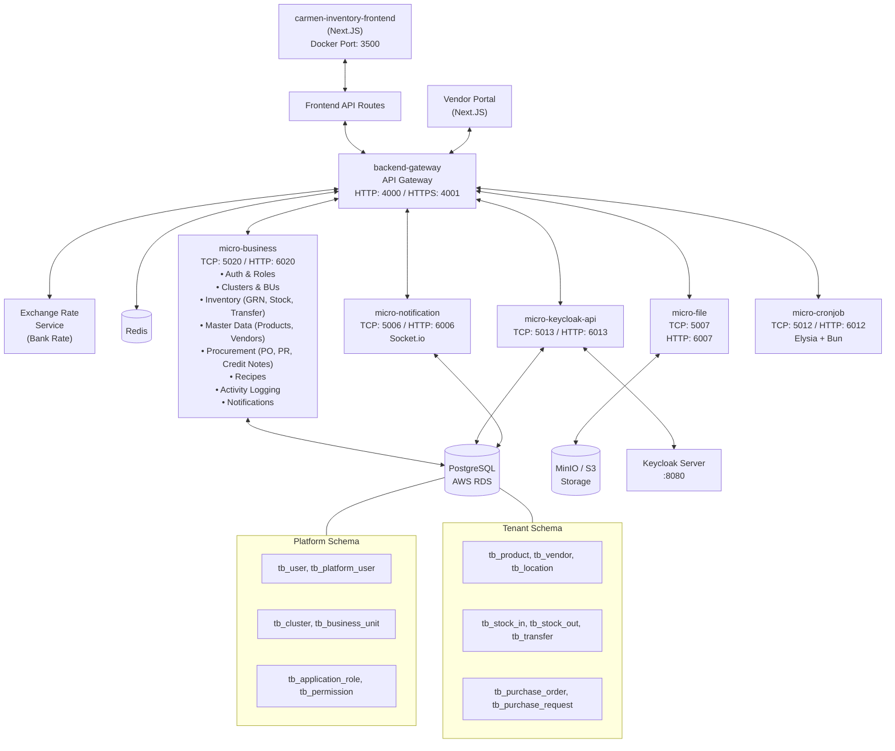

# Infrastructure Diagram

Server AWS

## Server

### CloudFront

    aws service : CloudFront
    comment : Domain management, Cloud, Proxy, DDOS

### Front-end

    aws service : S3
    project type : NextJS
    next-build : SSG

### Gateway

    aws service : EC2 (ECS)
    Project type : NestJS
    Concern : API Gateway Overload
    nest-build : microservice

### Elastic Load Balancing

    aws service : ELB
    comment : Load balancing, SSL termination, Proxy

### Microservices (Current Topology)

    - micro-business (Consolidated)

        project type : NestJS
        protocol : TCP
        Port number : 5020 (TCP) / 6020 (HTTP)
        Modules : auth, cluster, inventory, master, procurement, recipe, log, notification

    - micro-keycloak-api

        project type : NestJS
        protocol : TCP
        Port number : 5013 (TCP) / 6013 (HTTP)
        Integration : Keycloak identity provider

    - micro-file

        project type : NestJS
        protocol : TCP
        Port number : 5007 (TCP) / 6007 (HTTP)
        Storage : MinIO (S3-compatible)

    - micro-notification

        project type : NestJS
        protocol : TCP
        Port number : 5006 (TCP) / 6006 (HTTP)
        Real-time : Socket.io

    - micro-cronjob

        project type : Elysia + Bun
        protocol : TCP
        Port number : 5012 (TCP) / 6012 (HTTP)
        Scheduled tasks

### Database

    aws service : RDS OR Aurora
    project type : PostgreSQL
    Database : PostgreSQL
    schema : Dual-schema (Platform + Tenant)

